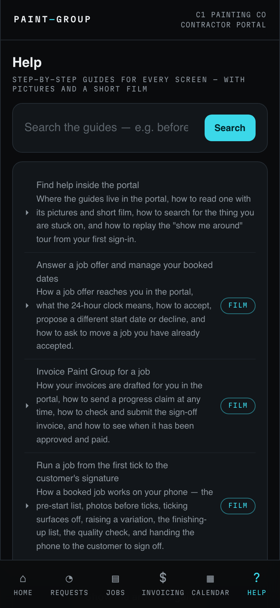
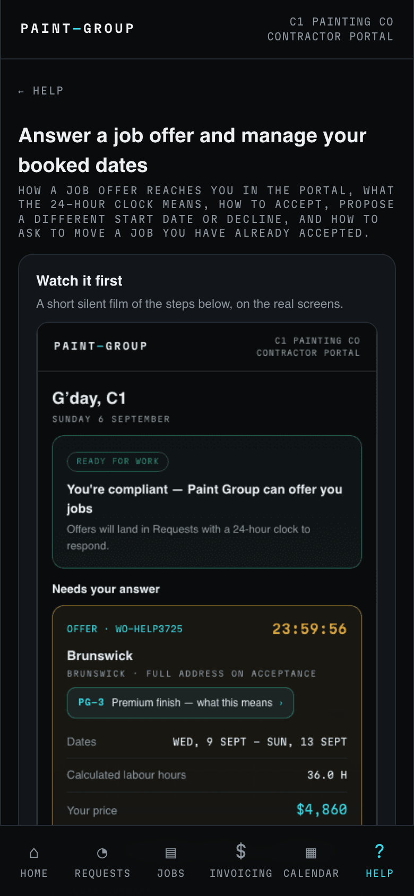
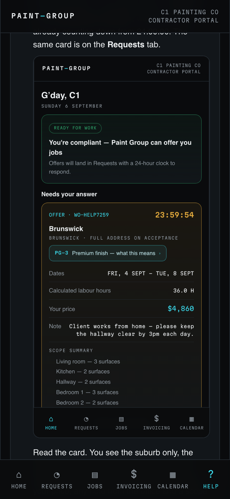
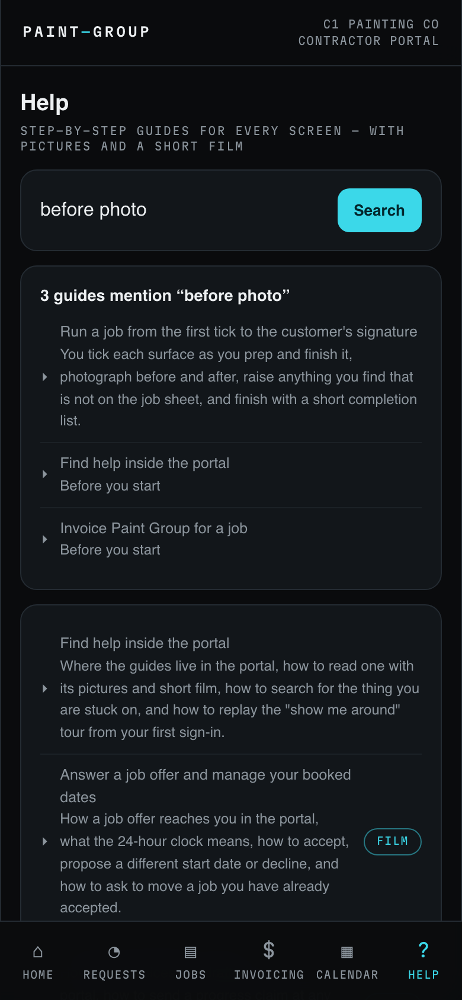
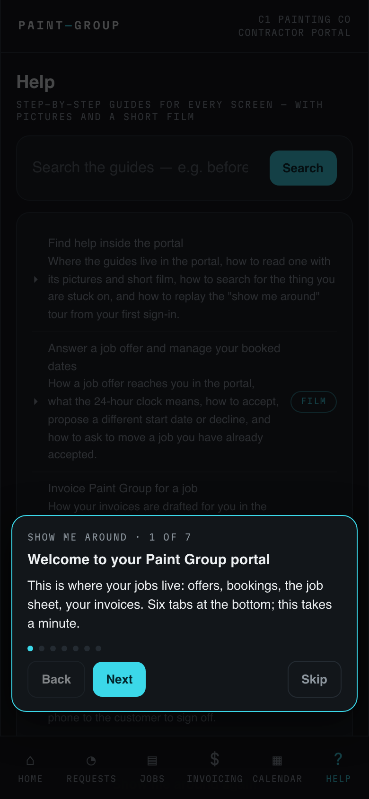

## What this is for
Every screen in the portal has a guide written for painters: what the screen is for, the steps in order, what the colours mean and what to do when something goes wrong. The guides live under the **HELP** tab so you never have to leave the portal or ring the office to find out how something works. You only ever see the guides written for contractors.

## Before you start
- You need to be signed in to the portal. Help is there even while your account is on hold for a missing insurance certificate.
- Pictures and films are taken on test jobs, so the names and prices in them are not real.

## Steps

### Open a guide
1. Tap **HELP** in the bar at the bottom of the portal. Each guide shows its title and a one-line summary of what it covers.
   
2. Tap a guide. Near the top is **Watch it first**, a short silent film of the steps on the real screens. It loops, so let it run once before you read on.
   
3. Scroll down for the steps. Each numbered step does one thing and shows the screen it happens on. Under the steps you will find what the colours and labels mean, and what to do if something goes wrong.
   
4. **← Help** at the top takes you back to the list.

### Search for what you are stuck on
1. Type a word or two into the search box on the Help page, for example "before photo" or "insurance", and tap **Search**.
2. The results show which guides mention every word you typed, with the sentence where they say it. Tap a result to open that guide.
   
3. If nothing matches, try fewer words, or the word as it appears on the screen you are looking at.

### Replay the tour
1. The first time you sign in, before you have any work on the books, a short **Show me around** tour walks you through the tabs. Tap **Next** to move on; each card takes you to the screen it is describing. **Skip** closes it.
2. To see it again, open **HELP** and tap **Show me around again**. Replaying it never changes anything on your account.
   

## What the colours and labels mean
- **Watch it first** — the guide has a film. Not every guide does.
- **N guides mention "…"** — the number of guides that use every word you searched for.
- **Nothing mentions "…"** — no guide uses all those words together; search for fewer.

## If something goes wrong
- **A picture or film does not load** — pull down to refresh. If it still shows a broken image, the file is missing on our side; tell the office which guide it is.
- **The tour does not appear on first sign-in** — it only shows once, and only when you have no offers or jobs yet. Replay it from **HELP** any time.
- **The thing you need is not in any guide** — call or message the office; the number is on your profile page. Guides are added with every new feature.

## Related
- [Answer a job offer and manage your booked dates](../scheduling/contractor.md)
- [Run a job from the first tick to the customer's signature](../work-orders/contractor.md)
- [Invoice Paint Group for a job](../self-invoicing/contractor.md)
