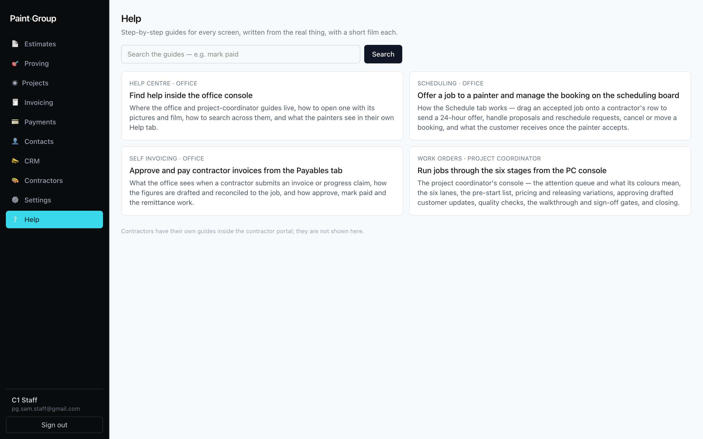
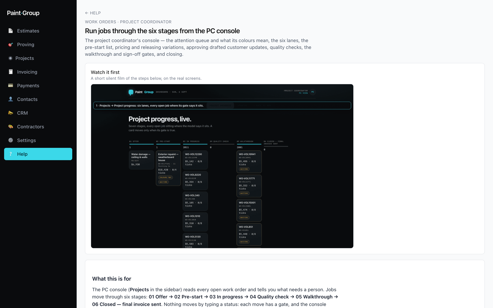
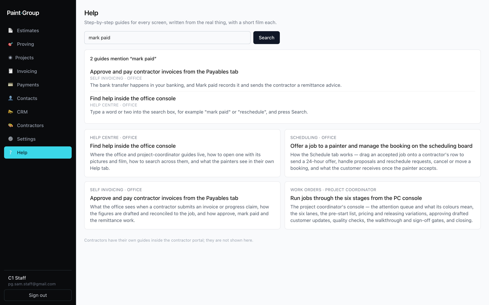

## What this is for
**Help** in the sidebar holds a guide for every feature of the console, written for the person using it: **Office** guides for the estimating, scheduling and invoicing screens, and **Project coordinator** guides for the work-order console. The same system gives painters their own guides in the portal, so when a painter rings about a screen you can read exactly what they have been told.

## Before you start
- Help is visible to every staff login, whatever areas the login has access to. Opening a guide never changes anything.
- Guides are written on the test project, so the jobs, painters and prices in the pictures are made up.

## Steps

### Open a guide
1. Click **Help** in the sidebar. Guides are grouped by feature; each card shows the role it was written for, its title and a one-line summary.
   
2. Click a guide. If it has a film, **Watch it first** sits above the steps and loops through them on the real screens. The steps follow, then what the colours mean and what to do when something goes wrong.
   
3. **← Help** returns to the list.

### Search
1. Type a word or two into the search box, for example "mark paid" or "reschedule", and press **Search**.
2. Every guide that uses all of those words is listed with the sentence where it says it. Click one to open it.
   

### Read what a painter sees
The office route only serves office and project-coordinator guides. To read the painter's version of a guide, sign in to the portal with a contractor test login on the test project, or open the file under `docs/help/<feature>/contractor.md` in the repository.

## What the colours and labels mean
- **Office** / **Project coordinator** — the role the guide is written for. A feature can have both.
- **N guides mention "…"** — how many guides use every word searched.
- **Nothing mentions "…"** — no guide uses all those words together.

## If something goes wrong
- **A guide is missing for a new feature** — help is part of the definition of done, so a feature without a guide is a gap to raise with the developer.
- **A picture shows an older screen** — the guide's pictures are re-taken when its screens change and the index check in CI warns when they fall behind. Raise it if a picture no longer matches.
- **A painter cannot find something** — their Help tab holds only the contractor guides. Read the contractor file for that feature and point them at the step.

## Related
- [Offer a job to a painter and manage the booking on the scheduling board](../scheduling/staff.md)
- [Approve and pay contractor invoices from the Payables tab](../self-invoicing/staff.md)
- [Run jobs through the six stages from the PC console](../work-orders/pc.md)
