## What this is for
Paint Group offers you jobs through the contractor portal. Each offer comes with the dates, the calculated labour hours, your price and a 24-hour clock. You answer from your phone: accept, propose a different start date, or decline. Once you accept, the full address and the customer's details unlock and the job moves to your Jobs tab and your Calendar.

## Before you start
- You need a portal login from Paint Group. Sign in at the address they sent you and you land on **Home**.
- Your **Home** page must show the green **READY FOR WORK** card. If it says you are not yet offerable, open **Profile** from Home and upload your current public liability insurance. Paint Group can only send you offers while your insurance is valid.
- Block out any days you cannot work under **Calendar** before offers arrive. Paint Group sees your blocked days on their scheduling board straight away, so they will not offer you those dates.

## Steps

### Answering an offer
1. Open the portal. A new offer shows on **Home** under **Needs your answer**, with the clock already counting down from 24:00:00. The same card is on the **Requests** tab.
   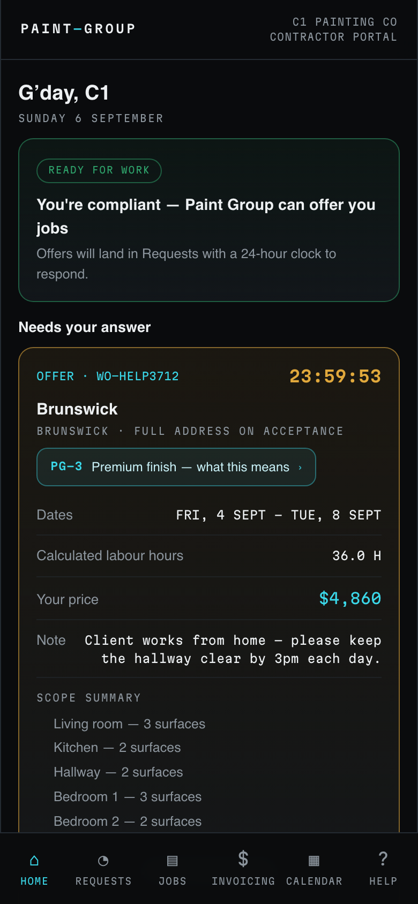
2. Read the card. You see the suburb only, the finish level chip (for example PG-3 Premium finish), the dates, the calculated labour hours, your price, any note from the office and a scope summary by area. The full street address stays hidden until you accept.
   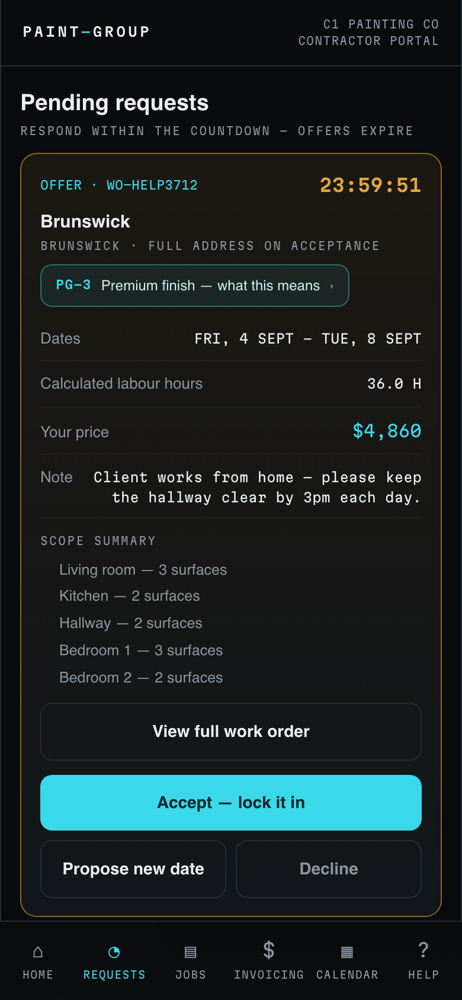
3. Tap **View full work order** to read the whole job sheet. The clock, **Accept — lock it in** and **Decline** stay pinned to the top while you read. The address card reads **SUBURB ONLY** until you accept.
   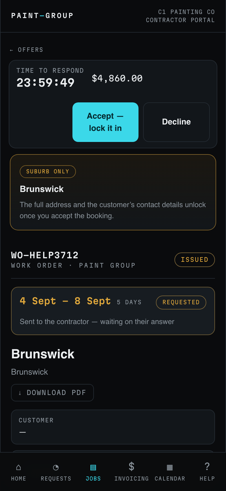
4. To take the job on the dates offered, tap **Accept — lock it in**. The card turns to **BOOKED** and says the full address and customer details are now on your job. Skip to *After you accept* below.
5. To turn the job down, tap **Decline**, pick a reason from the list (On another job, Too far to travel, Scope not for me, Price, Other), add a note if you want, then tap **Confirm decline**. The job goes straight back to Paint Group.
   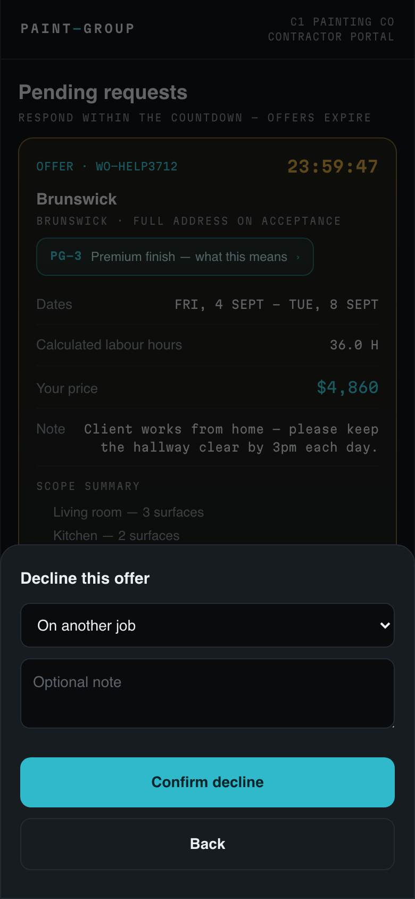
6. To take the job but start on a different day, tap **Propose new date**. In the calendar, the offered dates are outlined in amber, your booked days are green and your blocked days are hatched. Tap the day you could start, add a short note, then tap **Send proposal to Paint Group**.
   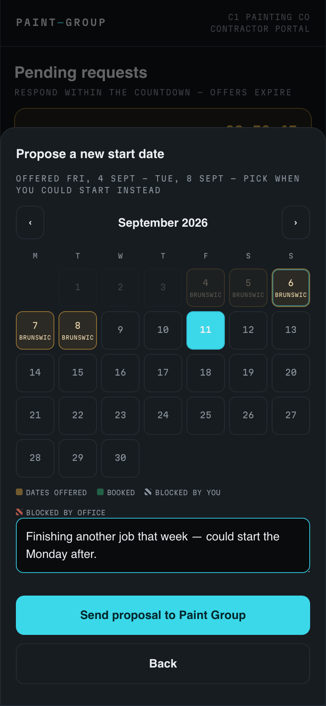
7. After you send a proposal the card shows **NEW DATE PROPOSED** and the message "Proposal sent — Paint Group will approve or decline your new start date. The 24-hour clock has stopped; you responded in time." Paint Group will check with the customer and either approve your date or decline it. If they decline, the job returns to them and you are not booked.
   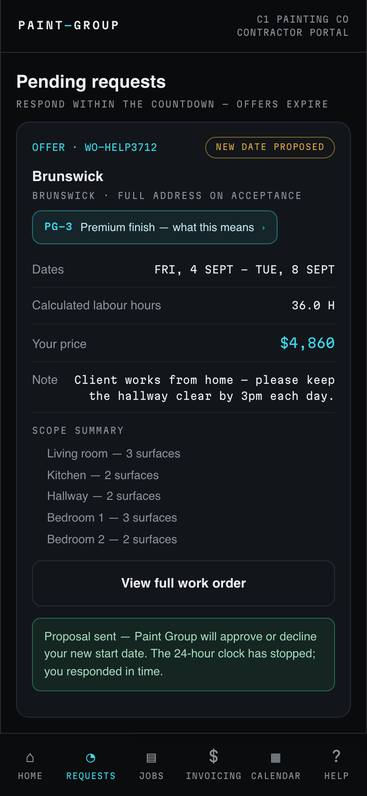

### After you accept
8. **Requests** now shows "Nothing waiting on you" and lists the offer under **EARLIER OFFERS** with a green **BOOKED** chip.
   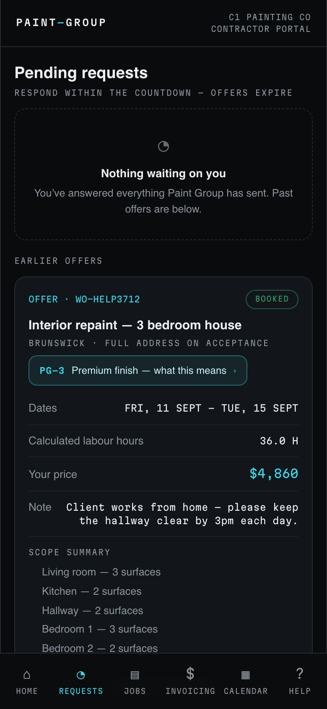
9. Open **Jobs**. The job sits under **COMING UP** with its start date, the surface count and your price. Jobs you are working on sit under **ON THE TOOLS NOW**, and completed ones under **FINISHED**. Tap **Open work order**.
   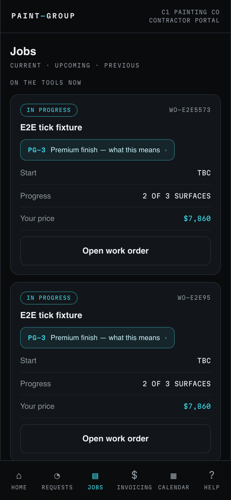
10. The job page now shows the full address and the customer's first name and phone. The **Ready to start?** card tells you how many pre-start items the office still has to tick before **Start the job** unlocks. **Finish & walkthrough** shows the day the customer walkthrough is booked for.
    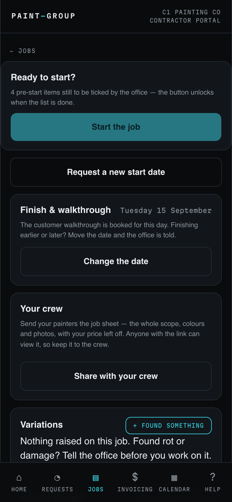
11. Open **Calendar**. Your booked days are green, with the job name on the first day and the walkthrough marked. Tap a free day to block it out. Booked days cannot be blocked here, so call the office if something has changed. You can also connect Google Calendar so accepted jobs appear in your own calendar.
    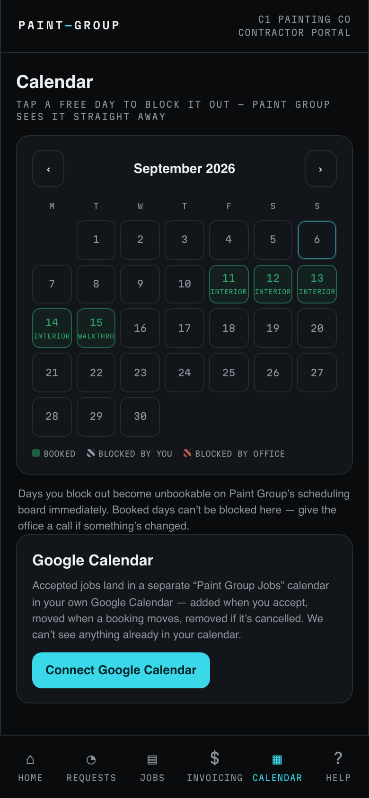

### Asking to move a job you have already accepted
12. On the job page, tap **Request a new start date**. Pick the day you could start instead, say why in the note, then tap **Send request**.
    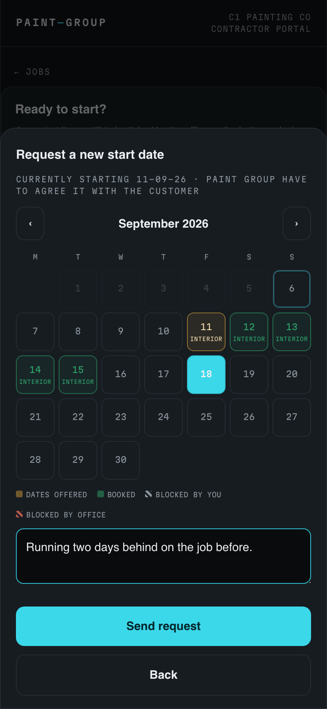
13. The job page shows **WAITING ON PAINT GROUP** with the date you asked for. Nothing moves yet: Paint Group must agree the new date with the customer, and until they do the original date still stands. You will see the job update when they decide.
    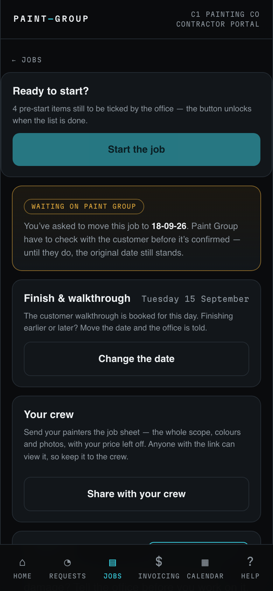

### If the clock runs out
14. An offer you do not answer within 24 hours expires on its own. It moves to **EARLIER OFFERS** with a red **EXPIRED** chip and the note that it went back to Paint Group for reassignment. Nothing else happens, but the office has to find someone else for that job.
    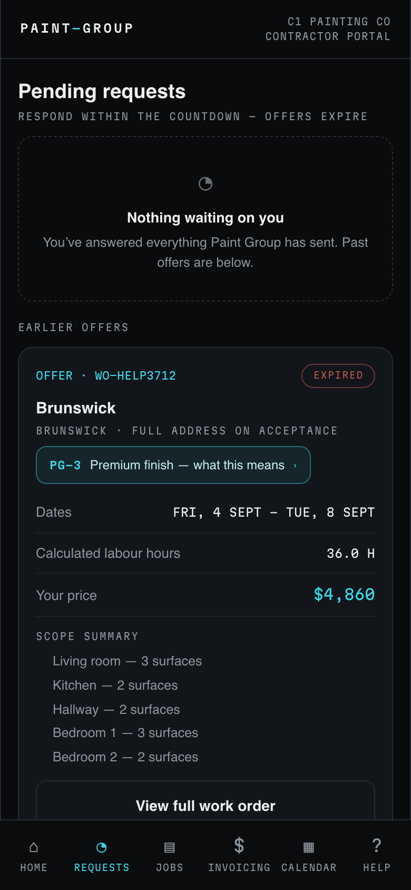

## What the colours and labels mean
- **Amber countdown** (hh:mm:ss) — an offer waiting on you. When it reaches zero the offer expires.
- **NEW DATE PROPOSED** (amber) — you answered in time; Paint Group is deciding on your date.
- **BOOKED** (green) — the job is yours on those dates.
- **WAITING ON PAINT GROUP** (amber) — you asked to move a booked job and the office has not decided yet.
- **DECLINED**, **EXPIRED**, **CANCELLED** (red) — the offer is closed and the job is back with Paint Group.
- **SUBURB ONLY** (amber) — you have not accepted yet, so the address is hidden.
- **REQUESTED** on the job page — the offer has been sent to you and is waiting on your answer.
- In the calendar: **green** is booked, **hatched grey** is a day you blocked, **hatched red** is a day the office blocked, **amber outline** is the dates on an open offer.

## If something goes wrong
- **"This offer has expired — it's gone back to Paint Group."** You answered after the 24 hours ran out. Call the office if you still want the job; they can offer it again.
- **You accepted but the address is still hidden.** Pull down to refresh the page. If it is still hidden, call the office.
- **The Accept button is missing.** Your insurance may have lapsed. Check **Home**: if the READY FOR WORK card is gone, upload a current certificate under **Profile**.
- **Nothing on Requests but the office says they sent an offer.** Make sure you are signed in with the email address Paint Group invited. Offers only appear on the account they were sent to.
- Anything else: call the Paint Group office on the number in your work order.

## Related
- [Invoice Paint Group for a job](../self-invoicing/contractor.md)
