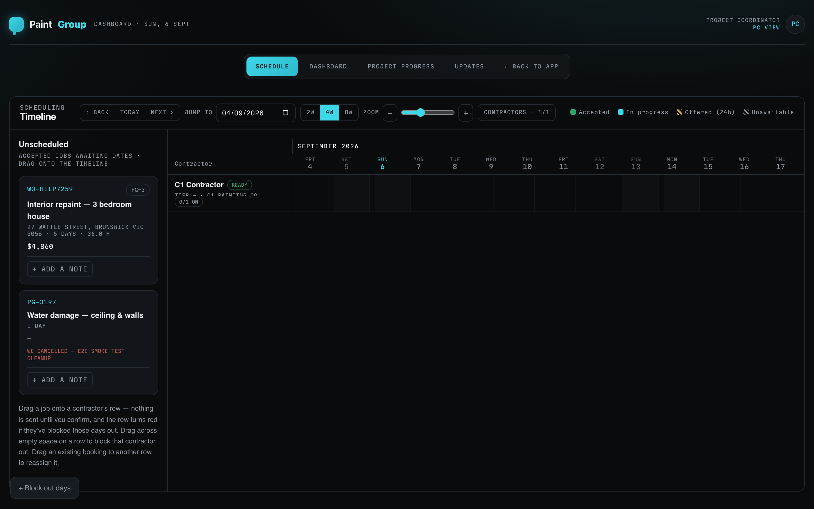
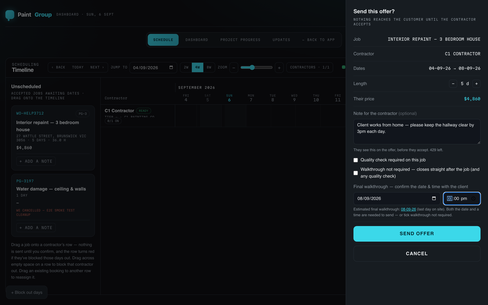
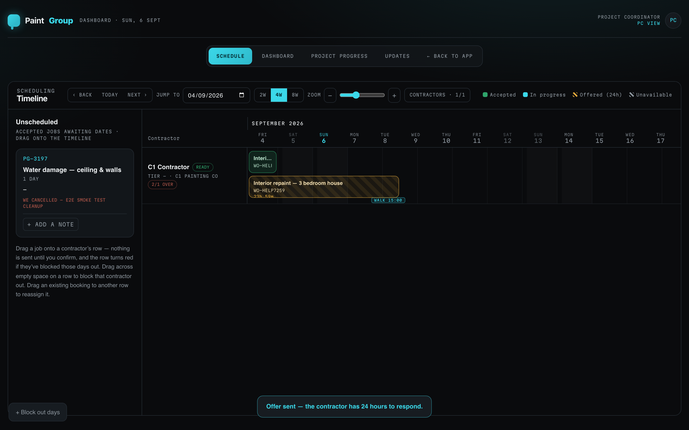
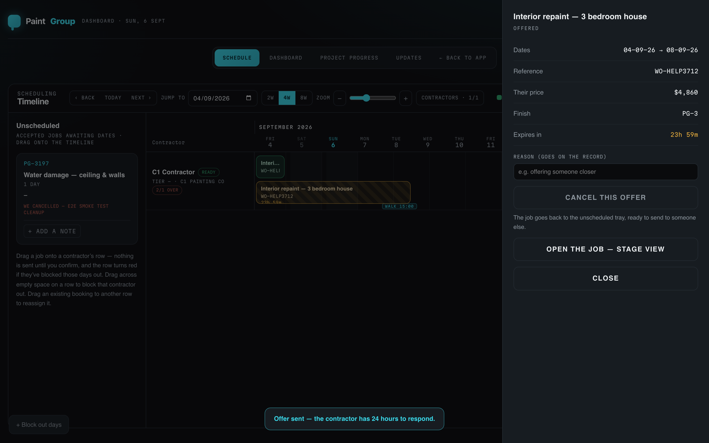
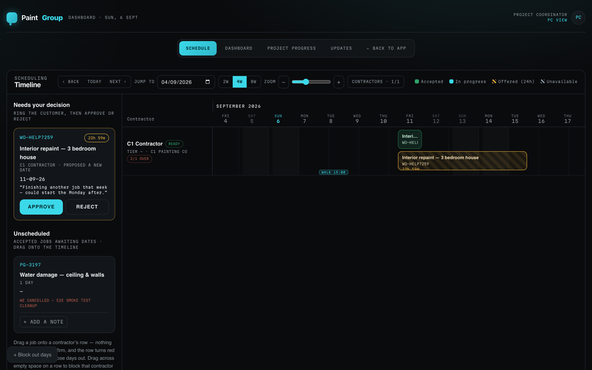
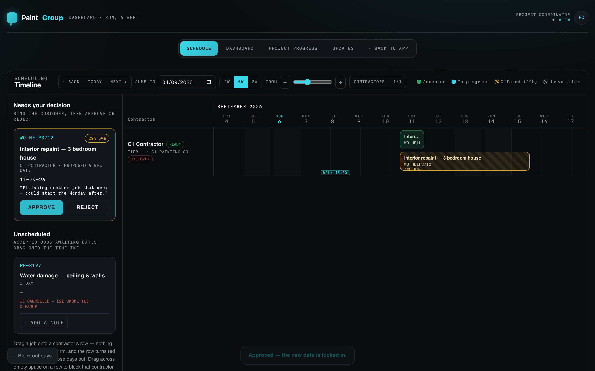
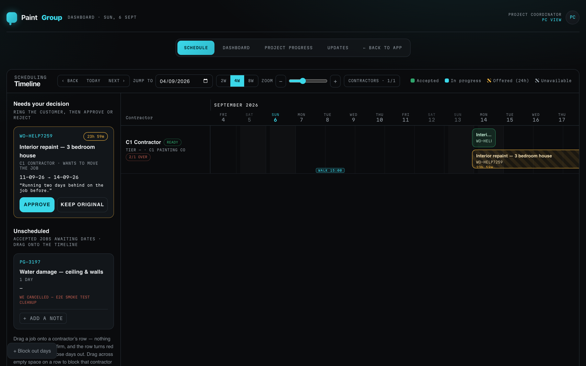
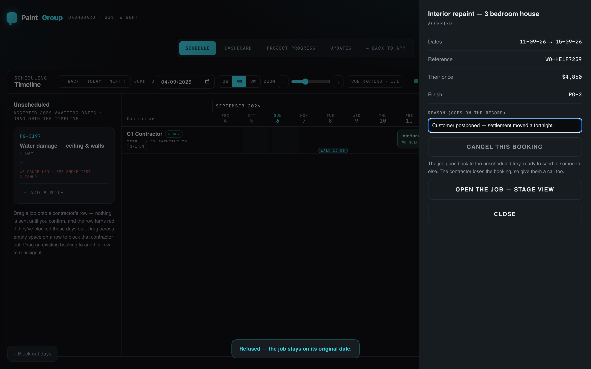
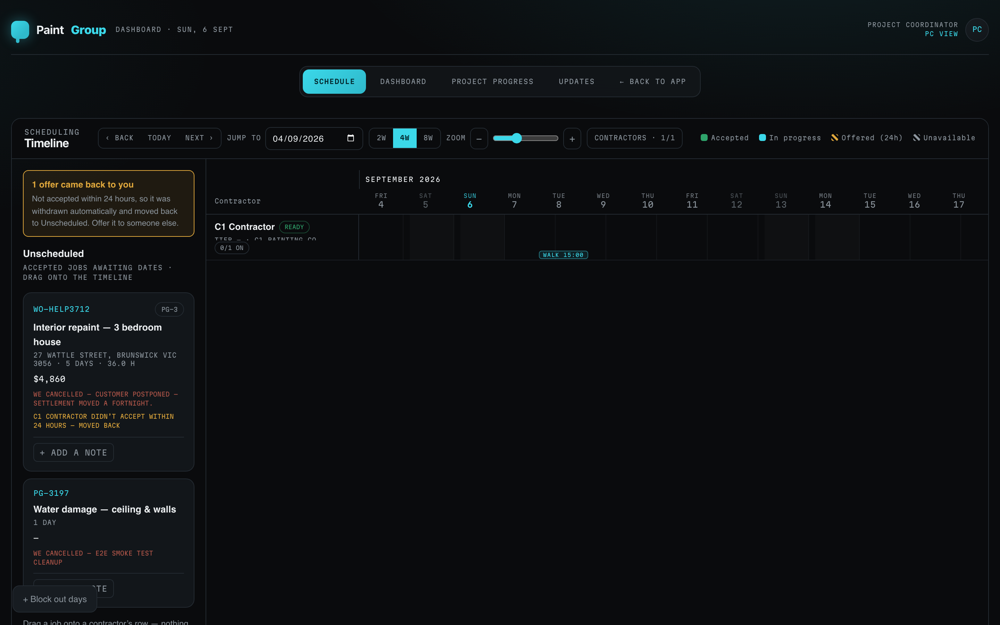

## What this is for
The scheduling board is where an accepted job gets a painter and dates. Every issued work order that has no booking sits in the **Unscheduled** tray. You drag it onto a contractor's row, confirm the offer, and the contractor has 24 hours to accept, propose another date or decline. Nothing reaches the customer until the contractor accepts. Once they do, the job turns green on the board and the customer gets their booking confirmation.

## Before you start
- The job must have an issued work order. Accept the estimate and issue the work order and it appears in the tray on its own. Older jobs accepted before work orders were automatic carry a label saying so.
- The contractor must be onboarded under **Contractors** in the sidebar and show a **READY** chip on their row. A contractor with lapsed insurance cannot be offered a job; the board refuses.
- Know the final walkthrough date and time. The offer sheet will not send until you either confirm the walkthrough with the client or tick that no walkthrough is required.
- Open the board from **Projects** in the sidebar, then the **Schedule** tab (the address is /pc/schedule).

## Steps

### Sending an offer
1. Open **Projects → Schedule**. The tray on the left lists **Unscheduled** jobs: reference, finish chip, title, address, estimated days and hours, and the contractor's price. Each contractor has a row on the timeline with a capacity chip such as **0/1 ON**. Use **2W / 4W / 8W**, **Zoom** and **Jump to** to move around, and **Contractors** to filter by tier or hand-pick rows.
   
2. Drag the job card onto the contractor's row, landing on the start day. If the row turns red, that contractor has blocked those days out; you can still send, but they told you they are unavailable.
3. The **Send this offer?** sheet opens. Check the job, contractor and dates, adjust **Length** with − and +, and read **Their price**. Add a **Note for the contractor** if there is something they must know before accepting; they see it on the offer. Tick **Quality check required on this job** if the job needs one.
4. Confirm the **Final walkthrough** with the client: enter the date and time, or tap the suggested date (the last day on site) and add the time. If the job has no customer walkthrough, tick **Walkthrough not required** instead. The sheet will not send without one of these.
   
5. Tap **Send offer**. The toast reads "Offer sent — the contractor has 24 hours to respond." The job leaves the tray and appears on the row as an amber hatched block with a countdown, and the walkthrough shows as a **WALK** pin.
   
6. Click the block at any time to see its details: dates, reference, price, finish and **Expires in**. From here you can **Cancel this offer** with a reason, which returns the job to the tray, or **Open the job — stage view**.
   

### When the contractor proposes a different date
7. A proposal appears at the top of the tray under **Needs your decision**, with the contractor's name, **PROPOSED A NEW DATE**, the date they want and their note. Ring the customer first, then tap **Approve** or **Reject**. The amber countdown on this card is your clock, not theirs; it turns red when overdue.
   
8. **Approve** books the job on the proposed date: the block turns green and the toast reads "Approved — the new date is locked in." **Reject** releases the job back to the tray so you can offer it to someone else.
   

### When the contractor accepts
9. The block turns green (**Accepted**). The customer's booking confirmation email goes out at this point, using the template under **Settings → Messaging**: painter's name, the start window, and the walkthrough date and time if booked. When a booking is created by approving a proposal instead, the overnight sweep sends the confirmation.

### When a booked contractor asks to move the job
10. The request appears under **Needs your decision** as **WANTS TO MOVE THE JOB**, showing the current date, the date they want and their reason. Ring the customer, then tap **Approve** to move the job or **Keep original** to refuse. The toast for a refusal reads "Refused — the job stays on its original date." The contractor sees the outcome on their job page.
    

### Cancelling or moving a booking
11. Click a green block, type the reason (it goes on the record), then tap **Cancel this booking**. The job returns to the tray with a red **WE CANCELLED** note, and the contractor loses the booking, so give them a call too.
    
12. To reassign, drag an existing block onto another contractor's row. The **Move this booking?** sheet opens; confirming cancels the old booking and sends a fresh 24-hour offer to the new contractor.

### When an offer lapses
13. An offer not answered within 24 hours is withdrawn on its own. The tray shows a banner, "1 offer came back to you", and the job card carries an amber note naming the contractor who did not accept. Offer it to someone else.
    

### Blocking days out
14. Tap **+ Block out days**, or drag across empty space on a contractor's row, choose the contractor and days, add an optional reason and tap **Block them out**. The contractor sees the block in their calendar. Office blocks can be removed from the block's detail sheet; days the contractor blocked themselves can only be cleared by them.

## What the colours and labels mean
- **Amber hatched block with countdown** — offered, waiting on the contractor (24 hours).
- **Green block** — accepted; the booking is confirmed and the customer has been told.
- **Cyan block** — the job is in progress.
- **Grey hatched block** — contractor unavailable (blocked out by them or by the office).
- **Needs your decision** card, amber border — a proposal or reschedule request waiting on you; **red border / OVERDUE** — you have not answered within the time shown.
- **WE CANCELLED — …** (red) on a tray card — the office cancelled a booking; the reason follows.
- **… DIDN'T ACCEPT WITHIN 24 HOURS — MOVED BACK** (amber) on a tray card — the offer lapsed.
- **READY** on a contractor row — insurance valid, can be offered work. **SUSPENDED** — cannot be offered work.
- **0/1 ON**, **2/1 OVER** — jobs on the row against the painters on their crew; OVER means they are double-booked.

## If something goes wrong
- **"This contractor has blocked these days out."** You can still send, but expect a decline or a proposal. Better to pick different days or another row.
- **The send fails with a message about the walkthrough.** Enter both a date and a time, or tick **Walkthrough not required**.
- **The contractor cannot be offered a job.** Check **Contractors** in the sidebar: their insurance has lapsed or they are suspended. They upload a new certificate in their portal profile.
- **A job you expected is not in the tray.** It has a live offer or an accepted booking already (look along the rows), or its work order has not been issued.
- **The customer did not get a confirmation.** Check **Settings → Messaging** is configured and the automation is on; the overnight sweep resends anything missed.

## Related
- [Reconcile and pay contractor invoices](../self-invoicing/staff.md)
