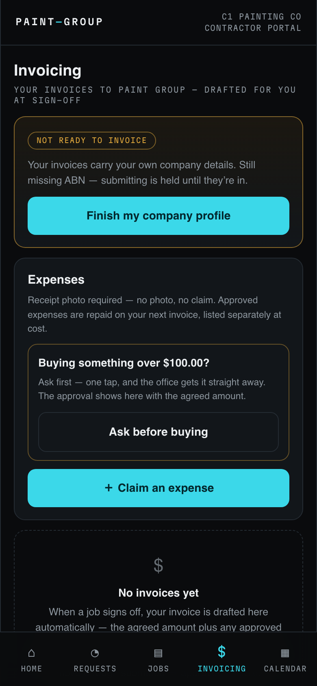
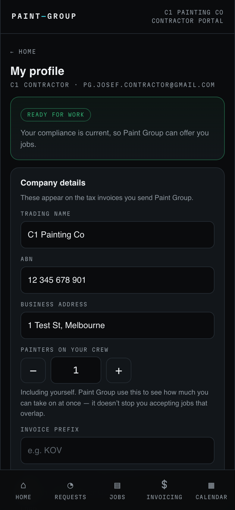
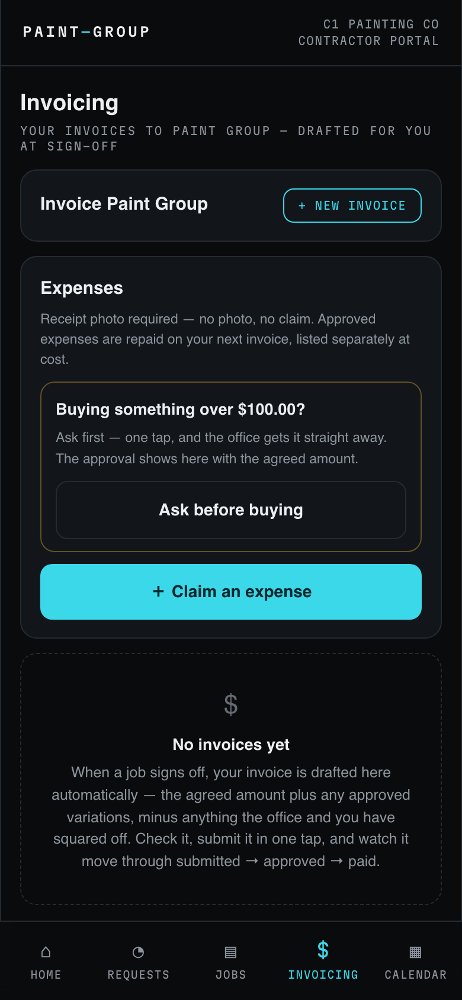
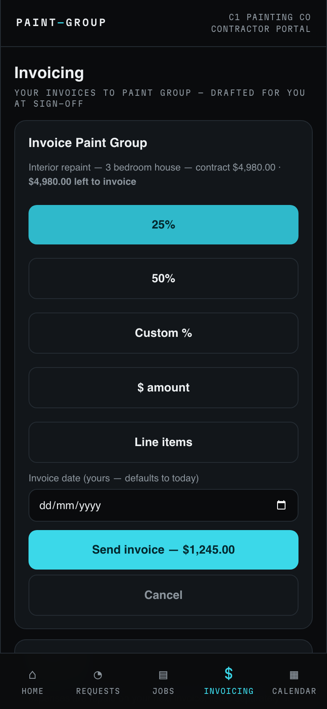
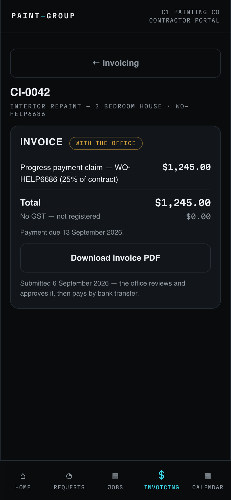
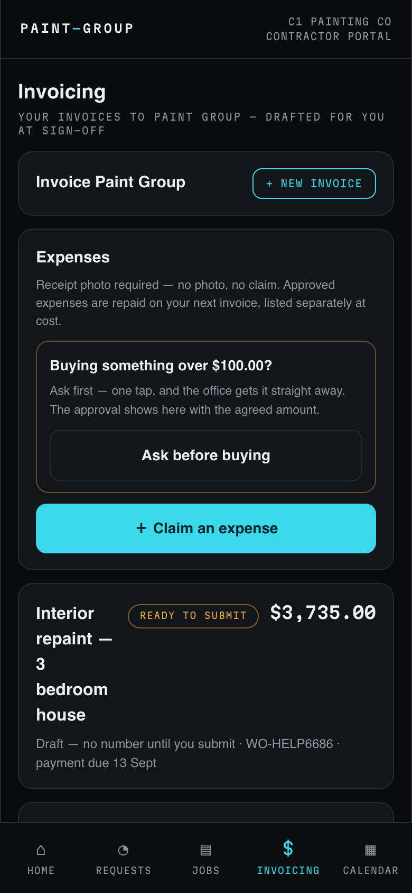
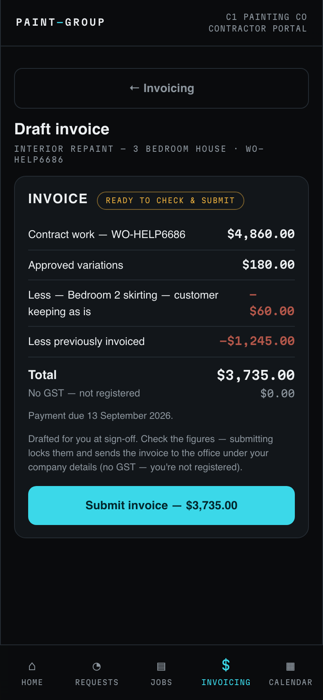
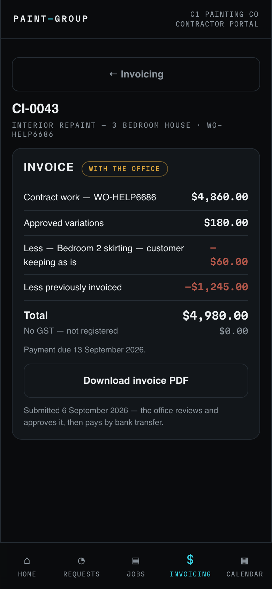
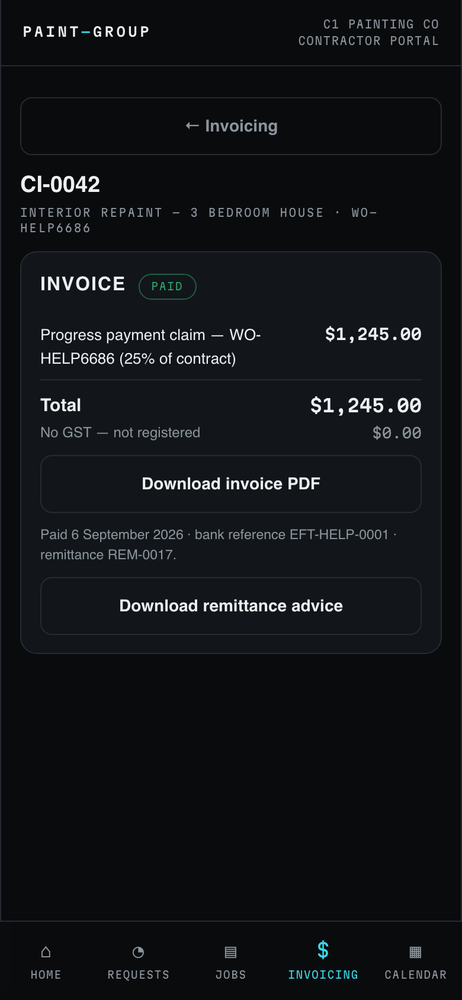
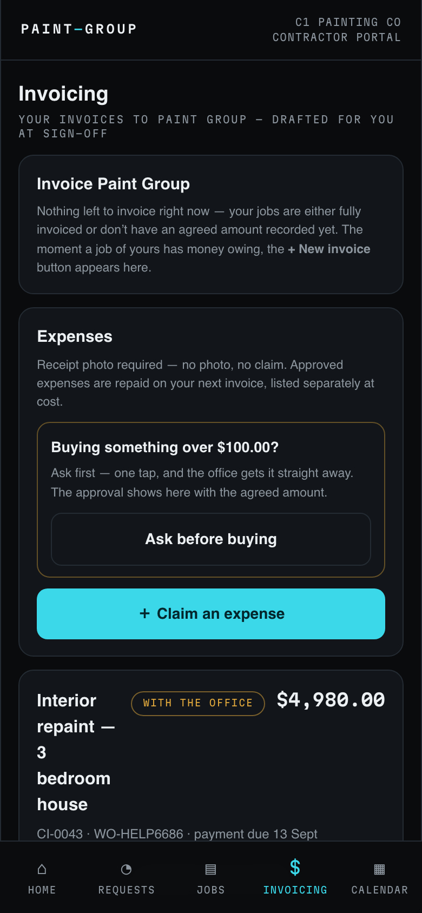

## What this is for
You invoice Paint Group from the **Invoicing** tab of the portal, not from your own accounting software. The platform drafts the figures for you: the agreed amount for the job, plus any approved variations, minus anything you and the office have squared off. You check it and submit in one tap. You can also send a progress payment claim at any point while the job is running. Every invoice carries your own company details, so the document is yours.

## Before you start
- Your company profile must be complete: trading name, ABN, business address and bank details. Until it is, **Invoicing** shows an amber **NOT READY TO INVOICE** card and submitting is held.
- If you are registered for GST, switch on **I'm registered for GST** in your profile. Your invoices then read **TAX INVOICE** and show the GST included. If you are not registered, they read **INVOICE** with "No GST — not registered".
- The job must have an agreed amount and be yours (accepted through **Requests**). A job with nothing left to invoice does not appear in the claim list.

## Steps

### Finish your profile first
1. Open **Invoicing**. If you see **NOT READY TO INVOICE**, it names what is missing (for example "Still missing ABN"). Tap **Finish my company profile**.
   
2. Under **Company details** fill in your trading name, ABN, business address, the number of painters on your crew and, if you like, an invoice prefix. Further down, enter your mobile, your bank BSB and account number under **Where you get paid**, and keep your insurance current under **Insurance & licences**.
   

### Send a progress claim while the job is running
3. Back on **Invoicing**, the **Invoice Paint Group** card now shows **+ NEW INVOICE** whenever one of your jobs has money owing. Below it, **Expenses** is where you claim purchases with a receipt photo. Tap **+ NEW INVOICE**.
   
4. Pick the job if you have more than one. The card shows the contract amount and how much is left to invoice. Choose **25%**, **50%**, **Custom %**, **$ amount** or **Line items**. The button updates to show the exact figure, for example **Send invoice — $1,245.00**. Set an invoice date if you want it different from today, then tap the button.
   
5. You land on the invoice itself. It has a number (for example CI-0042), the chip **WITH THE OFFICE**, one line "Progress payment claim — (25% of contract)", the total, the GST line and the payment due date. Tap **Download invoice PDF** to keep a copy.
   

### Check and submit the sign-off invoice
6. When a job signs off, the final invoice is drafted for you. On **Invoicing** it appears with an amber **READY TO SUBMIT** chip and "Draft — no number until you submit". Tap it.
   
7. Check each line: **Contract work** is the agreed amount, **Approved variations** adds extras the office approved, **Less —** lines take off scope that came out (a deduction the office set says "set by the office" and has their note), and **Less previously invoiced** takes off any progress claims already sent. The **Total** is what you are submitting. When it is right, tap **Submit invoice**. Submitting locks the figures and sends the invoice to the office under your company details.
   
8. The invoice now has a number and the chip **WITH THE OFFICE**. The office reviews and approves it, then pays by bank transfer.
   

### Getting paid
9. When the office pays, the chip turns green **PAID** and the page shows the payment date, the bank reference and the remittance number. Tap **Download remittance advice** for the record.
   
10. **Invoicing** lists every invoice with its status, amount, number, job reference and due date. **Approved — payment coming** means the office has approved it and it is in their payment run.
    

## What the colours and labels mean
- **NOT READY TO INVOICE** (amber) — your profile is missing something; submitting is held until it is in.
- **READY TO SUBMIT** / **READY TO CHECK & SUBMIT** (amber) — a draft waiting on you.
- **WITH THE OFFICE** (amber) — submitted and numbered; the office has not approved it yet.
- **Approved — payment coming** (blue) — approved; payment is being arranged.
- **PAID** (green) — paid, with the bank reference and remittance shown.
- **INVOICE** vs **TAX INVOICE** — the heading follows your GST registration at the time you submit.
- **RCTI** (grey) — Paint Group issues this invoice on your behalf under a signed agreement; you do not need to submit it.

## If something goes wrong
- **"Submitting is held until your company profile has …"** Open **Profile** and fill in what it names, then come back. The button appears once everything is in.
- **"The office is finalising a pay adjustment on this job."** A credit on a variation still needs the office to set the figure. Wait for it to appear on the draft, or call them to settle it.
- **The claim is refused as more than what is left.** A claim can never exceed the amount still to invoice on that job. Lower the percentage or amount.
- **A figure looks wrong.** Do not submit. Call the office: the draft comes from the agreed offer and the approved variations, so the fix is on the job, not on the invoice.
- **No invoice appeared after sign-off.** Pull down to refresh **Invoicing**. If it is still missing, call the office.

## Related
- [Answer a job offer and manage your booked dates](../scheduling/contractor.md)
