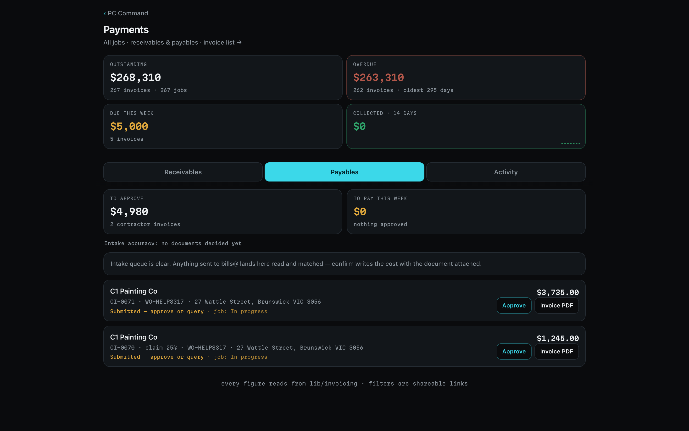
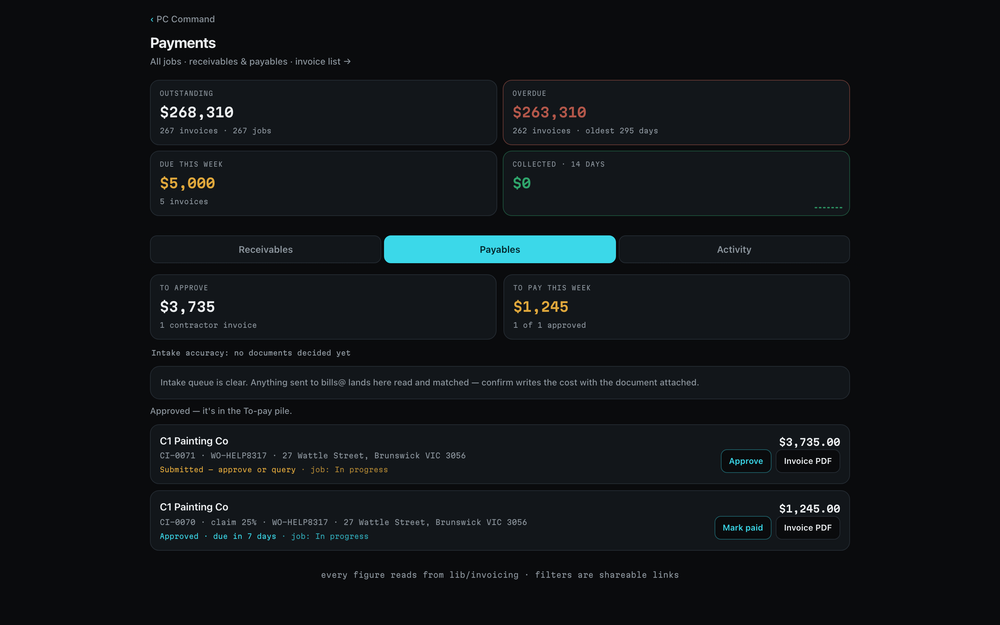
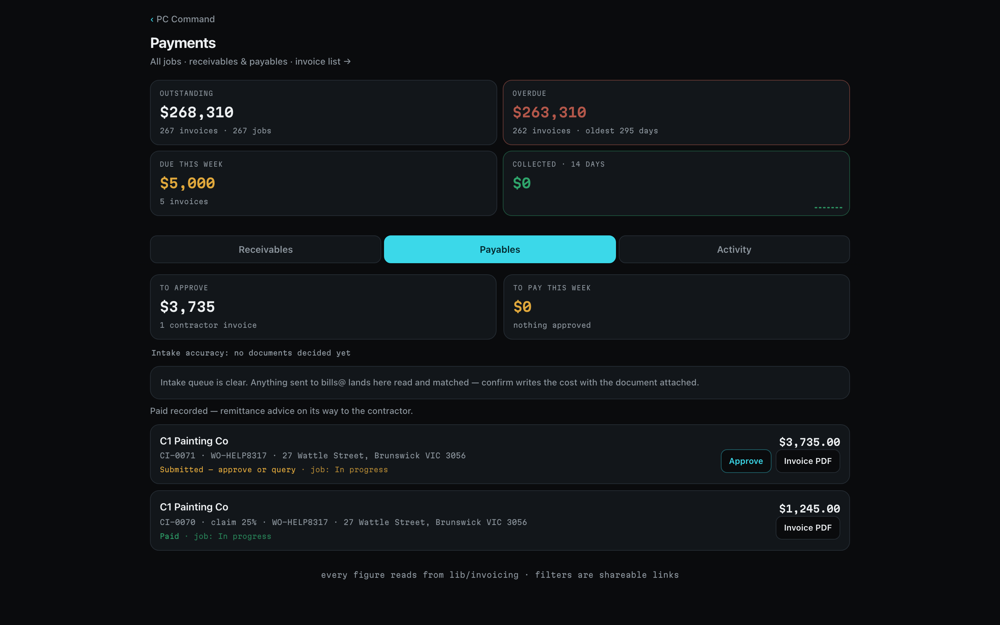

## What this is for
Contractors do not type invoices. The platform drafts each one from the job: the offer amount on the work order, plus approved variations, minus credits and any deduction the office set, minus what the contractor has already claimed. The contractor checks and submits; the office approves and records the payment. Nothing here moves money. The bank transfer happens in your banking, and **Mark paid** records it and sends the contractor a remittance advice.

## Before you start
- Open **Payments** from the sidebar, then the **Payables** tab. The address is /invoicing?tab=pay.
- Any manual deduction on a variation (a credit for scope removed after work started) must be set on the job before the contractor can submit. Until it is, their submit is held with "the office is finalising a pay adjustment".
- Have your bank reference ready before you tap **Mark paid**: it asks for the reference and the payment date.

## Steps
1. Open **Payments → Payables**. The tiles show **TO APPROVE** (submitted invoices awaiting you) and **TO PAY THIS WEEK** (approved, due within the week). Below the intake queue for supplier bills sit the contractor invoice rows: company, invoice number, job reference and address, and a status line such as **Submitted — approve or query · job: In progress**. A progress claim says **claim 25%** in its reference line.
   
2. Tap **Invoice PDF** to read the document the contractor submitted. Check it against the job: the offer amount on the work order, the approved variations, and any deductions. If something is wrong, ring the contractor; the fix is made on the job (the variation or its deduction), and they re-submit.
3. Tap **Approve**. The row turns blue with **Approved · due in … days**, the button becomes **Mark paid**, and the toast reads "Approved — it's in the To-pay pile." The contractor sees **Approved — payment coming**.
   
4. Make the bank transfer in your banking. Then tap **Mark paid**, enter the bank reference when prompted, and the payment date (yyyy-mm-dd). The row turns green **Paid**, the toast reads "Paid recorded — remittance advice on its way to the contractor", and a remittance number is issued. The contractor's invoice page shows the payment date, reference and a **Download remittance advice** button.
   
5. Tap the company name on a row to open the job's money view, where the contractor's invoices sit alongside the customer invoices and costs for that job.

## How the figures reconcile
- **Contract work** is the contractor payment recorded on the work order when the offer was sent.
- **Approved variations** are variations the customer approved and the contractor accepted, at the contractor's rate.
- **Less —** lines are credits for scope removed. Where work had already started, the office sets the figure on the variation and it appears to the contractor as "set by the office" with your note.
- **Less previously invoiced** takes off progress claims already submitted on the same job, so a job is never invoiced twice.
- **GST** is backed out of the total only when the contractor was registered at the time they submitted; the document then reads **TAX INVOICE**. Unregistered contractors submit an **INVOICE** with no GST.
- Approved contractor expenses ride on their next invoice as separate at-cost reimbursement lines.
- **RCTI**: a contractor who has signed the recipient-created tax invoice agreement shows an **RCTI** chip. Their drafts can be approved by the office without the contractor submitting.

## What the colours and labels mean
- **Submitted — approve or query** (amber) — waiting on the office.
- **Approved · due in N days** (blue) — approved and in the to-pay pile.
- **Paid** (green) — payment recorded; remittance sent.
- **TO APPROVE** and **TO PAY THIS WEEK** tiles — totals across all contractors.
- **claim NN%** in a reference line — a progress claim, not a sign-off invoice.
- **job: In progress** (and the other stage names) — where the job is in the work order loop, so you can judge whether a claim is reasonable.

## If something goes wrong
- **The contractor says they cannot submit.** Either their company profile is incomplete (they fix it under Profile in the portal) or a variation credit is waiting on your deduction figure. Set it on the job and their button appears.
- **The amount does not match what you expected.** Compare against the work order offer and the variations on the job. Do not edit the invoice; correct the job and ask them to re-submit.
- **You approved the wrong invoice.** Do not mark it paid. Contact whoever administers the platform to reverse the approval.
- **The remittance PDF is missing.** It renders shortly after **Mark paid**; refresh. If it still has not attached after a few minutes, check the error monitor.

## Related
- [Offer a job to a painter and manage the booking](../scheduling/staff.md)
