## What this is for
Once you have accepted a booking, the job page in **Jobs** is where the work is recorded. You tick each surface as you prep and finish it, photograph before and after, raise anything you find that is not on the job sheet, and finish with a short completion list. Your ticks and photos are what the office and the customer see, so the office writes the customer's progress updates from them. The job ends with the customer approving each area and signing on your phone.

## Before you start
- The job must be booked (you accepted the offer). Until then the job page shows the offer clock and the suburb only.
- The office works through the **pre-start list** for the job: colours confirmed, materials ordered and so on. Your job page shows how many items are still to be ticked by the office. You cannot start the job until that list is done.
- Photos are taken with your phone's camera from the job page. Make sure you have signal on site; a photo that does not upload says so and can be retried.
- Have your crew's phones ready if you want them to see the job sheet: **Your crew → Share with your crew** gives them a read-only link with your price left off.

## Steps

### Starting the job
1. Open **Jobs** and tap the job. At the top, **Ready to start?** shows how many pre-start items the office still has to tick. When the list is done, the **Start the job** button lights up. Tap it on the morning you start; the office is told you are on site. If you do nothing, the job starts itself on its booked date once the list is true.
   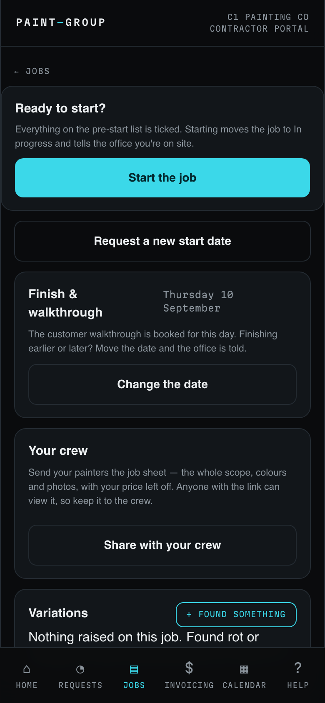

### Ticking surfaces off
2. **Scope & ticks** lists every area on the job sheet and its surfaces. Each row has three squares: to do, prepped, done. Tap a row once to mark it **PREPPED**, again to mark it **DONE**. The count at the top tracks the whole job.
   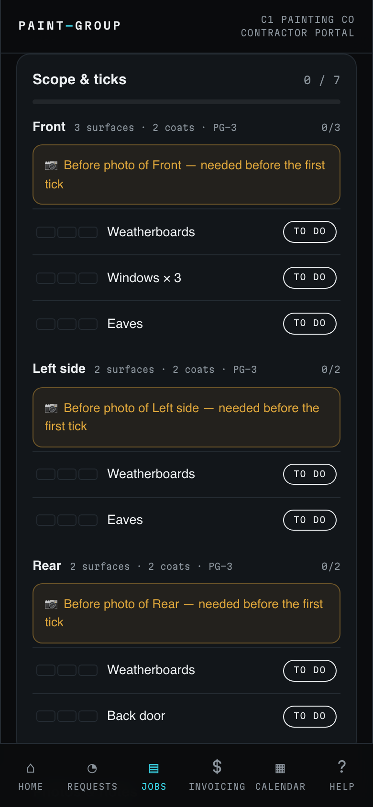
3. **Before you can tick anything in an area, that area needs a before photo.** If you tap a row first, the list tells you: "Before photo of Front — one shot before you start." Tap the amber **Before photo of … — needed before the first tick** button, take the shot, and the message changes to "Before photo saved… Tick away."
   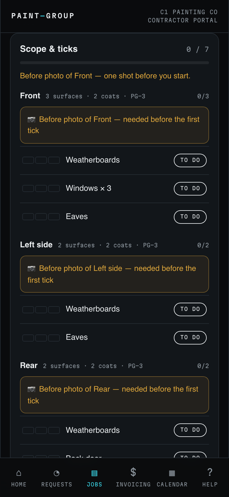
4. Now tick. The row turns cyan **PREPPED** on the first tap and green **DONE** on the second.
   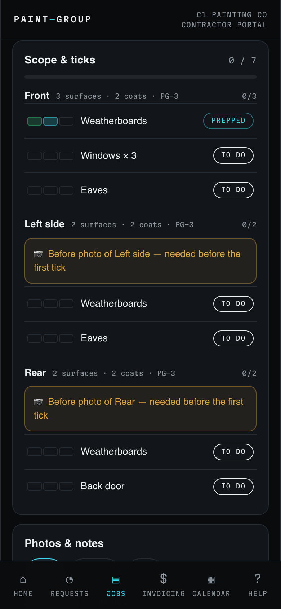
5. When you are about to tick the last surface in an area as done, the list asks for a **finished shot** of that area from the same angle as the before. Take it, then tick. Every area ends up with a before and an after.

### Photos and notes from site
6. **Photos & notes** is for anything else: progress or finished photos not tied to a tick, and a short note for the office. A note is for information that is not a variation, for example something you noticed that is not part of the job.
   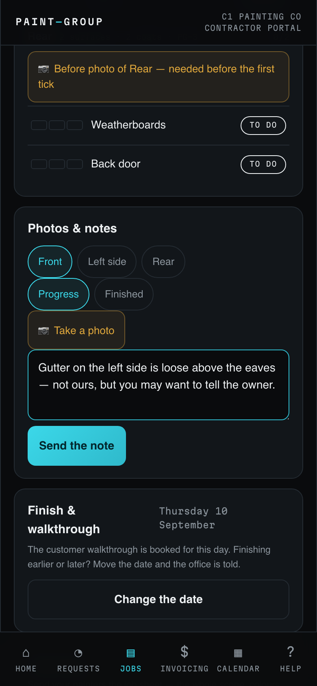

### Found something? Raise a variation
7. Anything not on the job sheet, rot, damage, extra scope or a customer request, goes through **Variations → + FOUND SOMETHING** before you work on it. Pick the category (Rot / substrate, Damage, Extra scope, Customer request), describe it in plain words (the office reads it to the customer), take at least one photo, and add roughly how long it would take. Tap **Send to the office**.
   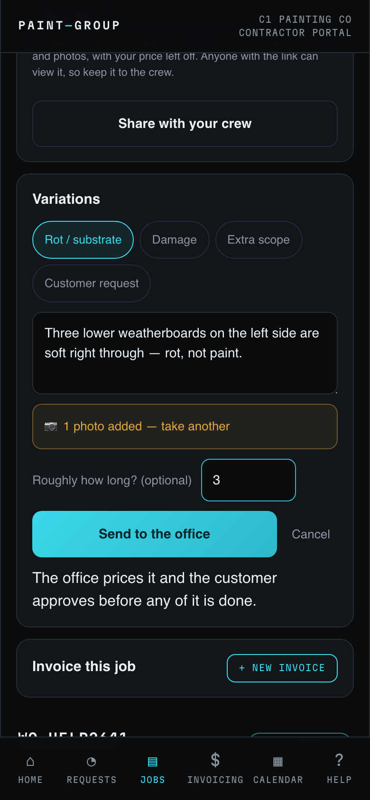
8. The variation shows as **WITH THE OFFICE**. The office prices it and sends it to the customer; nothing on it is to be done until it comes back approved.
   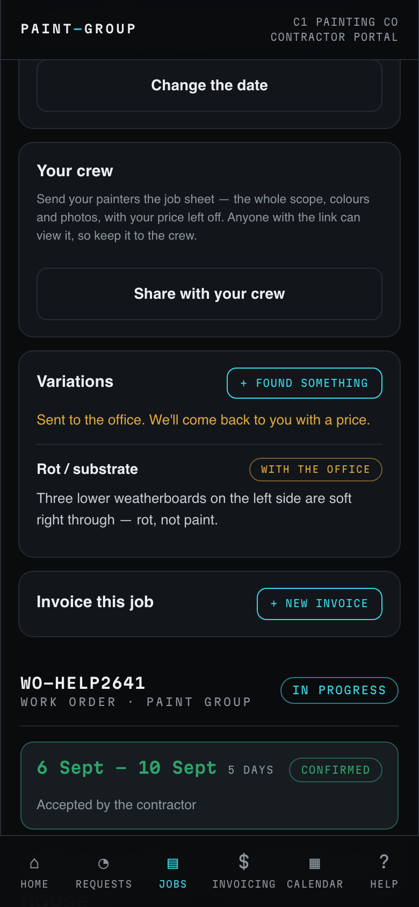
9. When the customer has approved and signed, the variation shows **YOUR APPROVAL** with the extra pay and hours, for example "Accept $180.00 — 3 hrs". Tap to accept: the chip turns green **ACCEPTED**, the card says how much is added to your payment for this job, and the work is now part of the job. A variation that removes scope shows the affected rows struck through with **Removed from scope**; if it affects your pay, you acknowledge it here.
   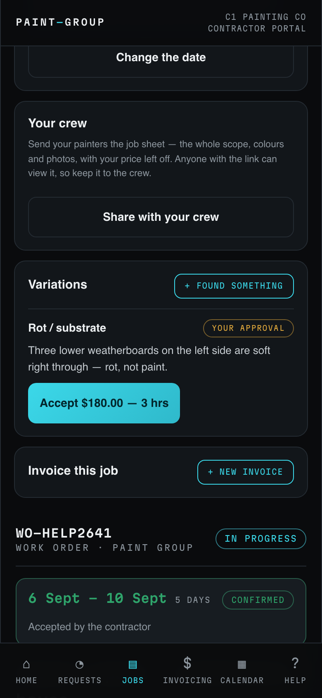

### Finishing up
The second walkthrough film covers this part of the job, from the completion list to the customer's signature:

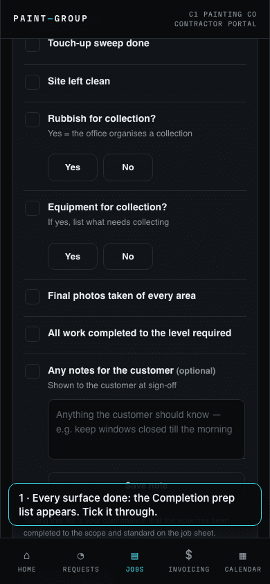

10. When every surface is **DONE**, the **All surfaces done** card and the **Completion prep** list appear on the same screen. Work through it: **Touch-up sweep done**, **Site left clean**, **Rubbish for collection?** (Yes tells the office to organise a collection), **Equipment for collection?** (Yes asks you to list what needs collecting), **Final photos taken of every area**, **All work completed to the level required**, and **Any notes for the customer**, which is optional and is shown to the customer at sign-off. Ticking the list is your confirmation that the work is complete to the job sheet.
    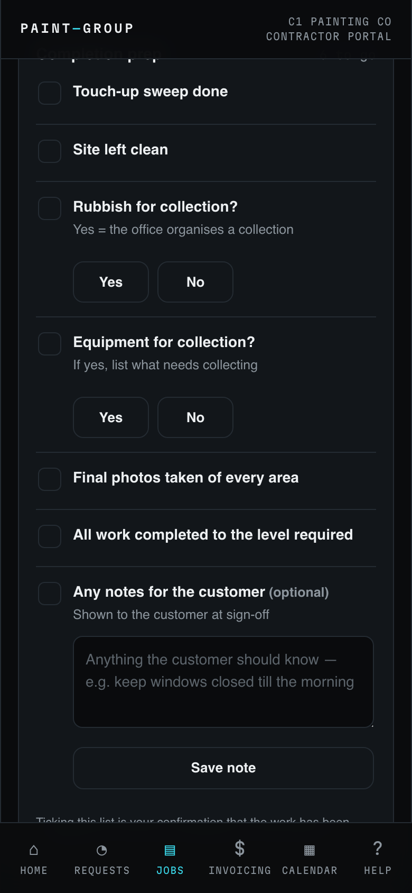
11. Tap **All done — next step**. The job routes itself: to a **quality check** if one is due on this job, straight to the **walkthrough** if not, or to complete if the booking has no customer walkthrough. The message tells you which.
    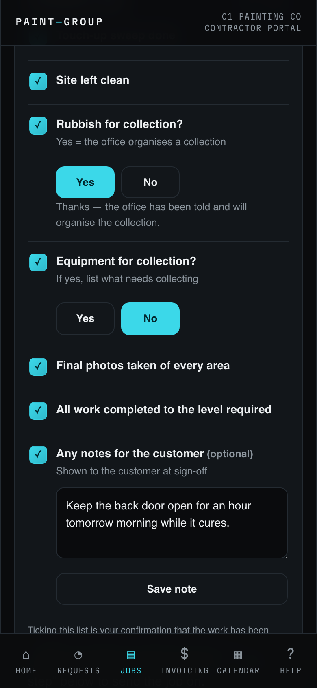

### The quality check
12. If a check is due, the job page shows **Quality check** and says the office is checking before sign-off; there is nothing for you to do unless something comes back to fix.
    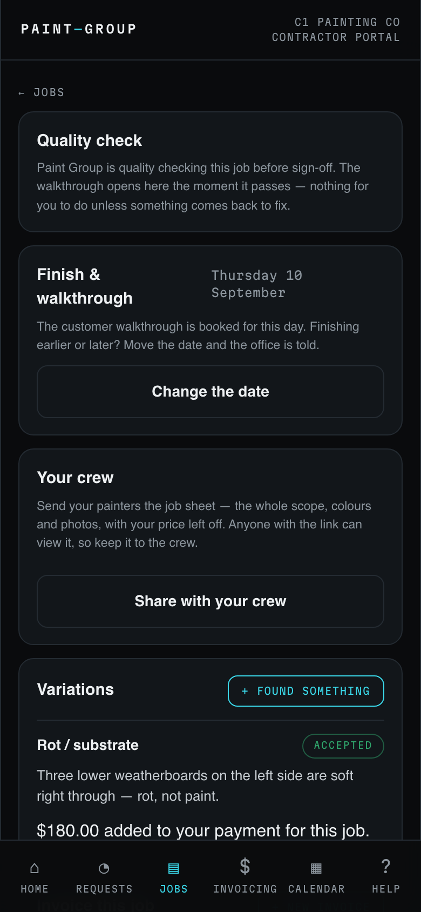
13. If the check finds something, the page shows a red **QUALITY CHECK — AREAS TO PUT RIGHT** card naming the area and what needs doing, with any photos, and the item appears on your tick list with an amber **RECTIFY** chip under that area (marked "raised by QA"). Put it right, tick it done, and tap **All done — next step** again. The job goes back to **Quality check** for the office to look at the fix.
    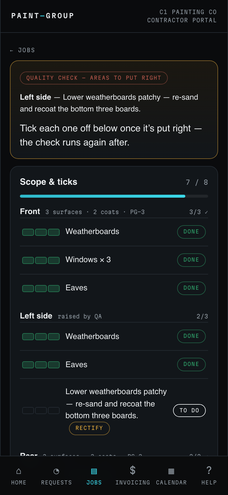
    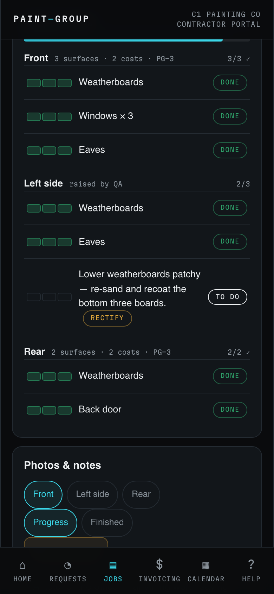

### Walkthrough and sign-off on your phone
14. Once the check passes (or no check was due), **Walkthrough & sign-off** appears with the booked date: "Walk the job with the customer on your phone: they approve each area and sign with their own name, right there." The **Finish & walkthrough** card above it also lists the quality check and its result. With the customer beside you, tap **Start the walkthrough**.
    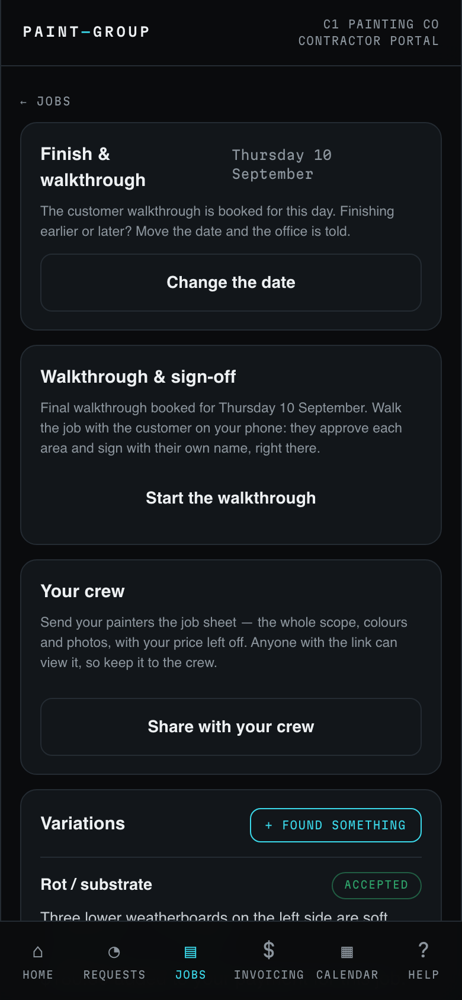
15. Your phone switches to the customer's view, headed **READY FOR YOUR LOOK — Your job is finished**, with your customer note at the top. Hand it over. For each area they tap **Happy with this**, or **Something's not right** and say what they have spotted. The bottom of the page lists what is still to look at.
    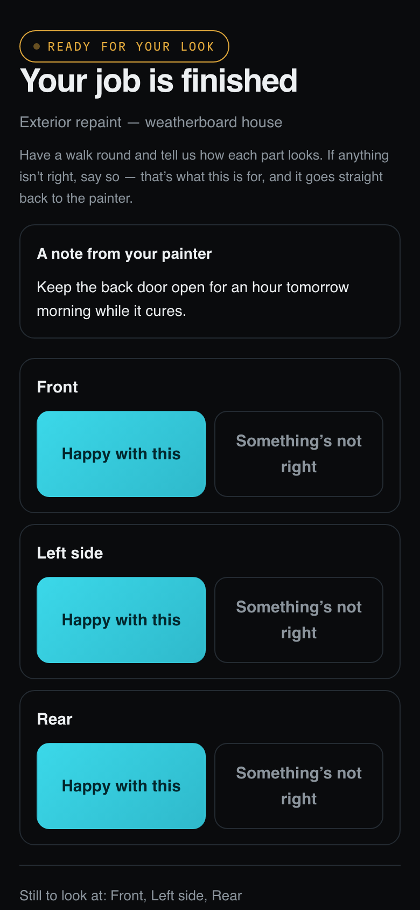
16. When every area shows **HAPPY**, they type their full name and tap **Sign off the job**. The page tells them signing confirms the work is done and starts their two-year warranty. **I'm away at the moment** is for a customer who wants to come back to it later.
    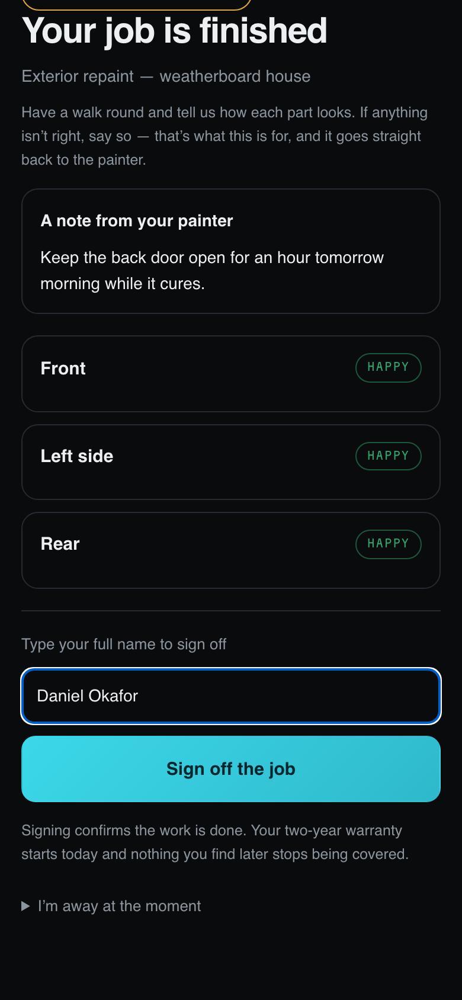
17. The screen reads **Signed off — thank you**, and says the completion report and warranty are on their way. Take your phone back; it returns to the job on its own, or tap **Back to the job**.
    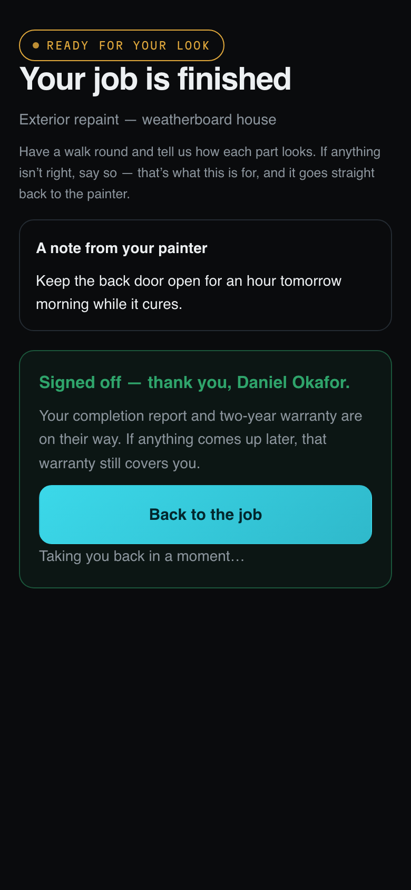
18. The job now reads **Job complete · signed off**, with who signed and when, and the work order header says **COMPLETE**. **Invoice this job** is waiting below (see the invoicing guide). If an area was flagged instead, the job comes back to you as In progress with the flagged area on your tick list, and the walkthrough runs again once it is fixed.
    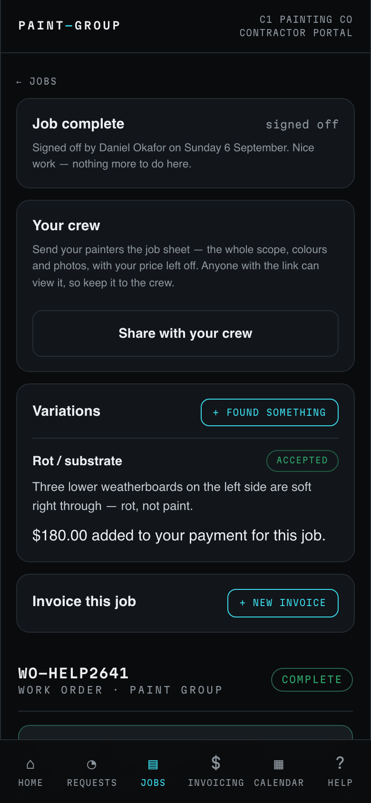

## What the colours and labels mean
- **TO DO / PREPPED / DONE** on a row — not started (grey), prepped (cyan), finished (green).
- **Before photo of … — needed before the first tick** (amber) — the area cannot be ticked until you take it.
- **Rectify** (amber, on a row) — the quality check or the customer flagged this; it needs putting right.
- **WITH THE OFFICE** (amber, on a variation) — raised, not yet priced. **YOUR APPROVAL** (amber) — approved by the customer, waiting on your accept. **ACCEPTED** (green) — part of the job, with the amount added to your payment. **Removed from scope** — struck from the job by a signed credit.
- **Quality check** — the office is checking; **QUALITY CHECK — AREAS TO PUT RIGHT** (red) — something failed and is on your list.
- **HAPPY** (green) / **FLAGGED** (amber) on the customer's walkthrough — approved / needs a fix.
- **IN PROGRESS** on the work order header — the job is live; **COMPLETE** and **Job complete · signed off** — closed.
- **REQUESTED / CONFIRMED** on the booking card — offer waiting on you / booking accepted.

## If something goes wrong
- **"Before photo of … — one shot before you start."** Not an error: tap the amber photo button, take the shot, then tick.
- **The photo did not upload.** "That photo didn't upload — check your signal and try again." Move to better signal and tap the button again; nothing is lost.
- **Start the job is greyed out.** The office has pre-start items still to tick. Ring them if the start date is close.
- **All done — next step does nothing.** A surface is not done, a completion item is unanswered, or a variation you raised is still waiting on a decision. Look for a row that is not green, a question without an answer, or a variation still marked **WITH THE OFFICE** or **YOUR APPROVAL**.
- **The customer is not there for the walkthrough.** Do not sign for them. Tell the office; they can open a remote sign-off for the customer.
- **The job came back as In progress after the walkthrough.** The customer flagged an area. It is on your tick list with what they said; fix it, tick it, and finish again.

## Related
- [Answer a job offer and manage your booked dates](../scheduling/contractor.md)
- [Invoice Paint Group for a job](../self-invoicing/contractor.md)
