## What this is for
Once you have accepted a booking, the job page in **Jobs** is where the work is recorded. You tick each surface as you prep and finish it, photograph before and after, raise anything you find that is not on the job sheet, and finish with a short completion list. Your ticks and photos are what the office and the customer see, so the office writes the customer's progress updates from them. The job ends with the customer approving each area and signing on your phone.

## Before you start
- The job must be booked (you accepted the offer). Until then the job page shows the offer clock, the **Offered amount** and the suburb only.
- The job sheet's facts at the top include **Estimated hours** — the total of every surface's hours allowance, the same figure the office sized the booking from.
- The office works through the **pre-start list** for the job: colours confirmed, materials ordered and so on. Your job page shows how many items are still to be ticked by the office. You cannot start the job until that list is done.
- Photos are taken with your phone's camera from the job page. A big photo is shrunk on your phone before it goes, so it is quick even on one bar of signal. While it goes the button shows a percentage; a photo that does not upload says why ("stalled — nothing moved for 45 seconds", "sign out and back in") and can be retried. Nothing sits on "Uploading…" for ever.
- Any photo on the job sheet can be tapped to see it full size. Swipe left or right, or use the arrows, to move through the set; tap outside the photo to close it.
- Have your crew's phones ready if you want them to see the job sheet: **Your crew → Share with your crew** gives them a read-only link with your price left off.

## Steps

### Starting the job
1. Open **Jobs** and tap the job. At the top, **Ready to start?** shows how many pre-start items the office still has to tick. When the list is done, the **Start the job** button lights up. Tap it on the morning you start; the office is told you are on site. If you do nothing, the job starts itself on its booked date once the list is true.
   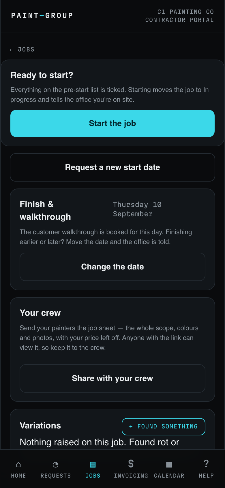

### Ticking surfaces off
1b. While the job is under way you get a text asking you to update your work order — tick what is done and add the day's photos — on day 1 at 7:30 am, then part-way through and on the last day at 3:30 pm (how many depends on the job's length). The link opens this page.
1b-ii. **App updates on this job** lists each reminder moment with its state: **Coming up**, **Due today**, **Answered** (a tick or a photo landed that day), **Missed**, or **No work that day** (the office marked the day as not worked, so it is not counted). If nothing lands you get up to two more texts that day — 10:30 and 1:30 after a morning text, 5:30 and 7:00 after an afternoon one — and never one after 7 pm. One update answers one moment: on a one-day job the morning text and the afternoon text each need their own.
1c. Under each surface there is a **What we expect ›** link. It opens the finish standard for that surface at this job's level (see [the finish standards guide](../standards/contractor.md)). A line with no standard, such as gutters, has no link. The job sheet also says whether the **Tape check** is required: it is not on jobs under 16 hours.
2. **Scope & ticks** lists every area on the job sheet and its surfaces. Each row has three squares: to do, prepped, done. Tap a row once to mark it **PREPPED**, again to mark it **DONE**. The count at the top tracks the whole job.
   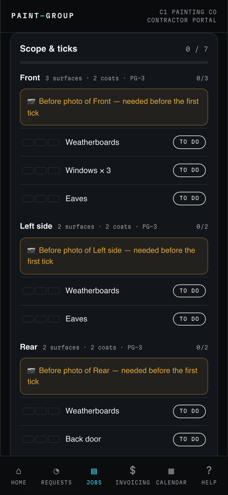
3. **Step 1 · Upload the before photos.** The job runs in four numbered steps, shown across the top of the page. Until the job has its before photos the scope list is locked and says so. Tap the big green **Upload photos** button on the **Step 1 · Before photos** card, pick every before photo at once, camera or library, and they upload the moment you choose them — the button counts "Uploading 3 of 8". A photo that fails stays listed with **Retry**. Take photos of all rooms or all sides, as you found them. Short videos are fine too. The moment they land, every row on the job unlocks. One exception: a row marked **No photos** by the office (a fuel allowance, a set-up line) ticks without any photo and a job made only of such rows asks for nothing.
   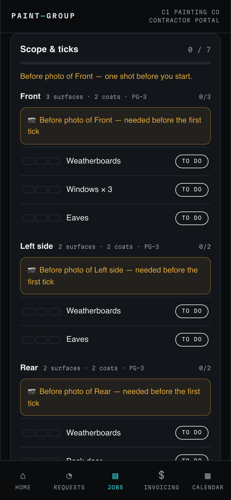
4. Now tick. The row turns cyan **PREPPED** on the first tap and green **DONE** on the second.
   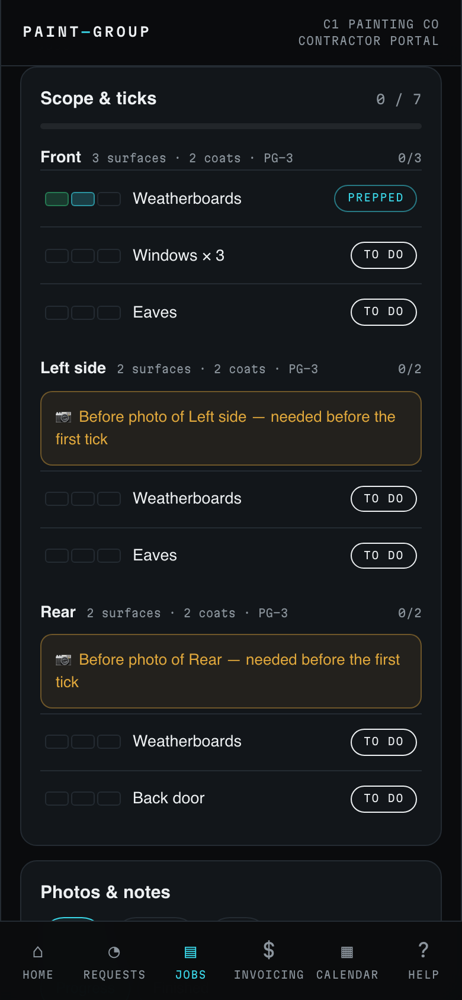
5. **Step 3 · Upload the after photos.** When every surface is **DONE** the **Step 3 · After photos** card appears. Tap the green **Upload photos** button and pick photos of all rooms or all sides now the work is finished, the same views as your before photos where you can; they upload straight away. Nothing asks for a finished shot per area any more; the job asks once. Step 4 stays locked, on your phone and on the server, until these are in.

### Photos and notes from site
6. **Got a question, or found something?** is the card under the steps. It is for questions only: a photo or short video of an item you are unsure about, or something the office should see, with a note. Do not put before or after photos here; those go in Step 1 and Step 3.
   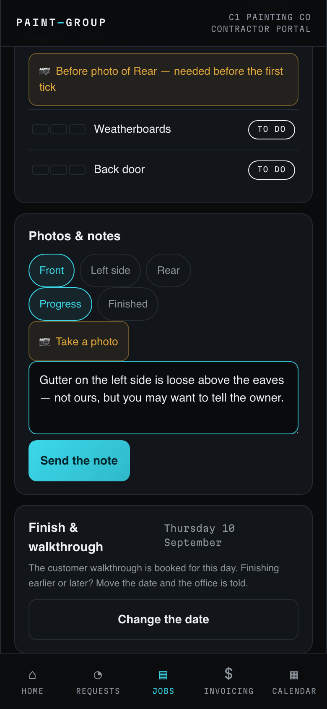

### Found something? Raise a variation
7. Anything not on the job sheet, rot, damage, extra scope or a customer request, goes through **Variations → + FOUND SOMETHING** before you work on it. Pick the category (Rot / substrate, Damage, Extra scope, Customer request), describe it in plain words (the office reads it to the customer), take at least one photo or a short video, and add roughly how long it would take. Tap **Send to the office**.
   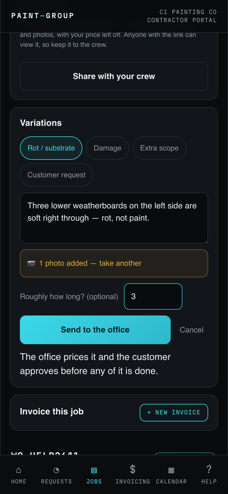
8. The variation shows as **WITH THE OFFICE**. The office prices it and sends it to the customer — the same card then reads **WITH THE CUSTOMER** — and nothing on it is to be done until it comes back approved. You get a text and an email the moment it is approved and waiting on you (make sure the office has your mobile and email). If the office decides it isn't going ahead, the chip reads **NOT GOING AHEAD** with the office's reply underneath, and you get the same reply by text and email. Leave that work as it is.
   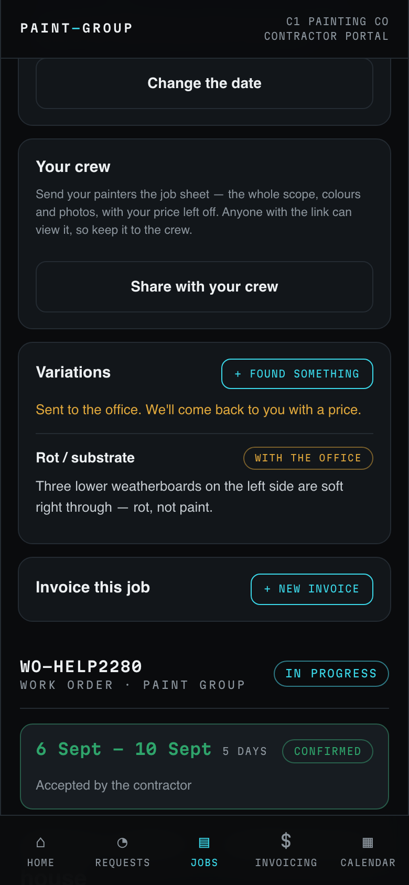
9. When the customer has approved and signed, the variation shows **YOUR APPROVAL** and, under it, **Variation approved by the client** with the extra pay and the estimated hours. Tap the big **Accept $180.00 — 3 hrs** button: the chip turns green **ACCEPTED**, the card says how much is added to your payment for this job, and the work is now part of the job. If the hours or the amount do not work for you, tap the small **Decline** underneath, write what would need to change in the box ("Please advise us of any further changes") and **Send to the office**. The chip reads **DECLINED — WITH THE OFFICE**; the office rings you or sends a revised change, and nothing on it is to be done until then. A variation that removes scope shows the affected rows struck through with **Removed from scope**; if it affects your pay, you acknowledge it here.
   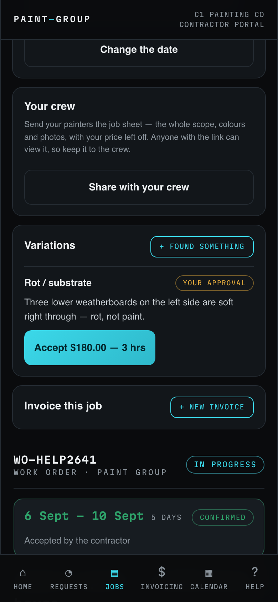

### Changes to the scope on the job sheet
10. The office can change a job's scope with the customer after the job sheet was issued. Every change the customer has signed appears on your job sheet under **Changes to the scope**: **Added** with the work and roughly how many hours, or **Removed** (its rows are also struck through above). A change the office made with the customer **before you were on the job** is **In the job** the moment the customer signs it: nothing for you to accept. A change the customer signs **while you are on the job** comes to you in **Variations** as **Variation approved by the client**, with the amount and hours, for your Accept or Decline (step 9) — since 7 Oct 2026 you are asked, not told. There is never a customer price on it.
    Approved work is also on your tick list. A new area from the office appears under its own heading with a row per surface; a variation you raised appears under **Variations** in your own words. Tick them like any other row — they count in the job's progress, need a before photo like any heading, and the job cannot finish until they are done. A row for a signed removal stays struck through.
11. If the changes were signed before the job was offered to you, they are already in the job: the sheet lists them as **In the job**, and **Your price** on the offer and the job already includes them — the **Payment** line reads "Fixed price incl. approved changes". Nothing to accept.

### Finishing up
The second walkthrough film covers this part of the job, from the completion list to the customer's signature:

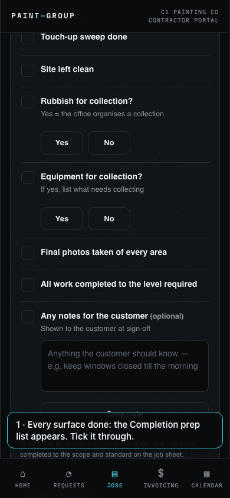

10. When every surface is **DONE** and the after photos are in, the **Step 4 · Finish the job** card and the **Completion prep** list appear on the same screen. Work through it: **Touch-up sweep done**, **Site left clean**, **Rubbish for collection?** (Yes tells the office to organise a collection), **Equipment for collection?** (Yes asks you to list what needs collecting), **Final photos taken of every area**, **All work completed to the level required**, and **Any notes for the customer**, which is optional and is shown to the customer at sign-off. Ticking the list is your confirmation that the work is complete to the job sheet.
    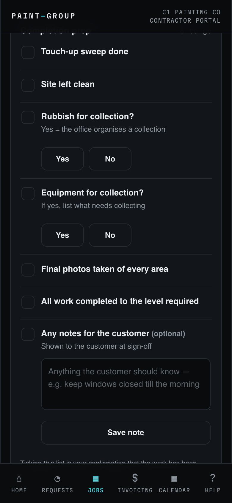
11. Tap **All done — next step**. The job routes itself: to a **quality check** if one is due on this job, straight to the **walkthrough** if not, or to complete if the booking has no customer walkthrough. The message tells you which.
    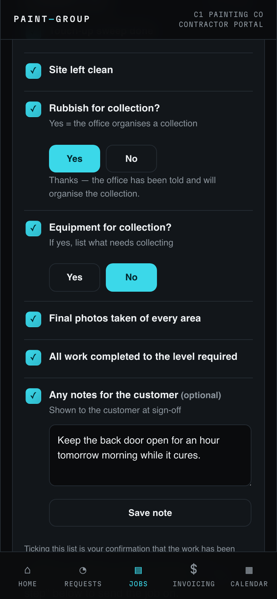
12. The same moment every surface is done, an **ALL SURFACES DONE · Start the walkthrough** bar pins itself under the Paint Group header and stays there while you scroll. It is the same next step as the card, one tap from anywhere on the page: it finishes the job, and if no quality check is due it opens the walkthrough straight away. While finishing-up items are still unticked the bar says how many are left, and the tap is refused until they are done.

### The quality check
13. If a check is due, the job page shows **Quality check** and says the office is checking before sign-off; there is nothing for you to do unless something comes back to fix. A job that has been quality checked is signed off by the office, not at a walkthrough on your phone: once it passes the page reads **Quality check passed — Paint Group signs this job off from the office**, and the job reads complete when they do.
    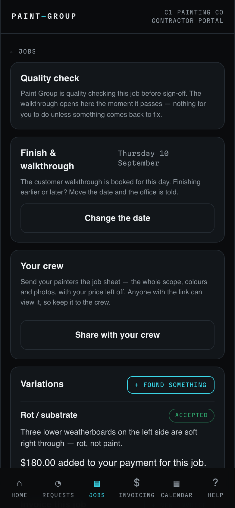
14. If the check finds something, the page shows a red **QUALITY CHECK — AREAS TO PUT RIGHT** card naming the area and what needs doing, with any photos, and the item appears on your tick list with an amber **RECTIFY** chip under that area (marked "raised by QA"). Put it right, tick it done, and tap **All done — next step** again. The job goes back to **Quality check** for the office to look at the fix.
    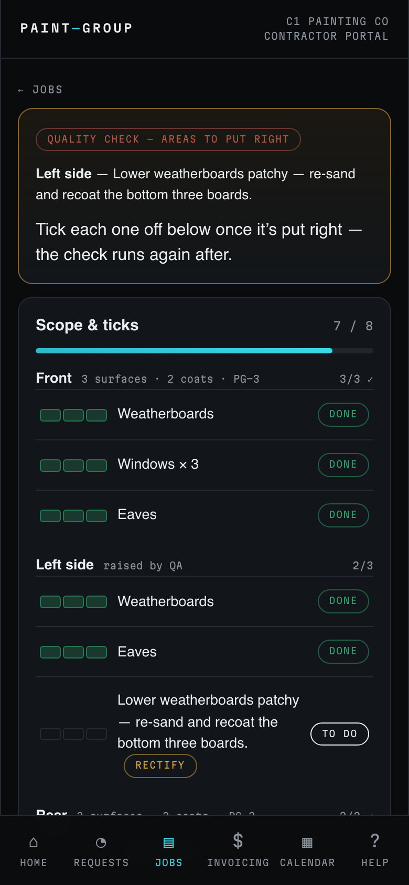
    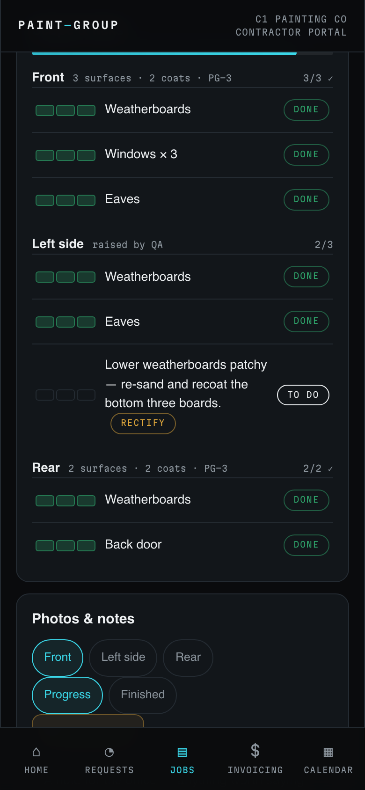

### Walkthrough and sign-off on your phone
15. When no check was due, **Walkthrough & sign-off** appears with the booked date: "Walk the job with the customer on your phone: they approve each area and sign in the box, right there." The **Finish & walkthrough** card above it also lists the quality check and its result. The pinned bar at the top now reads **READY TO SIGN OFF** and carries the same button, so you do not have to scroll to the card. With the customer beside you, tap **Start the walkthrough** on either.
    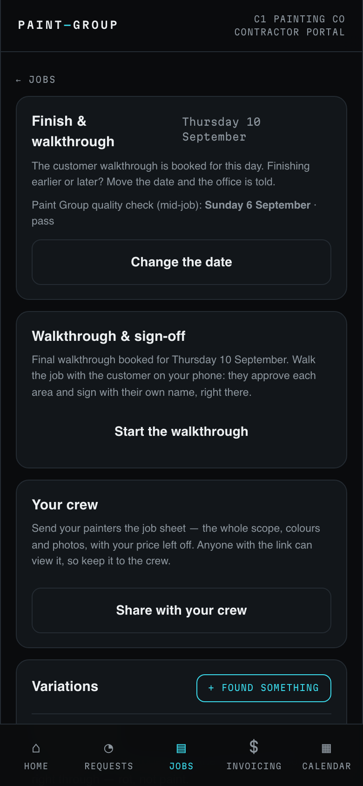
16. Your phone switches to the customer's view, headed **READY FOR YOUR LOOK — Your job is finished**, with your customer note at the top. Hand it over. For each area they tap **Happy with this**, or **Something's not right** and say what they have spotted. The bottom of the page lists what is still to look at.
    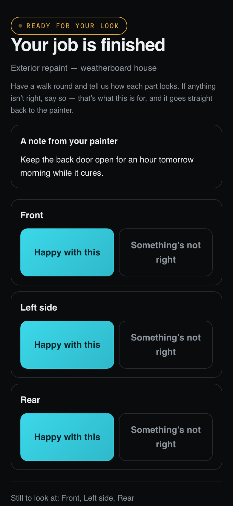
17. When every area shows **HAPPY**, they sign in the signature box (there is nothing to type — the sign-off is recorded in the name the job was booked under) and tap **Sign off the job**. The page tells them signing confirms the work is done and starts their two-year warranty. **I'm away at the moment** is for a customer who wants to come back to it later.
    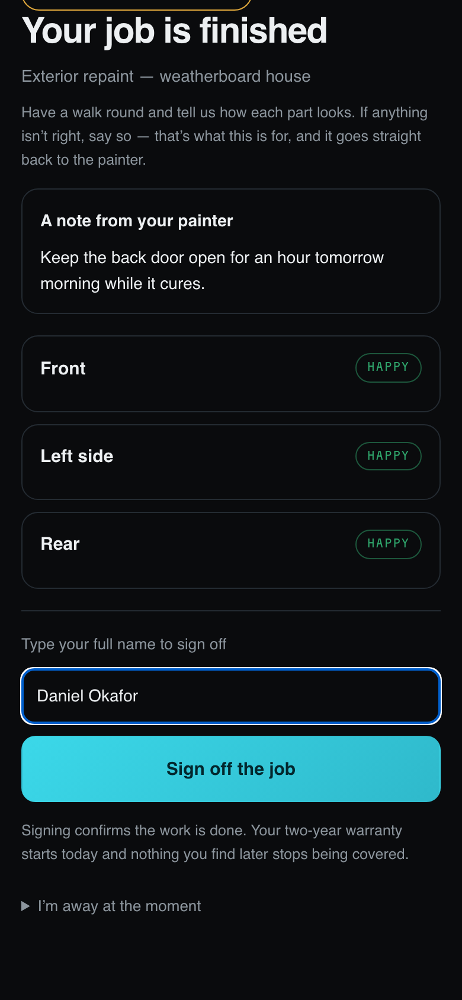
18. The screen reads **Signed off — thank you**, and says the completion report and warranty are on their way. Take your phone back; it returns to the job on its own, or tap **Back to the job**.
    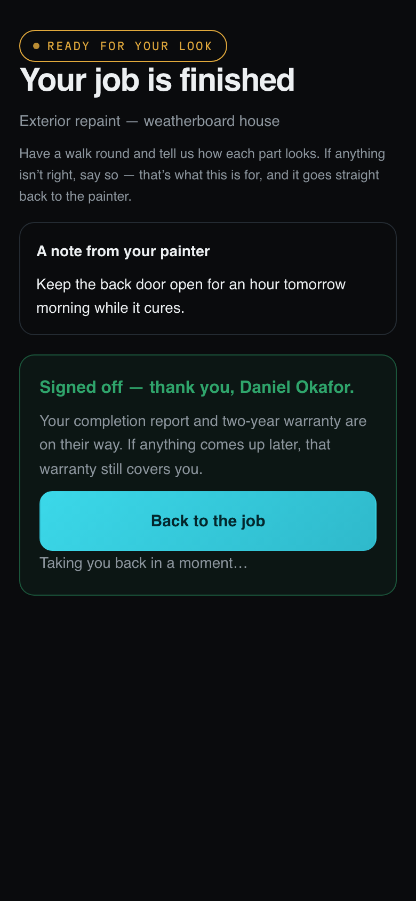
19. The job now reads **Job complete · signed off**, with who signed and when, and the work order header says **COMPLETE**. **Invoice this job** is waiting below (see the invoicing guide). If an area was flagged instead, the job comes back to you as In progress with the flagged area on your tick list — see the next step.
20. **A flagged area, put right.** The customer's flag sits on your tick list as a **RECTIFY** row with what they said. Fix it, add an after photo of it (Step 3's card, **add more**), and tick it. The pinned bar at the top now reads **FLAGGED AREAS PUT RIGHT · Fixed — send the report**, and the card below says the same. One tap completes the job: the customer is emailed their completion report with a **What you flagged, and what we did** section, their two-year warranty starts, and the job reads **Job complete**. There is no second walkthrough — they already looked at everything and told you what was wrong.
    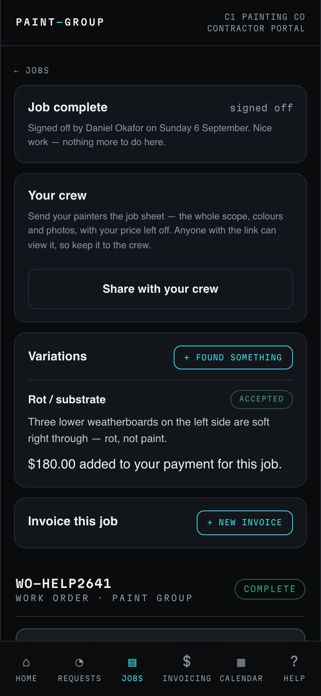

## How long were you on site (some painters only)
If the office has switched it on for you, the **All surfaces done** card asks **How long were you on site?** before the job moves on — days on site and hours in total, pre-filled from your booking. Change it to what actually happened. It goes on your invoice as a note ("Time on site — as entered by the painter") and it never changes what you are paid. Tick **Skip** to leave it and the booked days are used instead. If you never see the question, it is not switched on for you — nothing to do.

### Photos from the office
Near the top of the job sheet, above the scope, a **From the office** section holds photos we have attached for you — the elevation the scaffold goes on, where the gear lives, the colour to match. Each one says which area it belongs to, or **Whole job** when it is about the site generally, with a line about what to notice. Tap one to see it full size.

On a job that came to us from PaintScout these are often the only photos of the job, so it is worth a look before you start. They can be added or changed after you accept, so check again on the morning.

They are separate from your own photos: your before, progress and completion shots stay under **Site photos** and are yours. Nothing you upload appears in **From the office**. The same section is on the crew link you hand to your painters, so they see the office's photos without needing your login.

## What the colours and labels mean
- **TO DO / PREPPED / DONE** on a row — not started (grey), prepped (cyan), finished (green).
- **PG-2 Utility / PG-3 Premium / PG-4 Showcase** at the top of the job sheet — the standard this job is being done to, and what the walkthrough judges the work against. Tap it for the prep and the acceptance test at that level. An area shown with its own level beside it is a deliberate exception and overrides the job's. The office can correct the level after a job has gone out, so if it changes between the offer and the start, the new one is what you are held to — the job sheet always shows the current standard.
- **🔒 Locked until Step 1** — the scope cannot be ticked until the before photos are uploaded. **🔒 Step 3 first** on the finish card means the after photos are still to come.
- **Rectify** (amber, on a row) — the quality check or the customer flagged this; it needs putting right.
- **WITH THE OFFICE** (amber, on a variation) — raised, not yet priced. **YOUR APPROVAL** (amber) — a variation you raised, approved by the customer, waiting on your accept. **ACCEPTED** (green) — part of the job, with the amount added to your payment; a change the office made with the customer arrives already green. **Removed from scope** — struck from the job by a signed credit.
- **Quality check** — the office is checking; **QUALITY CHECK — AREAS TO PUT RIGHT** (red) — something failed and is on your list.
- **HAPPY** (green) / **FLAGGED** (amber) on the customer's walkthrough — approved / needs a fix.
- **IN PROGRESS** on the work order header — the job is live; **COMPLETE** and **Job complete · signed off** — closed.
- **REQUESTED / CONFIRMED** on the booking card — offer waiting on you / booking accepted.

## If something goes wrong
- **"Step 1 first — upload the before photos, then every row unlocks."** Not an error: tap the green Upload photos button on the Step 1 card, pick the photos, then tick.
- **The photo did not upload.** "That photo didn't upload — check your signal and try again." Move to better signal and tap the button again; nothing is lost.
- **Start the job is greyed out.** The office has pre-start items still to tick. Ring them if the start date is close.
- **The card says the office has not set the pre-start list up yet.** The list is missing on this job rather than unfinished. Ring the office — the job cannot start until it is there.
- **All done — next step does nothing.** A surface is not done, a completion item is unanswered, or a variation you raised is still waiting on a decision. Look for a row that is not green, a question without an answer, or a variation still marked **WITH THE OFFICE** or **YOUR APPROVAL**.
- **The customer flagged an area, then tapped Happy with this straight after.** That withdraws the flag: the rectify row disappears from your list, the job returns to the walkthrough, and they can sign as normal. If they had flagged something you had already put right, that row stays on the record.
- **The customer is not there for the walkthrough.** Do not sign for them. Tell the office; they can open a remote sign-off for the customer.
- **The job came back as In progress after the walkthrough.** The customer flagged an area. It is on your tick list with what they said; fix it, tick it, and tap **Fixed — send the report** on the bar at the top. The job completes and the customer gets the report — no second walkthrough.

## Related
- [Answer a job offer and manage your booked dates](../scheduling/contractor.md)
- [Invoice Paint Group for a job](../self-invoicing/contractor.md)
