## What this is for
The PC console (**Projects** in the sidebar) reads every open work order and tells you what needs a person. Jobs move through six stages: **01 Offer → 02 Pre-start → 03 In progress → 04 Quality check → 05 Walkthrough → 06 Closed — final invoice sent**. Nothing moves by typing a status: each move has a gate, and the console shows you the gate that is holding a job. Your work is the pre-start list, pricing variations, approving the customer updates drafted from the painter's ticks, quality checks, and the sign-off.

## Before you start
- A job appears in the console once its estimate is accepted and the work order issued. Booking it is done on the **Schedule** tab (see the scheduling guide).
- Colours must be confirmed on the job sheet before materials can be ordered, and the pre-start list must be true before a job can start. The console tells you both.
- The customer's variation approval is by signature on a link you send them; the painter never sees the customer's price.

## Steps

### Reading the console
1. Open **Projects**. The **Dashboard** shows four tiles: **ON THE BOOKS**, **CRITICAL** (SLA breach, silent site), **WAITING ON YOU** (price, colours, nudge, drafts) and **SIGNED OFF THIS WEEK**. Below them, **Needs you now** is the queue, ranked worst first. Each card names the job, says what is wrong and offers one action, for example **Open**, **Ring them**, **Price it**, **Review**. The cross dismisses a card you have dealt with outside the system.
   
2. **Project progress** shows the six lanes with every open job as a card: reference, contractor, contract value and tick progress, plus **COLOURS TBC**, **WAITING** or **BLOCKED** where a gate is holding it.
   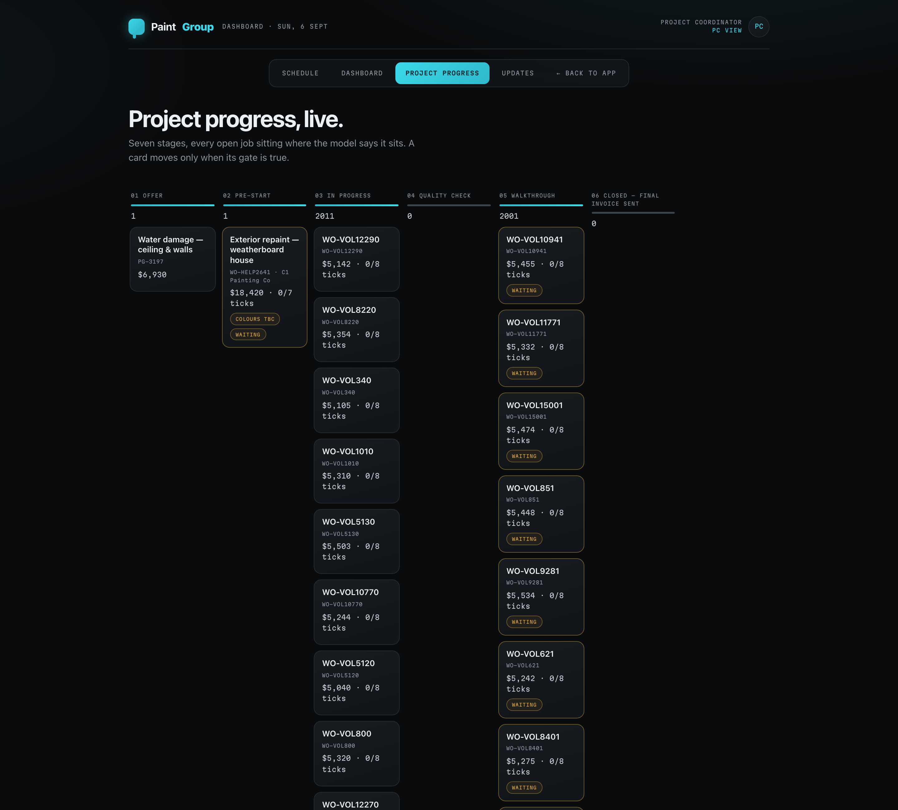
3. Open a job. The header carries the stage rail, the money line (contract inc GST, variations, contractor pay, estimated GP, deposit) and the view switch: **PC view**, **Painter's view** (the same tick list the painter sees, which you can tick on their behalf), **Edit job sheet**, **Revise scope**, **Money view**.
   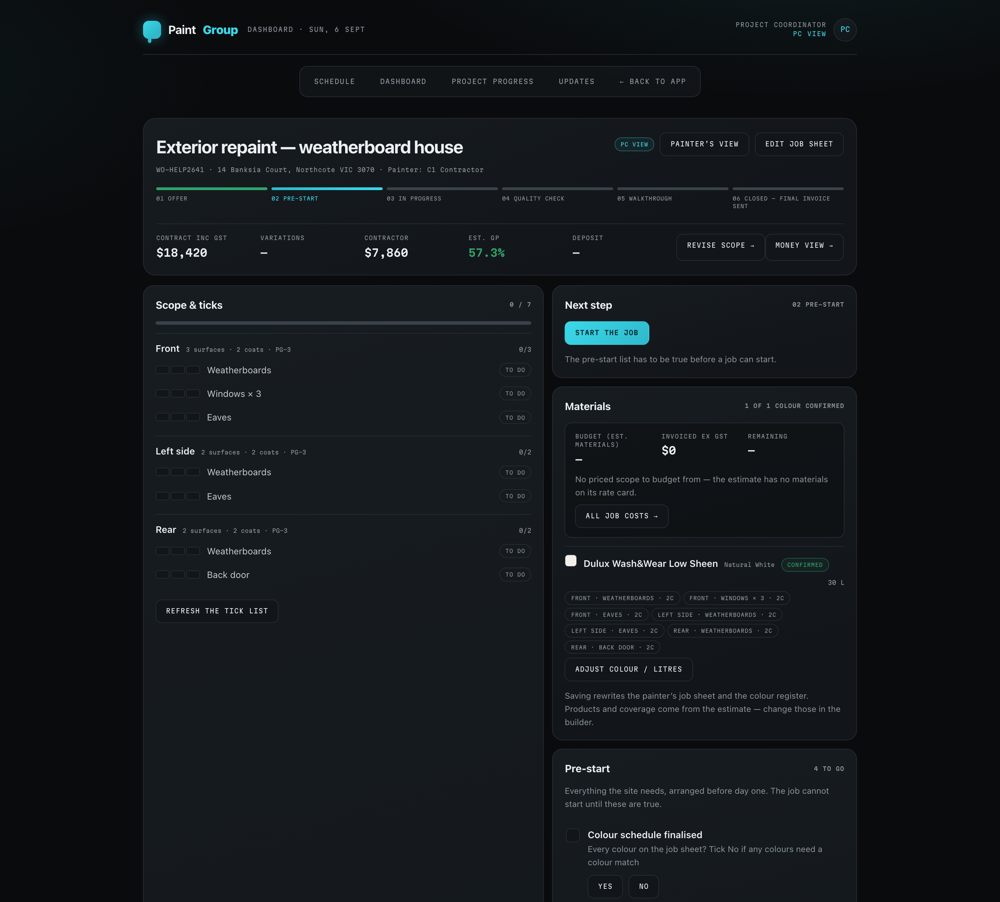

### Pre-start
4. Scroll to the **Pre-start** card (the counter reads **N TO GO**, then **ALL DONE**). It is the same card whether the job is **offered** to a contractor or **assigned** to an employee — the list belongs to the job, not to who is painting it, and it is built the moment the job is issued and again when a painter goes on it. Answer **Colour schedule finalised** with **Yes**, or **No** if any colour still needs a colour match, then tick **Materials ordered** (it needs the colours first), **Equipment movements booked** and **Access details recorded**. **Pre-start checklist** and **SWMS / induction attached** are optional on a residential job; ticking the first emails the customer the pre-start checklist, and the second is required on commercial and body corporate jobs. An item that ticks itself is marked **auto**.
   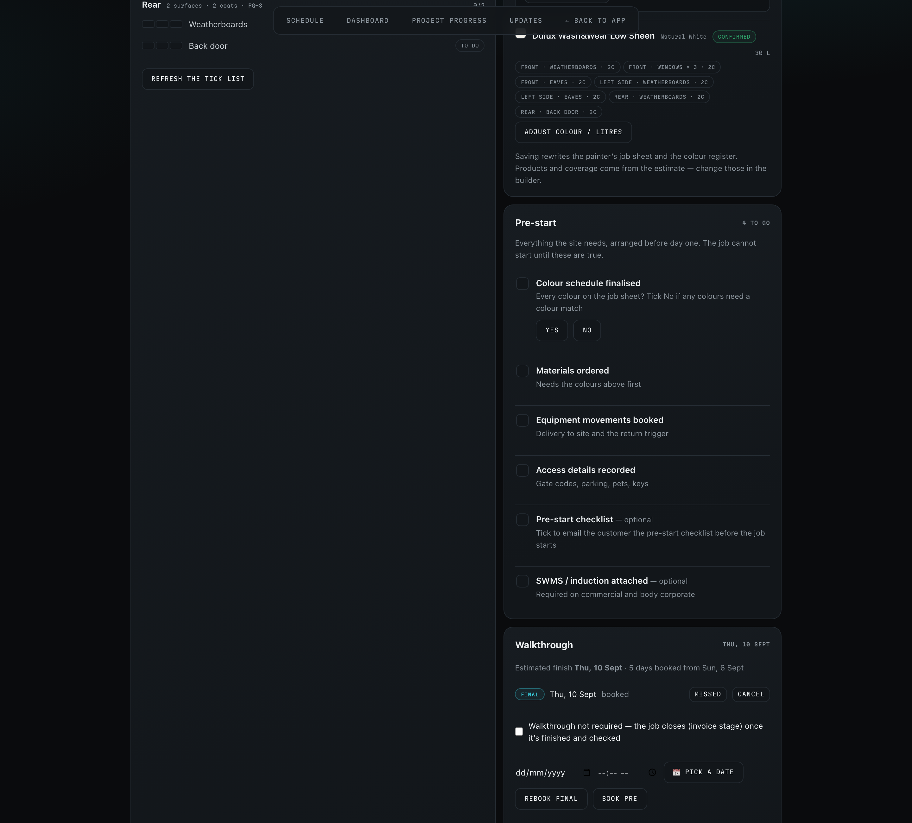
5. When the card reads **ALL DONE** the job can start. Further down, under the job facts, tick **Quality check required** if this job needs a check regardless of the contractor's record (a new contractor's first three jobs get one automatically); **Add a mid-job check** schedules an extra one for a date you choose.
   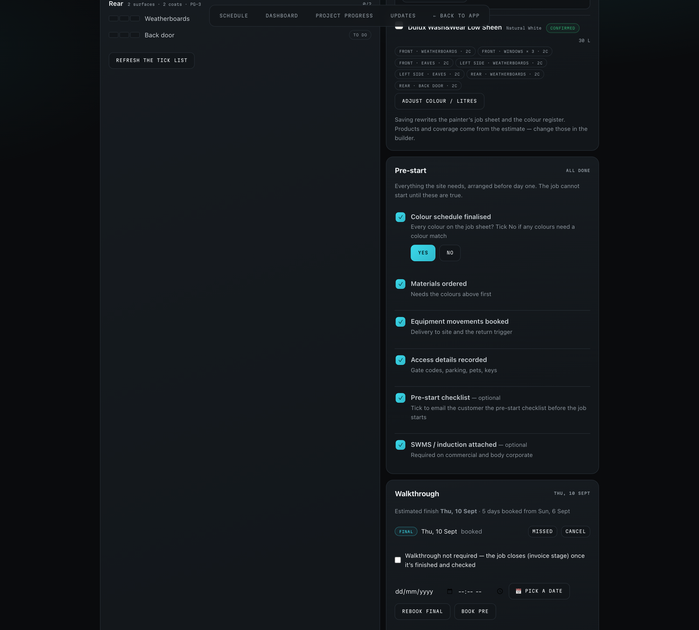
6. **Next step** offers **Start the job** once the list is true, with the gate's wording underneath while it is not. You can start early; the console warns that starting moves the start date to today and asks you to press again. Otherwise the job starts itself on its booked date once the list is done.
   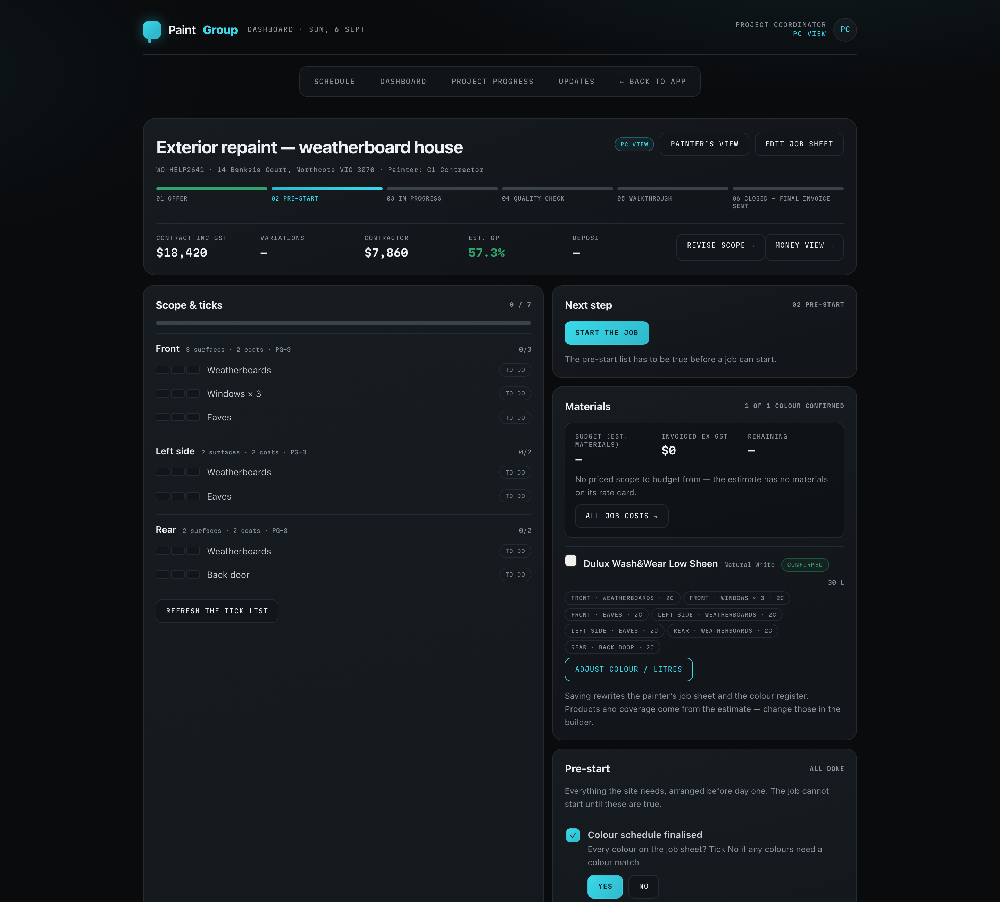
7. At **03 In progress** the **Scope & ticks** card shows the painter's list live, with the amber before-photo prompts until each area has its photo.
   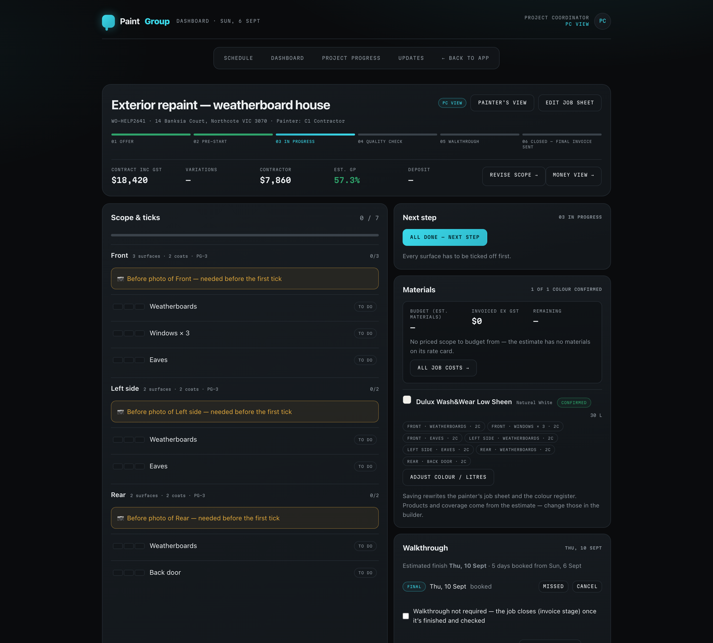

### Photos for the painter
The **Photos for the painter** card on the job page is how you put a picture in front of whoever is doing the work: the elevation the scaffold goes on, where the gear lives, the colour to match, the bit of the brief a sentence never quite carries.

Pick the area it belongs to (or leave it on **Whole job**), type what the painter should notice, and choose the file. It appears on their job sheet under **From the office**, above the scope, the moment it uploads — on their phone, in the portal, and on the job-sheet link.

This matters most on a **handover job from PaintScout**. Those come in without any of the estimator's photos, and the sheet's own photos are frozen at acceptance, so before this there was nothing to show the painter at all. On those jobs these are the only pictures of the job there are.

**Remove** takes one back off the sheet. It only ever removes photos the office added: the painter's own before, progress, quality-check and completion shots are their record of the work and the button cannot touch them — they live further down under **Site photos**.

**Painter's view** on the job page shows the sheet exactly as the painter has it, photos included — check there rather than the builder's job-sheet tab, which is the office's copy.

A caption is worth writing. "Scaffold this side" on the right elevation saves a phone call; an uncaptioned photo makes the painter guess what they are looking at.

The card disappears once a job is closed — a closed job's sheet is final.

### The level of finish on a job that is already out
The **Level of finish** card on the job page says which PG standard this job sheet holds the painter to — **PG-2 Utility**, **PG-3 Premium** or **PG-4 Showcase** — and, in brackets, the level the job was priced at.

Those two can disagree. The level is frozen onto the job sheet when the job is issued, and changing it in the revision builder moves the **money** without touching the sheet: the painter goes on reading the standard the job went out with. That is what this card is for. Pick the level the job is actually being done to and **Save to the job sheet**; the painter's copy, the offer and the portal all change straight away.

Two things it deliberately does not do. **It does not change the price** — the level multiplier is priced and signed as a variation in **Revise scope**, so correcting the sheet here and sending the variation there are two separate jobs, and both need doing. And it leaves any area that carries a level of its own alone: the card names those areas before you save, and everything else follows the job. If an area was pinned to the level you are now moving the whole job to, it stops reading as an exception.

**Level 1** is not offered. It has no contractor standard, and calling a Level 1 job PG-2 would hold a painter to more prep than the customer paid for.

The card disappears once a job is closed — a closed job's sheet is final.

### Variations for approval
The Dashboard's second section, **Variations for approval**, lists every open variation across every job: the ones **waiting on you** (raised, no price yet — amber, **Price it**) first, then those priced and waiting on the customer, then those the customer has approved and the painter has not yet accepted. The heading counts them ("3 open · 1 waiting on you"); each row names the category, the amount once priced, the job and the painter's words, and opens the variation on the job page. A declined, cancelled or accepted variation leaves the list on its own.

### Pricing a variation
8. A raised variation appears on the job as a card with a five-step rail: **RAISED → PRICED → CUSTOMER → CONTRACTOR → WORK**, the painter's words, their photo and their hours estimate. It also lands in the queue as **Variation waiting on a price**. Choose **Price it in the builder — working scope** for anything with materials or several lines, **Quick price — hours only** for a small labour-only item, or **Approve for the contractor only — no charge to the client** when Paint Group is absorbing it.
   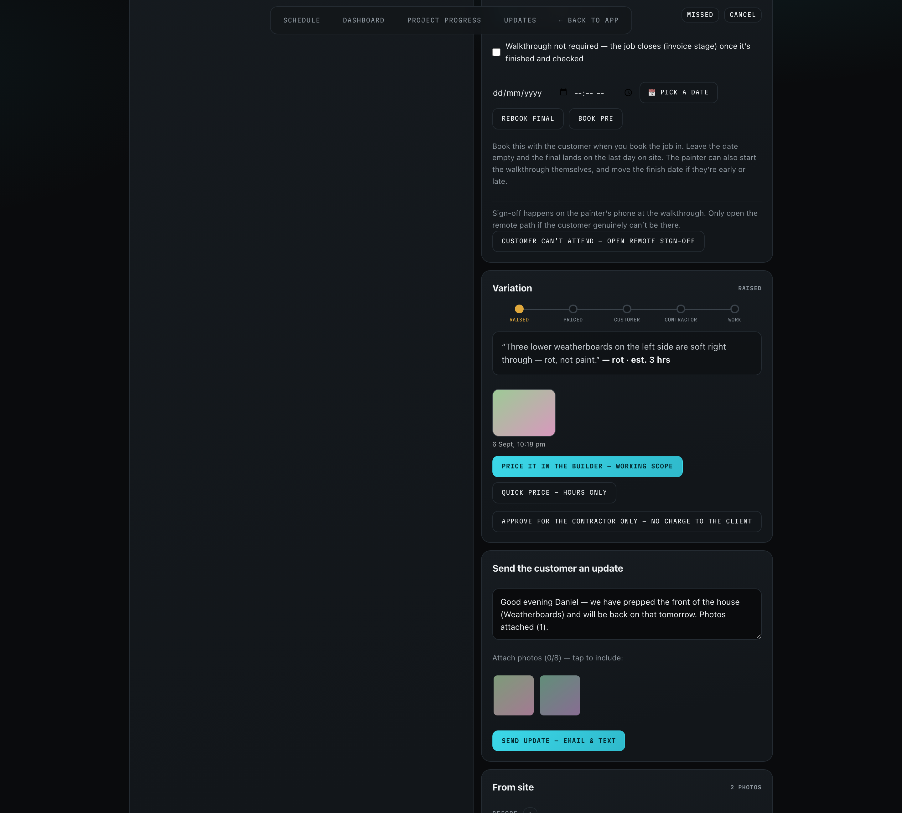
9. Quick price: enter the hours and any materials. The preview shows the customer price from the pricing engine and the contractor's amount.
   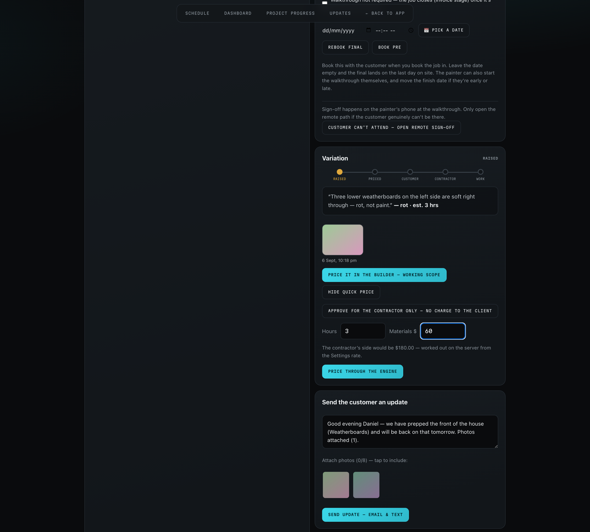
10. Priced, the card reads "with the customer" with the amount, and the signing link has been emailed. **Text the link** or **Both** if the customer prefers. **Set contractor amount** overrides what the painter receives. The queue card **Variation priced, customer silent** appears if they do not answer.
    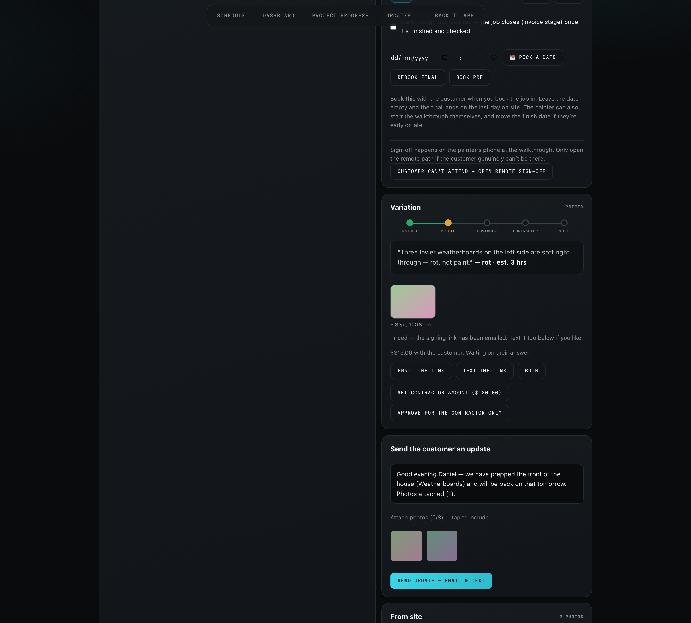
11. The customer approves by signing the link. Under **Settings → Automations**, "Approved variations go straight to the painter" is on by default, so the painter sees it as **YOUR APPROVAL** straight away and accepts; the rail reaches **CONTRACTOR** then **WORK**. If that automation is off, a **Release** step appears here for you. A removal signed after work started raises **Pay adjustment needs you**: enter the deduction and why; the painter sees your note.

### Customer updates from the painter's ticks
12. Each day's ticks and photos become a drafted customer update. **Updates** lists **Updates waiting on you**; read it, edit if needed, then **Approve & send**. Nothing goes to the customer until a person approves it. On the job page, **Send the customer an update** comes pre-written from the latest ticks with the site photos ready to attach; edit the words and tap **Send update — email & text**.
    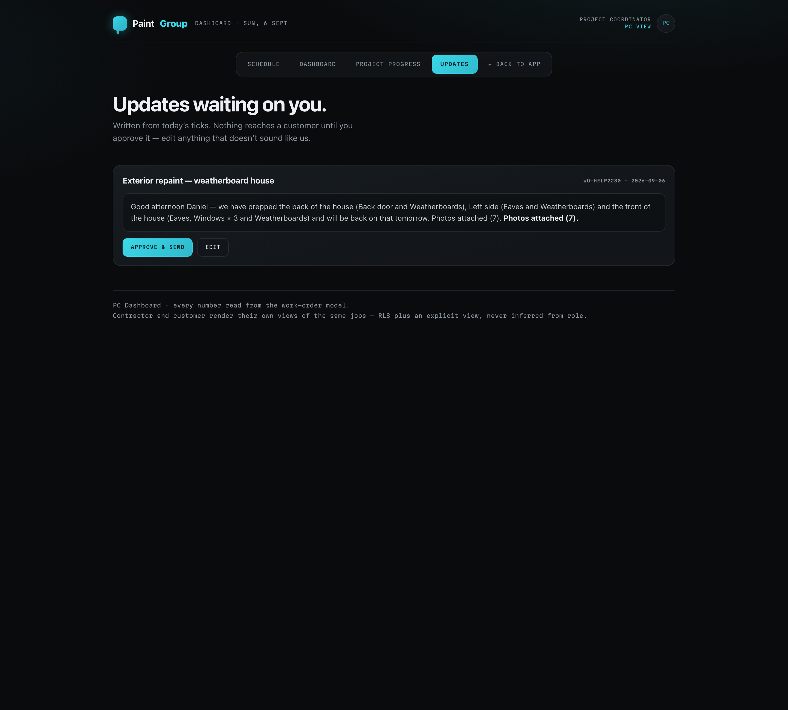

### Quality check
13. When the painter taps **All done — next step**, the server routes the job: to **04 Quality check** if a check is due, otherwise straight to the walkthrough. Checks are due on a new contractor's first three jobs, on any job where you ticked **Quality check required**, and for any mid-job check you added. The check appears on the job as a **Quality check** card ("Photo-logged against the standards. Every line looked at before a pass.") with the four standards: **Cut lines**, **Coverage**, **Prep evidence**, **Site**. The queue says **Quality check to do**. Tick each standard as you inspect it; the pass button reads **N standards to check** until all are ticked.
    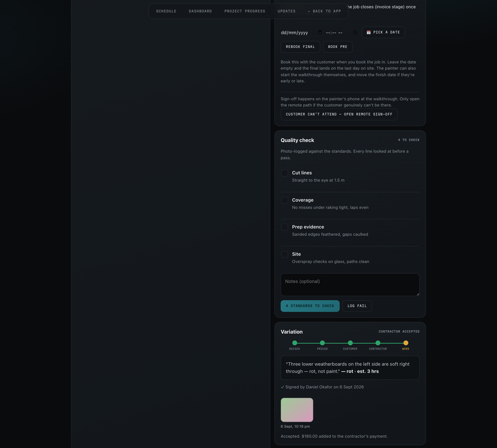
14. To fail it, tap **Log fail**, enter **Where** (the area) and what needs putting right, add **Photos of where it failed — show the painter**, and tap **Log fail — raise rectification**. The check is logged **FAIL**, the job returns to **03 In progress**, and the item lands on the painter's tick list marked **Rectify** under the area you named. The failed card stays on the page as the record — **Logged: FAIL · re-check scheduled** — and Job facts lists the re-check as **due**.
    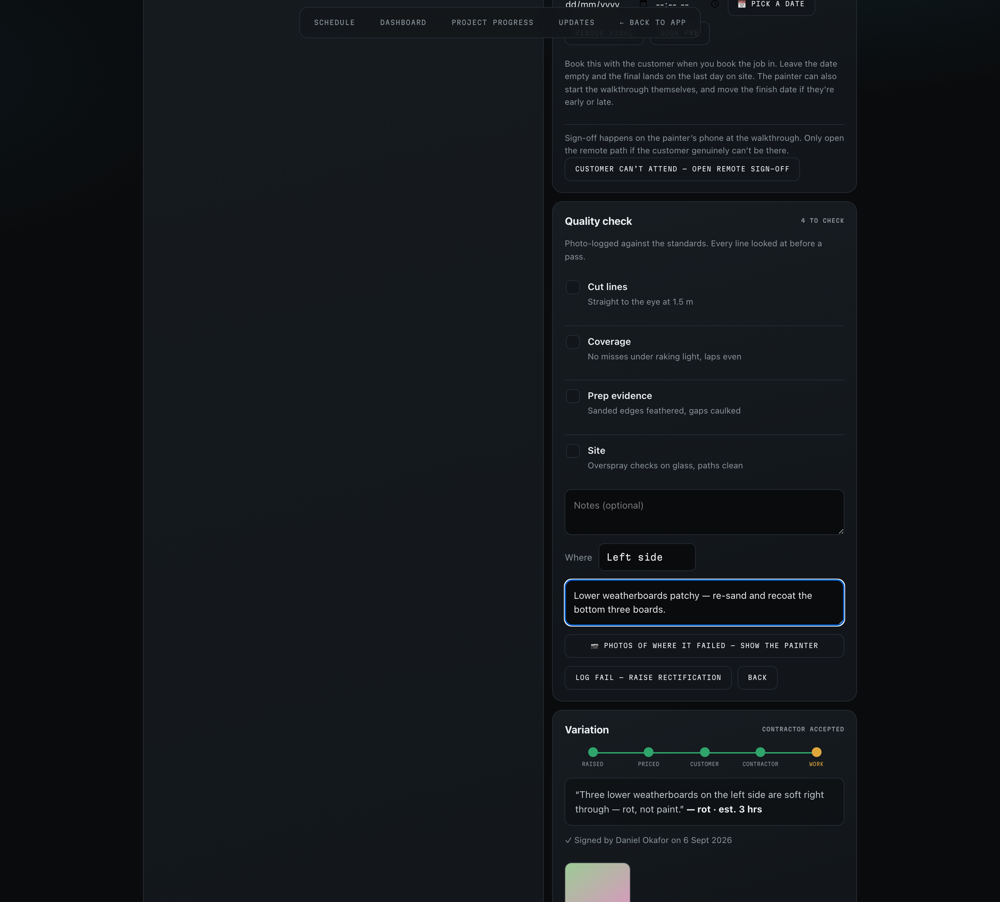
15. When the painter has put it right and finished again, the job comes back to **04 Quality check** with two cards: the failed check, still **Logged: FAIL** with no buttons, and a fresh **Quality check re-check** card with all four standards unticked. Work the re-check card: tick each standard as you inspect the fix; when every one is ticked it reads **READY TO LOG**; add a note and tap **Log check — PASS**. (**Add a mid-job check** is for an extra inspection, not for this — the re-check is scheduled by the fail itself.)
    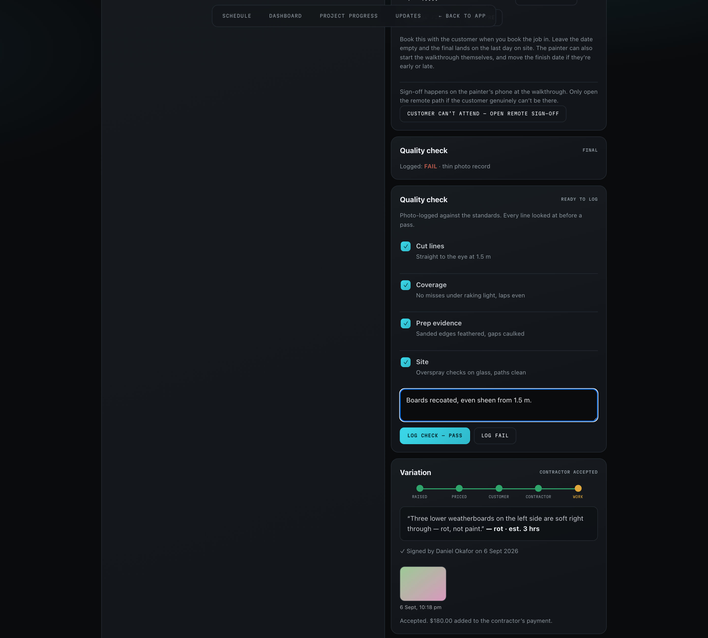
16. A pass with no other check open moves the job on by itself: the customer's evidence pack is delivered and the stage becomes **05 Walkthrough**. The pack cannot go while any check is unpassed. A logged FAIL counts as open only until its re-check exists; once the re-check passes, the fail is history and holds nothing. If the re-check fails too, the same thing happens again — a further re-check, as many times as it takes.

### Walkthrough and sign-off
17. At **05 Walkthrough** the **Next step** card offers **Move to closed — final invoice sent**, which is the office closing the job on the customer's behalf; the normal path is the customer signing on the painter's phone. The **Walkthrough** card shows the estimated finish and the booked **FINAL** walkthrough with **Missed** and **Cancel**; pick a date and time and **Rebook final** to change it (an empty date lands on the last day on site), or **Book pre** for a pre-walkthrough. Ticking **Walkthrough not required** closes the job at the invoice stage once it is finished and checked. Under **Sign-off from our side**, **Walk through on this device** runs the customer's walkthrough on your own screen when you are with them, and **Record sign-off manually** records an approval they gave by phone or on paper, with their full name and how they approved. **Customer can't attend — open remote sign-off** is the gate for the remote path: only open it when the customer genuinely cannot be there; it sends them their own signing link.
    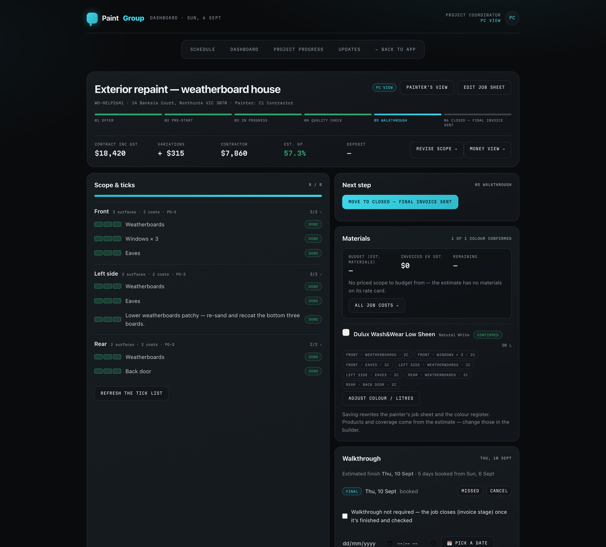
    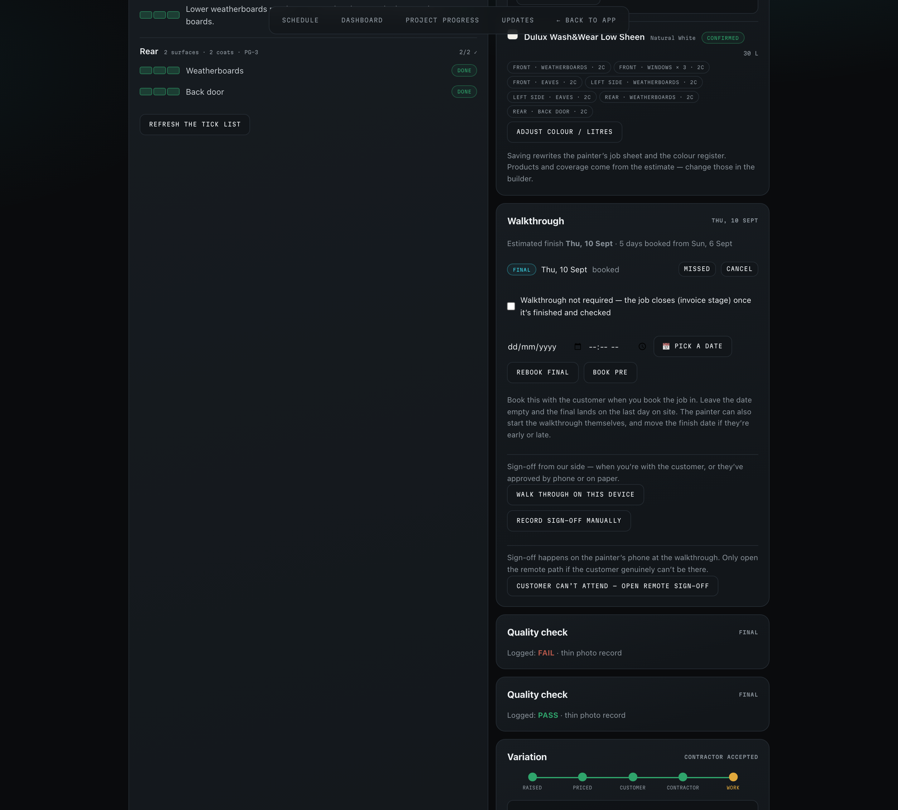
18. The sign-off clock sends the customer reminders at the intervals set under Settings, and the queue shows **Sign-off clock at 48 hours** when it has run that long. Deemed execution is switched off: a job waits at Walkthrough until a person signs, however long the clock runs. An **Extension requested on sign-off** card asks you to approve or decline.
19. A flagged area returns the job to **03 In progress** with the area on the painter's list. A customer who taps **Happy with this** on that area straight after withdraws the flag: the untouched rectify row is removed and the job goes back to **05 Walkthrough** on its own (the event log reads *flag withdrawn*). Once the painter has put it right and ticked it, their **Fixed — send the report** press completes the job straight to **06 Closed**: the sign-off records **Flagged areas put right** (kind *rectified*), the customer is emailed the completion report with a **What you flagged, and what we did** section, and the warranty and invoice drafts fire as they would on a signature. The walkthrough does not run again.

### Closed
20. Signing closes the job: **06 Closed — final invoice sent**, the **Next step** card reads "This job is finished and signed off", and the header gains **Final invoice (draft)**. The final invoice, warranty and completion report are created in that one step. **Something found after sign-off — reopen** takes the job back to Walkthrough for the customer to sign again; it asks for a reason.
    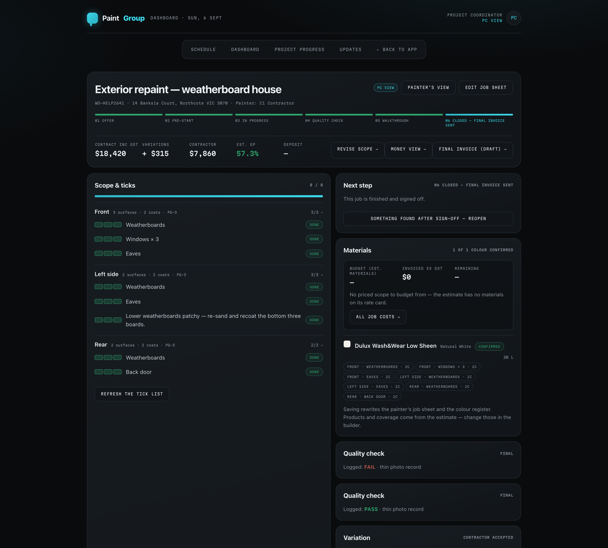
    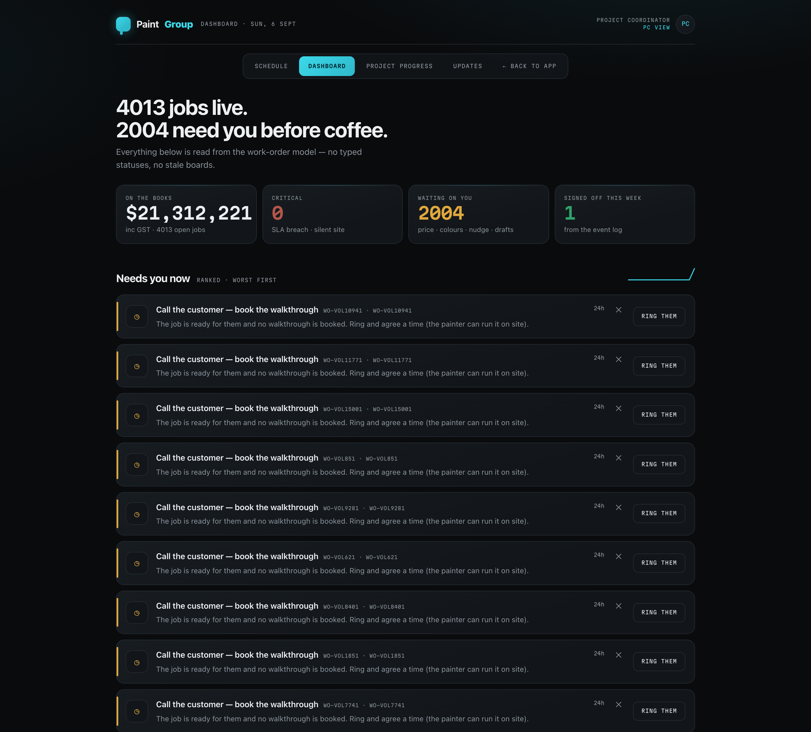

## Reviews, and what the dashboard counts from a job
- **Review card** (walkthrough and completed jobs): **We asked for a review** records that the customer was asked — a person's tick until the review-request automation ships. **Review received** with the stars records that it came back (a person's tick until the Google Business Profile connection). One row per job; asking twice never resets the first ask.
- **Quality check attempts**: every check on a job carries an attempt number — 1 for the first, one more after every fail. "Passed first time" on the dashboard means attempt 1 passed.
- **Finished on time**: the last surface ticked writes the moment the job was done; the booking's end date, moved by the painter's finish date or a reschedule that lengthens the job, is what it is compared with. A longer booking is logged as an extension on the job's activity.

## What the colours and labels mean
- **Amber** — waiting on a decision, usually yours: **WAITING**, **COLOURS TBC**, a queue card with an amber bar, a variation at **RAISED** or **PRICED**.
- **Clay (red)** — overdue or breached: **CRITICAL** tile, **Offer unanswered past SLA**, **Nothing ticked in N days**, an overdue decision.
- **Cyan** — live or informational: the current stage on the rail, **Customer update due**, drafted updates.
- **Emerald (green)** — done: completed stages on the rail, a passed check, **SIGNED OFF THIS WEEK**.
- Lane names are the stage names: **01 Offer, 02 Pre-start, 03 In progress, 04 Quality check, 05 Walkthrough, 06 Closed — final invoice sent**. There is no separate completion-prep lane; the painter's finishing-up list is part of In progress.
- Variation rail: **RAISED → PRICED → CUSTOMER → CONTRACTOR → WORK**.

## If something goes wrong
- **"The pre-start list has to be true before a job can start."** An item is unticked or a question unanswered; colours must be ticked before materials.
- **"The pre-start list has not been built for this job yet."** The job reached Pre-start without its list. Open the job once: the page builds the list as it loads, and the card appears. If the card still reads **Pre-start · list not built** after a refresh, tell whoever looks after the platform — the job cannot start until the list is there, which is deliberate: an empty list is not a finished one.
- **"1 variation still waiting on a decision."** The painter cannot finish while a variation is unpriced, unsigned or unaccepted. Price it, chase the customer's signature, or approve it for the contractor only.
- **"Every surface has to be ticked off first."** The painter has rows not yet Done. Check **Scope & ticks**, or tick on their behalf from **Painter's view** if you have confirmed the work on site.
- **"N quality checks still open."** Log every scheduled check as a pass before the pack can go. A logged **FAIL** is not what is holding it: the fail schedules its own re-check, and it is the re-check (or a mid-job check you added) that is still unlogged. The card with the standards is the one to work. If the job is at Quality check and the only card reads Logged: FAIL, the painter has not finished again yet — the re-check card appears when they tap **All done — next step**.
- **A job sits at Quality check with no card.** No check was due; use **All done — next step** to route it on.
- **The painter says they cannot tick.** Their area has no before photo yet, or the job is not at In progress.
- **The customer never received the variation link.** Check the contact's email and phone on the estimate, then **Text the link** or **Both**.

## Related
- [Offer a job to a painter and manage the booking](../scheduling/staff.md)
- [Approve and pay contractor invoices](../self-invoicing/staff.md)
