## What this is for
The PC console (**Projects** in the sidebar) reads every open work order and tells you what needs a person. Jobs move through seven lanes: **01 Offer → 02 Booking confirmed → 03 Pre-start → 04 In progress → 05 Quality check → 06 Walkthrough → 07 Closed — final invoice sent**. Nothing moves by typing a status: each move has a gate, and the console shows you the gate that is holding a job. The one exception is the calendar: a booked job sits in **Booking confirmed** until its start date is within the next seven days, then shows in **Pre-start** on its own. Your work is the pre-start list, pricing variations, approving the customer updates drafted from the painter's ticks, quality checks, and the sign-off.

## Before you start
- A job appears in the console once its estimate is accepted and the work order issued. Booking it is done on the **Schedule** tab (see the scheduling guide).
- Colours must be confirmed on the job sheet before materials can be ordered, and the pre-start list must be true before a job can start. The console tells you both.
- The customer's variation approval is by signature on a link you send them; the painter never sees the customer's price.

## Steps

### Reading the console
1. Open **Projects**. The **Dashboard** shows four tiles: **ON THE BOOKS**, **CRITICAL** (SLA breach, silent site), **WAITING ON YOU** (price, colours, nudge, drafts) and **SIGNED OFF THIS WEEK**. Below them, **Needs you now** is the queue, ranked worst first. Each card names the job, says what is wrong and offers one action, for example **Open**, **Ring them**, **Price it**, **Review**. The cross dismisses a card you have dealt with outside the system. Under each card's wording, **+ note** opens a one-line box for a short reminder to yourself — who you rang, what happens next (up to 280 characters). Press **Save** (or **Enter**) and the note shows in italics on that card every time it comes back; tap the note to change it, and save it empty to remove it. The note belongs to that reminder only and is seen by the office, never by the painter or the customer.
   
2. **Project progress** shows the seven lanes with every open job as a card: reference, contractor, contract value and tick progress, plus **COLOURS TBC**, **WAITING** or **BLOCKED** where a gate is holding it. The **03 Pre-start** lane lists the soonest start at the top. A job that starts within three days (today, tomorrow, or the two days after) — or whose start date has passed without it starting — is filled **orange** and says **STARTS TODAY**, **STARTS TOMORROW**, **STARTS IN 3 DAYS** or **START DATE PASSED**.
   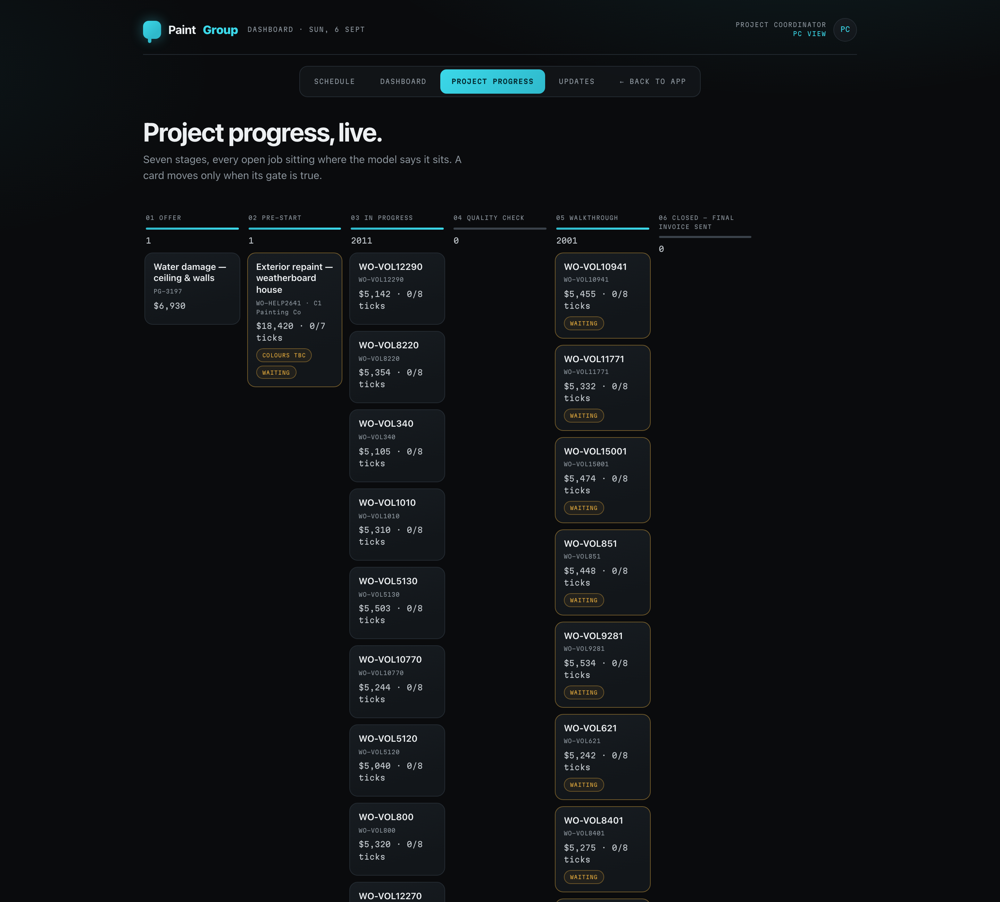
3. Open a job. The header carries the stage rail, the money line (contract inc GST, variations, contractor pay, estimated GP, deposit) and the view switch: **PC view**, **Painter's view** (the same tick list the painter sees, which you can tick on their behalf), **Edit job sheet**, **Revise scope**, **Money view**.
   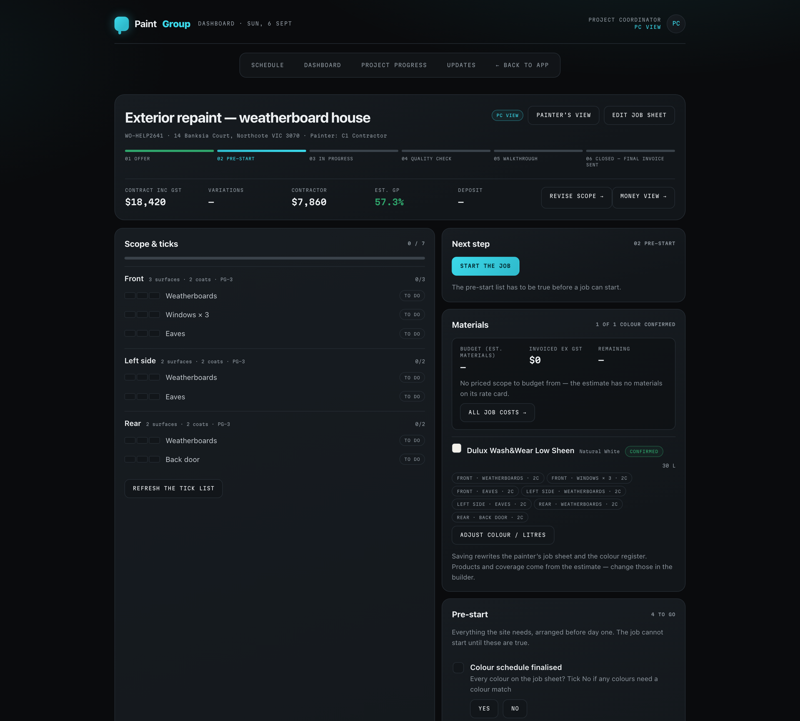

### What the estimator noted
Under the header, before the tick list, an **Estimator notes · internal** card lists everything the estimator typed or recorded about this job in the builder — dated, signed, voice notes with a player. Add your own note or recording here too; the estimator sees it in the builder. Internal only: nothing in this card reaches the painter's job sheet, the portal or the customer.

### Finding a project
3a. The search box in the top bar is on every console page — Schedule, Dashboard, Project progress, Updates, Timesheets. Type any part of the job's reference, its title or address, the customer's name, the estimate's title or its number (**42**, **#0042**). Matches drop down under the box with their stage; open jobs come first and closed ones are greyed. Click a match, or arrow to it and press **Enter**, to open the job's console page. **⌘K** (Ctrl+K on Windows) or **/** jumps to the box from anywhere on the page; **Esc** closes the list. "No project matches" means the words are not on any job; a line saying the read was refused means the search itself failed, not that the job is missing.

### Booking confirmed and Pre-start
4. Scroll to the **Pre-start** card (the counter reads **N TO GO**, then **ALL DONE**). It is the same card whether the job is **offered** to a contractor or **assigned** to an employee — the list belongs to the job, not to who is painting it, and it is built the moment the job is issued and again when a painter goes on it. Answer **Colour schedule finalised** with **Yes**, or **No** if any colour still needs a colour match, then tick **Materials ordered** (it needs the colours first), **Equipment movements booked** and **Access details recorded**. Under **Materials ordered** and under **Equipment movements booked** there is a box: write everything the job needs — paint, primer, filler; ladders, scaffold, sprayer — and press **Save materials list** or **Save equipment list** (**Saved** appears). You can do this before you tick anything; saving the list never ticks the item. It stays on the job as the reference and is there next time you open it. The lists are office-only: the painter's job sheet does not show them. **Pre-start checklist** and **SWMS / induction attached** are optional on a residential job; ticking the first emails the customer the pre-start checklist, and the second is required on commercial and body corporate jobs. An item that ticks itself is marked **auto**.
   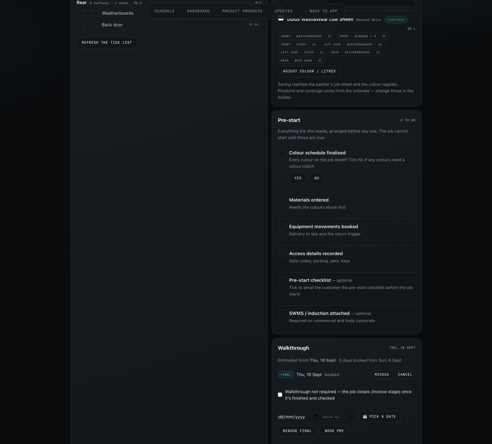
5. When the card reads **ALL DONE** the job can start. Further down, under the job facts, tick **Quality check required** if this job needs a check regardless of the contractor's record (a new contractor's first three jobs get one automatically); **Add a mid-job check** schedules an extra one for a date you choose. **Quality check not required on this job** is the override the other way: press it for a job that should skip the check even though the contractor is new — any check already due comes off the books, the facts read **Not required — waived by the office**, and a job parked at Quality check moves on as a pass would. Ticking **Quality check required** or adding a mid-job check turns the waiver off again.
   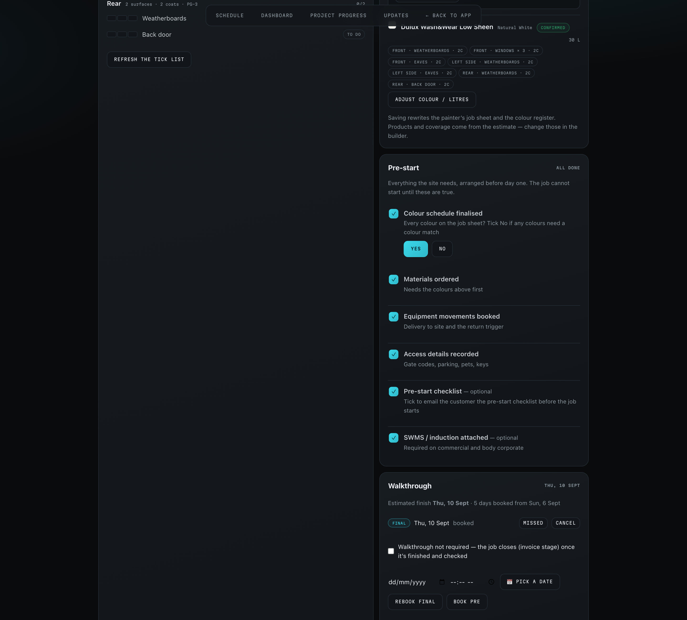
6. **Next step** offers **Start the job** once the list is true, with the gate's wording underneath while it is not. You can start early; the console warns that starting moves the start date to today and asks you to press again. Otherwise the job starts itself on its booked date once the list is done.
   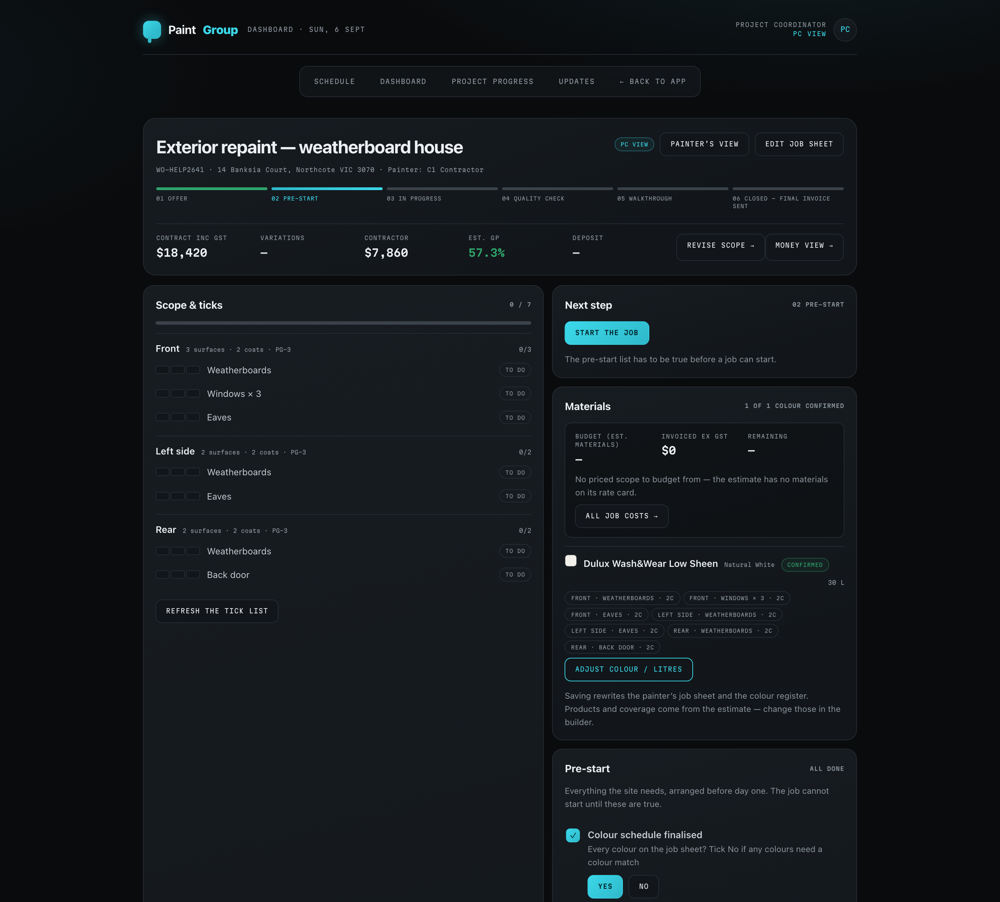
7. At **04 In progress** the **Scope & ticks** card shows the painter's list live, locked with a 🔒 line until the painter's Step 1 before photos are in (one batch for the whole job, since 30 Sep 2026). Under each line is a small **Photos not required — …** button: press it on a line that is not a surface (a fuel allowance, a site set-up line) and the painter is never asked for a before or finished shot of it; the row shows **No photos** and the button reads **Photos required again**. The same button sits on the read-only scope list before the job starts. The photo rule is per job: one batch of before photos unlocks every row, and one batch of after photos of all rooms or all sides is needed before the painter can finish — only a line you mark **Photos not required** is exempt.
   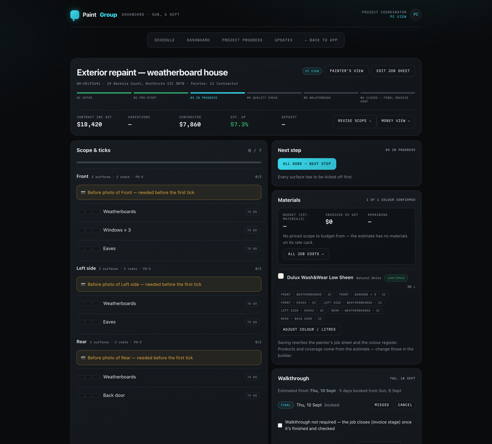

### Photos for the painter
The **Photos for the painter** card on the job page is how you put a picture in front of whoever is doing the work: the elevation the scaffold goes on, where the gear lives, the colour to match, the bit of the brief a sentence never quite carries.

Pick the area it belongs to (or leave it on **Whole job**), type what the painter should notice, and choose the file. It appears on their job sheet under **From the office**, above the scope, the moment it uploads — on their phone, in the portal, and on the job-sheet link.

This matters most on a **handover job from PaintScout**. Those come in without any of the estimator's photos, and the sheet's own photos are frozen at acceptance, so before this there was nothing to show the painter at all. On those jobs these are the only pictures of the job there are.

**Remove** takes one back off the sheet. It only ever removes photos the office added: the painter's own before, progress, quality-check and completion shots are their record of the work and the button cannot touch them — they live further down under **Site photos**. A painter can send a video as well as a photo from their Variations and Photos & notes cards: it appears as a tile with a play badge and plays full-size when tapped.

**Painter's view** on the job page shows the sheet exactly as the painter has it, photos included — check there rather than the builder's job-sheet tab, which is the office's copy.

A caption is worth writing. "Scaffold this side" on the right elevation saves a phone call; an uncaptioned photo makes the painter guess what they are looking at.

The card disappears once a job is closed — a closed job's sheet is final.

### The level of finish on a job that is already out
The **Level of finish** card on the job page says which PG standard this job sheet holds the painter to — **PG-2 Utility**, **PG-3 Premium** or **PG-4 Showcase** — and, in brackets, the level the job was priced at.

Those two can disagree. The level is frozen onto the job sheet when the job is issued, and changing it in the revision builder moves the **money** without touching the sheet: the painter goes on reading the standard the job went out with. That is what this card is for. Pick the level the job is actually being done to and **Save to the job sheet**; the painter's copy, the offer and the portal all change straight away.

Two things it deliberately does not do. **It does not change the price** — the level multiplier is priced and signed as a variation in **Revise scope**, so correcting the sheet here and sending the variation there are two separate jobs, and both need doing. And it leaves any area that carries a level of its own alone: the card names those areas before you save, and everything else follows the job. If an area was pinned to the level you are now moving the whole job to, it stops reading as an exception.

**Level 1** is not offered. It has no contractor standard, and calling a Level 1 job PG-2 would hold a painter to more prep than the customer paid for.

The card disappears once a job is closed — a closed job's sheet is final.

### Further instructions for the crew
The **Further instructions for the crew** card on the job page is the note at the top of the painter's work order — the key under the mat, which side to start on, the neighbour who needs warning. It is the same note as the box on the builder's work-order tab: write it in either place and the other shows it.

Type the instructions and press **Save to the work order**. The card says "Saved — the work order carries the new instructions." From then on the painter's job-sheet link, the crew link and their portal job page all show the new text the next time they open it. The painter is not sent a message about the change, so ring them if it matters today.

Clear the box and save to take the note off the sheet altogether.

If the card shows an amber line, "The painter's sheet currently says: …", the note was edited in the builder after the job went out and the painter never got it. Check the text in the box and press **Save to the work order** to send that version.

The card is read-only once a job is closed — a closed job's sheet is final.

### Changing a colour from our colour list
On the **Materials** card, **Adjust colour / litres** opens the row. **Choose a saved colour** opens our colour list, the same one the estimator uses in the builder: search by name or tap a brand, then pick a colour. That fills in the colour name and swatch. You can still type a colour name or hex by hand for anything that is not on the list, or use **+ Add a colour** to add it to the list for next time. Press **Save to job sheet** to send the colour to the painter's sheet.

### Variations for approval
The Dashboard's second section, **Variations for approval**, lists every open variation across every job: the ones **waiting on you** (raised, no price yet — amber, **Price it**) first, then those priced and waiting on the customer, then those the customer has approved and the painter has not yet accepted. The heading counts them ("3 open · 1 waiting on you"); each row names the category, the amount once priced, the job and the painter's words, and opens the variation on the job page. A declined, cancelled or accepted variation leaves the list on its own.

**Rejecting a painter's request** (since 8 Oct 2026). A row waiting on you also has a **Reject** button. Press it, write your reply to the painter in the box — why it isn't going ahead, or what you'd need instead — and press **Reject and send reply**. The variation is closed as declined (it can only be rejected while it is still with you; once priced it is the customer's to answer), and your reply goes to the painter who raised it by text and email. The row then says in words what happened: "Rejected — texted and emailed your reply to Jacob", or "Rejected — but your reply didn't reach Jacob" with the reason (most often no mobile or email on file — fill those in under Contractors and ring them). The painter's job page reads **Not going ahead** with your reply; the variation card on the job page here shows "Rejected by the office" with the same words. The same **Reject** button is on a raised variation's card on the job page.

### Pricing a variation
8. A raised variation appears on the job as a card with a five-step rail: **RAISED → PRICED → CUSTOMER → CONTRACTOR → WORK**, the painter's words, their photo and their hours estimate. It also lands in the queue as **Variation waiting on a price**. Choose **Price it in the builder — working scope** for anything with materials or several lines, **Quick price — hours only** for a small labour-only item, or **Approve for the contractor only — no charge to the client** when Paint Group is absorbing it.

8a. **Price it in the builder** opens Revise scope *for that request*: a blue line at the top of the changes panel reads "Pricing Qudrat's request: …" in the painter's words. Make the change in the scope and **Save & draft variations for signature** — the addition you draft **becomes the painter's request** (since 7 Oct 2026, 12A Cavell Court): the same card on the job moves from RAISED to PRICED, the painter's portal reads **With the customer**, and there is never a second variation beside the first. The painter's words stay on the record, followed by the change's title. Back the change out of the scope before the customer signs and the request simply returns to RAISED. (Before 7 Oct the builder drafted a separate row and the painter's request sat at RAISED for ever — if you still see one of those, cancel it against the priced row.)
   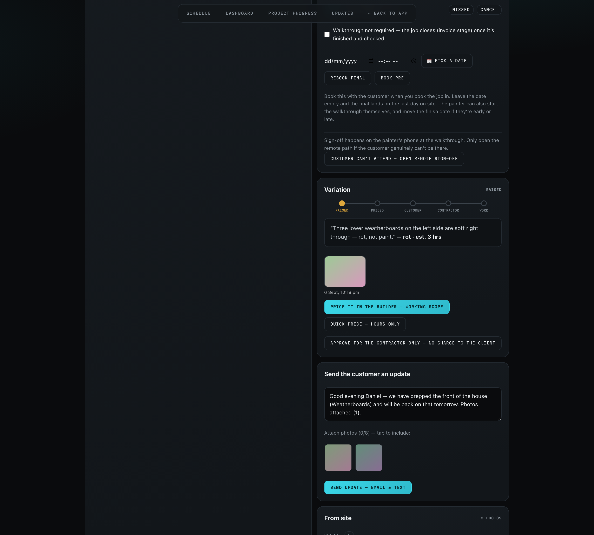
9. Quick price: enter the hours and any materials. The preview shows the customer price from the pricing engine and the contractor's amount.
   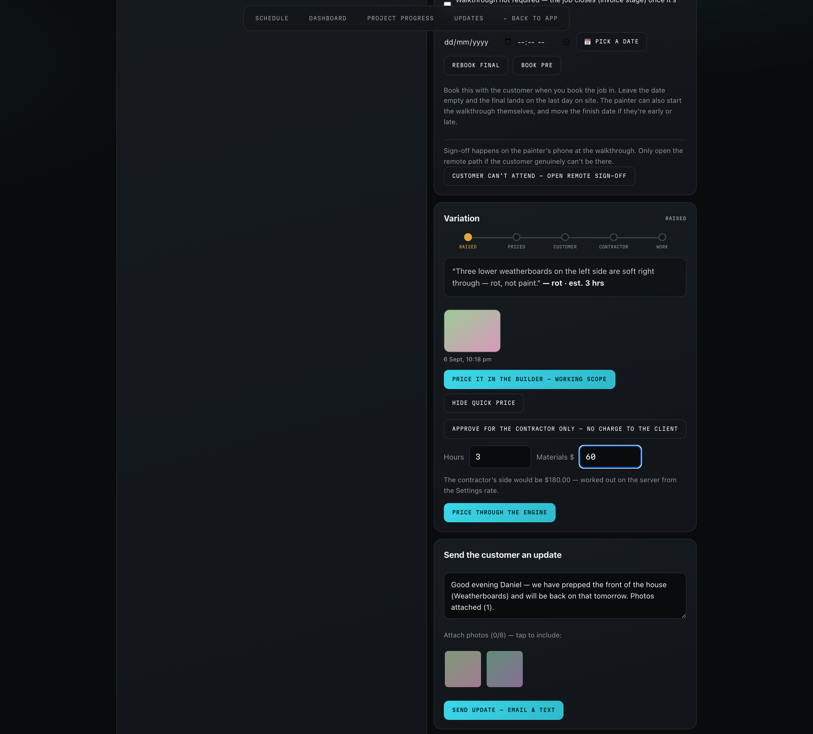
10. Priced, the card reads "with the customer" with the amount, and the signing link has been emailed. **Text the link** or **Both** if the customer prefers. **Set contractor amount** overrides what the painter receives. The queue card **Variation priced, customer silent** appears if they do not answer.
    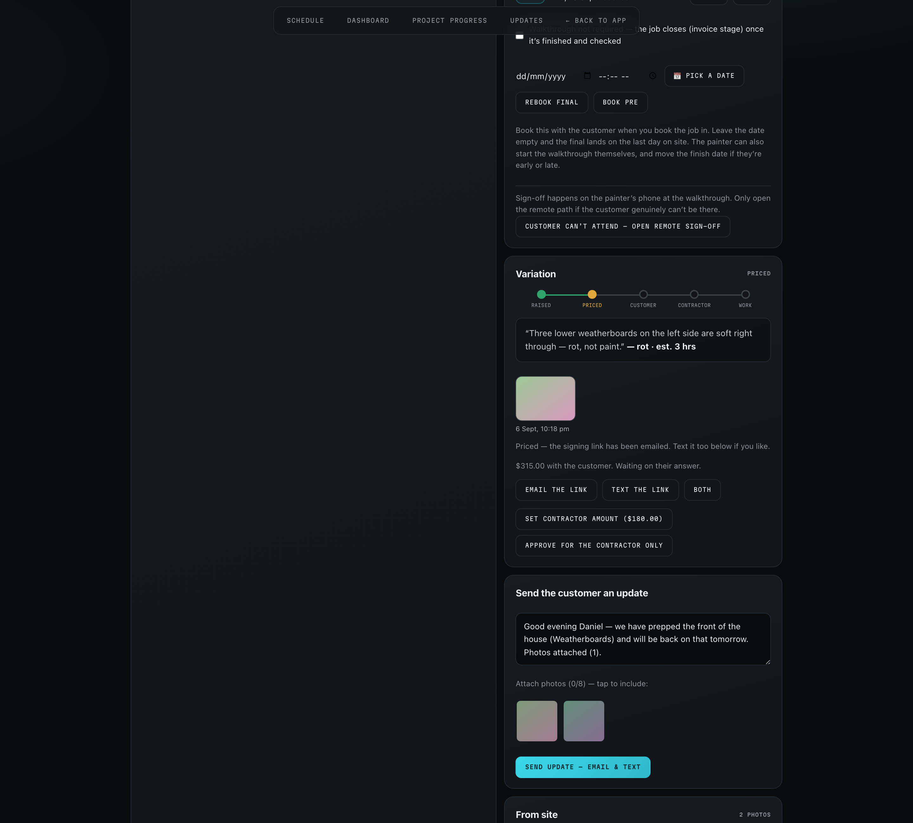
11. The customer approves by signing the link. Under **Settings → Automations**, "Approved variations go straight to the painter" is on by default, so the painter sees it as **YOUR APPROVAL** straight away and accepts; the rail reaches **CONTRACTOR** then **WORK**. If that automation is off, a **Release** step appears here for you. The customer is emailed a confirmation the moment they sign (since 8 Oct 2026): the changes they approved, what each adds or takes off, the new total and who signed, with a link back to the signed page. It goes to the estimate's contact email (and the second contact, if there is one); the email is on their CRM record, and the job's record says whether it went or why not — no email on the contact, or the customer has switched job emails off in their account. Their signing page says "We've emailed you a confirmation" only when it went. A removal signed after work started raises **Pay adjustment needs you**: enter the deduction and why; the painter sees your note.

### Changes from Revise scope — one offer, one signature
11a. Changes made in **Revise scope** (the working scope) go to the customer as **one offer**. Edit the scope, then **Save & draft variations for signature**: the panel shows one row — "2 changes · one offer for the customer" — with the net figure (additions minus removals, inc GST) and the two changes listed under it. There is one **Copy signing link** and one **Email / Text / Both** for the whole offer; draft five changes and it is still one link. Every addition needs a photo before the offer can be sent (a removal does not); the send button stays off until each one has one.
11b. The customer opens the link, sees every change with its photos and lines, the total for the lot, and their job total before and after. They **Approve all** with one signature, or **No thanks** declines the lot — the changes are never approved one by one. Once answered, the same link shows the outcome.
11c. Where the changes go next depends on whether anyone is on the job yet. **No painter on the job** (not offered, not assigned): the signed changes are simply part of the job — they read as **In the job** on the job sheet, and the offer you send later carries the base pay plus those changes as one figure. **A painter already on the job** (since 7 Oct 2026): each signed addition goes straight to them for **their approval** — their job page shows **Variation approved by the client** with the amount and the estimated hours, a big **Accept** and a small **Decline**. They are told by text **and email** (Settings → Automations → *Variation waiting on you*); a painter with no mobile on file is emailed. The variation card here reads "Released — waiting on the contractor to accept" with a **Remind the painter** button that sends it again and says in words what went out — or "Nothing went out — No email or mobile on file", which means the painter's contact details need filling in under Contractors before anything can reach them. Accept and the rail reaches **CONTRACTOR** then **WORK**. Decline asks them "please advise us of any further changes"; their note comes back to you as a **Painter declined an approved change** card on the console, an email and text to whoever has **Change declined** ticked in Settings → Staff alerts, and a line on the variation card here. The change no longer holds the job's gate; revise it with the client in Revise scope, or set the painter's amount and send it again. A removal is acknowledged, as before. Either way the painter's job sheet now lists **Changes to the scope** — what was added or removed, with hours, never the customer's price — and every approved addition with site hours is also on their tick list: a new area under its own heading with a row per surface, a raised variation as one row under **Variations**. Those rows count toward progress and the finish gate like any other. A change with no hours (a price-only adjustment) adds no row.
11d. Drafting again after a signature drafts only what goes beyond it, and joins any offer still waiting on the customer; a change that nets back to nothing retires its draft.

### Customer updates from the painter's ticks
12. Each day's ticks and photos become a drafted customer update. **Updates** lists **Updates waiting on you**; read it, edit if needed, then **Approve & send**. Nothing goes to the customer until a person approves it. A draft that will never go — the job has since completed — has a **Delete** button (press twice; the second press confirms); the removal is logged on the job. When any drafts sit on completed jobs, a card at the top says how many and **Delete them all** clears them in one press. A sent update cannot be deleted; it is the record of what the customer received. On the job page, **Send the customer an update** comes pre-written from the latest ticks with the site photos ready to attach; edit the words and tap **Send update — email & text**.
    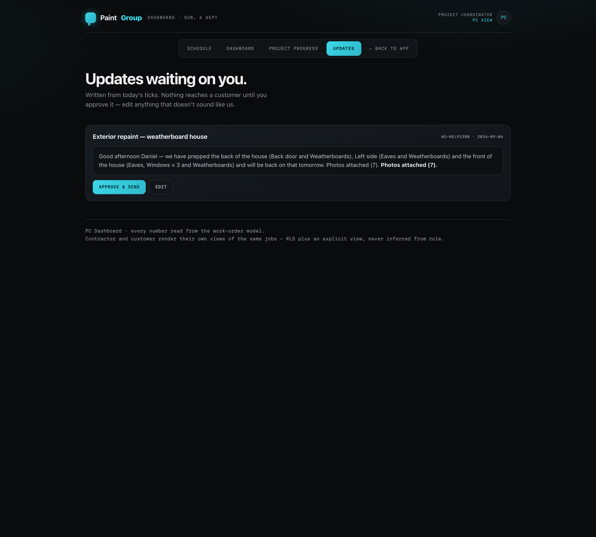

### Telling the office, and logging what the client was told
12c. **You are told when there is something to send.** The moment a painter's ticks draft a customer update (or the evening sweep catches one), whoever has **Update ready** ticked in Settings → Staff alerts gets an email and a text with a link to Updates — once per job per day. **You are reminded when the client is due one.** Each evening the sweep looks for jobs in progress whose customer has had nothing for the "update every N days" setting with nothing drafted, and emails and texts whoever has **Update due** ticked — once per job per day while it stays due. Tick both channels on Felipe's login (Settings → Staff logins → the alerts matrix) for these to reach him; a login with no phone gets email only.
12d. **Client updates** on the job page is a notes box for what the client was told by hand — a call, a text, a conversation on site. **Log it** writes the note to the job's timeline and, when the job has a customer record, to that customer's CRM record as a Note ("Client update: …", with your name). The timeline under the box lists every update sent to the customer and every note logged here, newest first.

### Moving a job on from In progress yourself
12a. The **Next step** card on an In-progress job now starts with **Before the next step:** — a short list of what the one routed button needs, each line ticked ✓ or open ○: every surface ticked off, the after photos (the painter's Step 3), the finishing-up list answered, and any variation still waiting on a decision. Fix the open lines in that order, then press **All done — next step**. The press runs the painter's own finish and routes the job: **05 Quality check** if a check is due, otherwise the walkthrough (or straight to closed on a *walkthrough not required* job). Anything still in the way comes back in words under the button, never as a code.
12b. **After photos missing, every box ticked.** The painter's finish needs the job's after photos — one batch of all rooms or all sides — and until 6 Oct 2026 the console had no way past that: pressing the button answered "not at prep" and nothing moved. Now the card offers two routes once the ticks are done: **Upload after photos** (if the painter has texted them to you — they land on the job as the after photos and the job can move) and **No after photos coming — move on without them**, which asks for a reason, puts an *after photos waived* entry on the job's record with your name, and lets the same button move the job. The painter's own rule is unchanged: only the office can waive.

### Quality check
13. When the painter taps **All done — next step**, the server routes the job: to **05 Quality check** if a check is due, otherwise straight to the walkthrough. Checks are due on a new contractor's first three jobs, on any job where you ticked **Quality check required**, and for any mid-job check you added. The check appears on the job as a **Quality check** card ("Photo-logged against the standards. Every line looked at before a pass.") with the four standards: **Cut lines**, **Coverage**, **Prep evidence**, **Site**. The queue says **Quality check to do**. Tick each standard as you inspect it; the pass button reads **N standards to check** until all are ticked.
    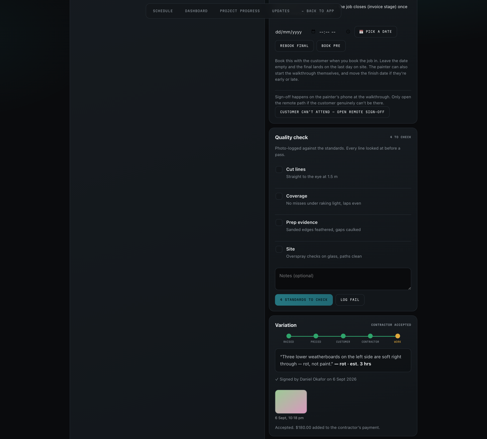
13a. Above the four standards, **What we expect on this job's surfaces** lists one link per surface line — **Lounge · Walls — what we expect ›** — opening the finish standard for that surface at the job's level, the same record the painter was shown (see [the finish standards guide](../standards/pc.md)). Each **Scope & ticks** row carries the same link while the job is in progress.
14. To fail it, tap **Log fail**, enter **Where** (the area) and what needs putting right, add **Photos of where it failed — show the painter**, and tap **Log fail — raise rectification**. The check is logged **FAIL**, the job returns to **04 In progress**, and the item lands on the painter's tick list marked **Rectify** under the area you named. The failed card stays on the page as the record — **Logged: FAIL · re-check scheduled** — and Job facts lists the re-check as **due**.
    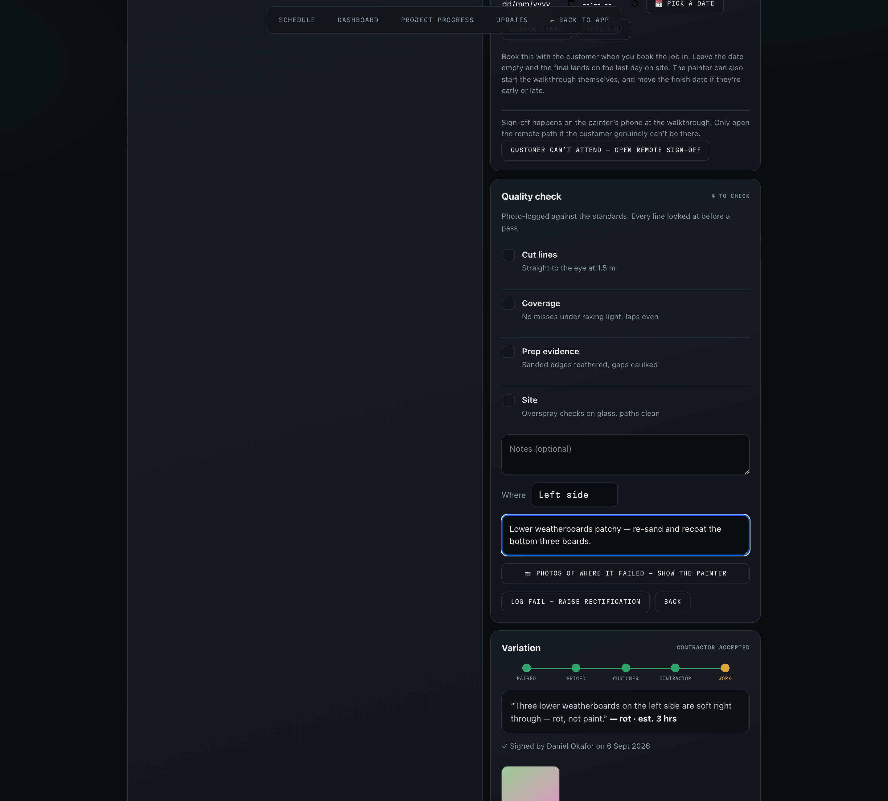
15. When the painter has put it right and finished again, the job comes back to **05 Quality check** with two cards: the failed check, still **Logged: FAIL** with no buttons, and a fresh **Quality check re-check** card with all four standards unticked. Work the re-check card: tick each standard as you inspect the fix; when every one is ticked it reads **READY TO LOG**; add a note and tap **Log check — PASS**. (**Add a mid-job check** is for an extra inspection, not for this — the re-check is scheduled by the fail itself.)
    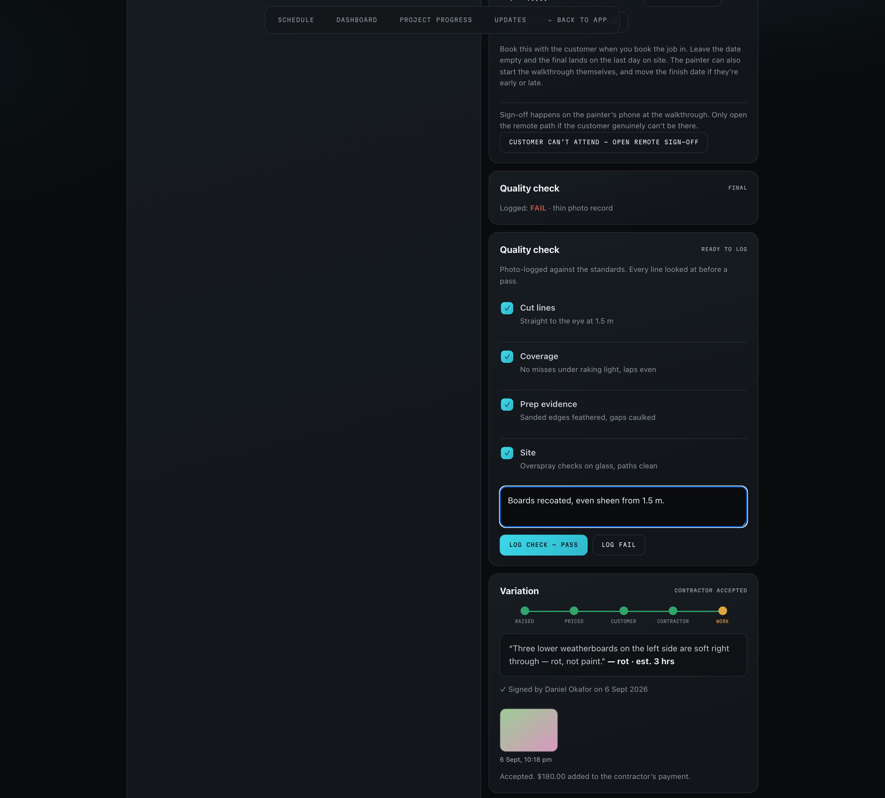
16. A pass with no other check open moves the job on by itself: the customer's evidence pack is delivered and the stage becomes **06 Walkthrough**. A job that reaches Quality check with **no check on it at all** (the checks were turned off or removed after it arrived) also moves on by itself the next time anyone opens it or the evening sweep runs — until 7 Oct 2026 it sat there for good (25 Bunney Road). **Quality check not required** on a parked job now means it: a logged FAIL with no re-check (one logged before 24 Sep 2026, when re-checks arrived) no longer holds a waived job — the fail stays on the record and the job moves on at the next view or sweep; turning the check back on puts the fail back in force. If a job still will not leave Quality check, the reason is on its page: a variation still waiting (approve, decline or release it), colour-match codes missing, or a check not yet logged; `node scripts/diag/wo-next-step.mjs "<address>"` prints the same verdict. The pack cannot go while any check is unpassed. A logged FAIL counts as open only until its re-check exists; once the re-check passes, the fail is history and holds nothing. If the re-check fails too, the same thing happens again — a further re-check, as many times as it takes.

16b. **Which jobs get a check is decided by the painter's status** (from 8 Oct 2026): a **New** painter's first jobs, a **Yellow** painter's every third job, every job for **Orange** and **Red**, and none automatically for **Green** — a Green painter is checked only when you choose. **Spot check this job** on the quality-check card adds one to any job under way (it clears a waiver). **Quality check required** on the job and the every-job setting still win. The status itself is on **Painters** in the console rail for now — the painter's name, colour, streak and the three measures behind it; it is recomputed every half hour from checks, update texts and call backs on signed-off jobs, and a job counts seven days after its sign-off.

### App updates and "No work today"
16a. On a job under way the **App updates** card lists the painter's reminder moments — day 1 at 7:30 am, then by length — each **Upcoming**, **Due today · N sent**, **Answered**, **Missed · N texts** or **Skipped**. The painter is texted up to three times on the day until a tick or a photo lands. A rained-off or locked-out day: pick the day (today or a past day), say why, and press **No work that day** — its moments are skipped and never counted, texts sent or not. **Clear** puts the day back. The same control is on the schedule board's block detail for a job under way.

### Checking in with the customer
16b. PC Command lists the customer check-ins for you, at the top of its queue (moved there from the CRM's Today on 6 Oct 2026), worked out from each booking's length in the painter's working days. A **3–6 day job** puts a **Check-in** card on the day half way through ("mid-job check-in, 50% through, day 3 of 5"), due by 5 pm; a **job of 7 days or more** gets two, at 35% and 70%. These rank high — a customer with a question mid-job is who the call is for. A **1–2 day job** gets a **Follow-up** card instead, due the next business morning after its last booked day: ring and check they are happy. Each card has **Open the job**, **Rang them** (the card goes for good) and **Tomorrow** (nobody picked up — it comes back the next day); both are recorded on the dismissal log like any Today item. The painter is texted to update their work order on the same rhythm. The CRM's Today and tab badge no longer count these.

### Walkthrough and sign-off
17. At **06 Walkthrough** what the **Next step** card offers depends on the job. **A job that went through a quality check is signed off by the office, not the customer**: the button reads **Sign off as complete — quality check passed**, and the **Walkthrough** card carries the same button with an optional note for the record. Pressing it approves every area on the customer's behalf, signs with your own name, freezes the report, starts the warranty, drafts the final invoice and closes the job; the customer is not asked to sign and is not sent reminders — they receive the completion report the moment it is signed. The painter's page shows **Quality check passed — Paint Group signs this job off from the office** instead of the walkthrough button. On a job with **no** quality check the normal path stands: the customer signs on the painter's phone, and the Next-step button is the office closing the job on their behalf. The **Walkthrough** card shows the estimated finish and the booked **FINAL** walkthrough with **Missed** and **Cancel**; pick a date and time and **Rebook final** to change it (an empty date lands on the last day on site), or **Book pre** for a pre-walkthrough. The **Walkthrough not required** button (on the Walkthrough card from the offer stage onwards, so it can be pressed the moment a job is approved or whenever circumstances change) means the job closes at the invoice stage once it is finished and checked; it reads **Walkthrough not required ✓ — require it again** while it is on. If the job is already at the walkthrough stage when you press it, the **Next step** card changes to **Close the job — no walkthrough required**: pressing that cancels any booked walkthrough and closes the job with the same report, warranty and invoice draft a signing would write. Under **Sign-off from our side**, **Walk through on this device** runs the customer's walkthrough on your own screen when you are with them, and **Record sign-off manually** records an approval they gave by phone or on paper, with their full name and how they approved. **Customer can't attend — open remote sign-off** opens the customer's own link for signing early. The customer signs by drawing in a signature box (the same pad as the estimate), never by typing a name; the sign-off is recorded in the name the job was booked under. Their own link can sign on its own once no final walkthrough is booked ahead of today — while one is still booked, the page tells them sign-off happens at the walkthrough and to call us if they can't make it.
    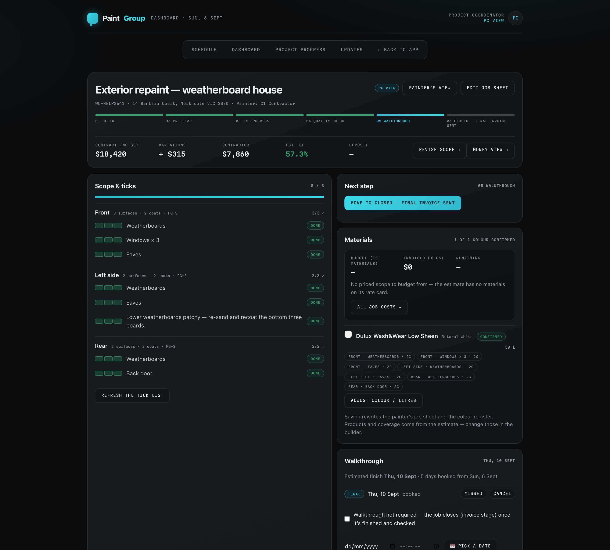
    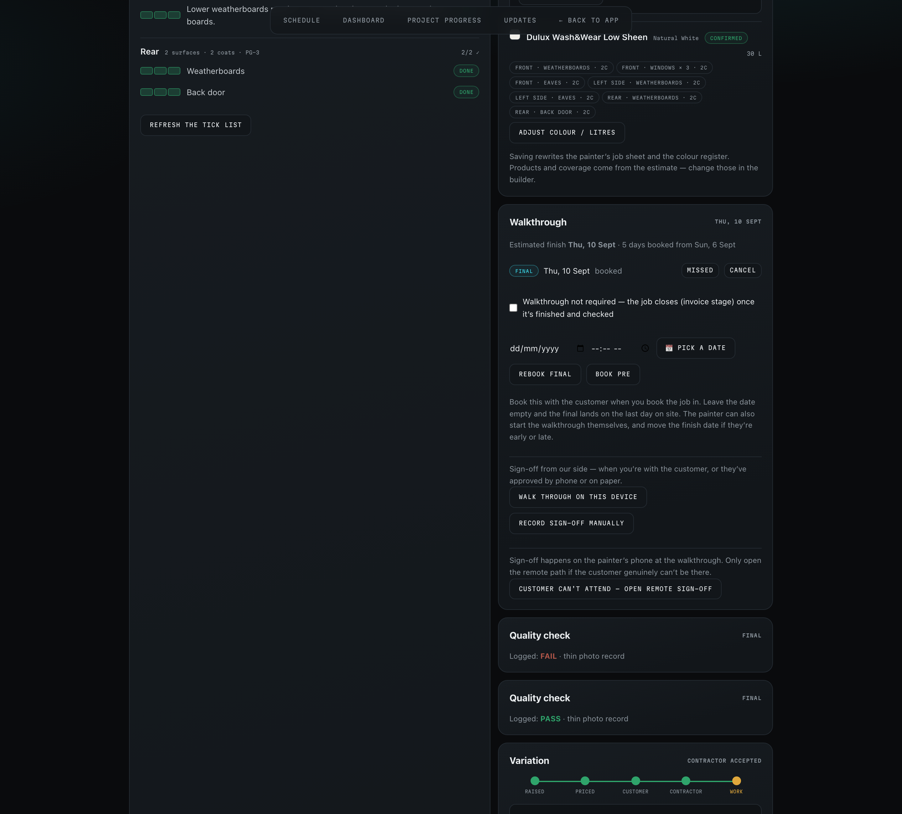
18. The sign-off clock sends the customer reminders at the intervals set under Settings, and the queue shows **Sign-off clock at 48 hours** when it has run that long. Deemed execution is switched off: a job waits at Walkthrough until a person signs, however long the clock runs. An **Extension requested on sign-off** card asks you to approve or decline.
19. A flagged area returns the job to **04 In progress** with the area on the painter's list. A customer who taps **Happy with this** on that area straight after withdraws the flag: the untouched rectify row is removed and the job goes back to **06 Walkthrough** on its own (the event log reads *flag withdrawn*). Once the painter has put it right and ticked it, their **Fixed — send the report** press completes the job straight to **07 Closed**: the sign-off records **Flagged areas put right** (kind *rectified*), the customer is emailed the completion report with a **What you flagged, and what we did** section, and the warranty and invoice drafts fire as they would on a signature. The walkthrough does not run again.

### Closed
20. Signing closes the job: **07 Closed — final invoice sent**, the **Next step** card reads "This job is finished and signed off", and the header gains **Final invoice (draft)**. The final invoice, warranty and completion report are created in that one step. **Something found after sign-off — reopen** takes the job back to Walkthrough for the customer to sign again; it asks for a reason.
    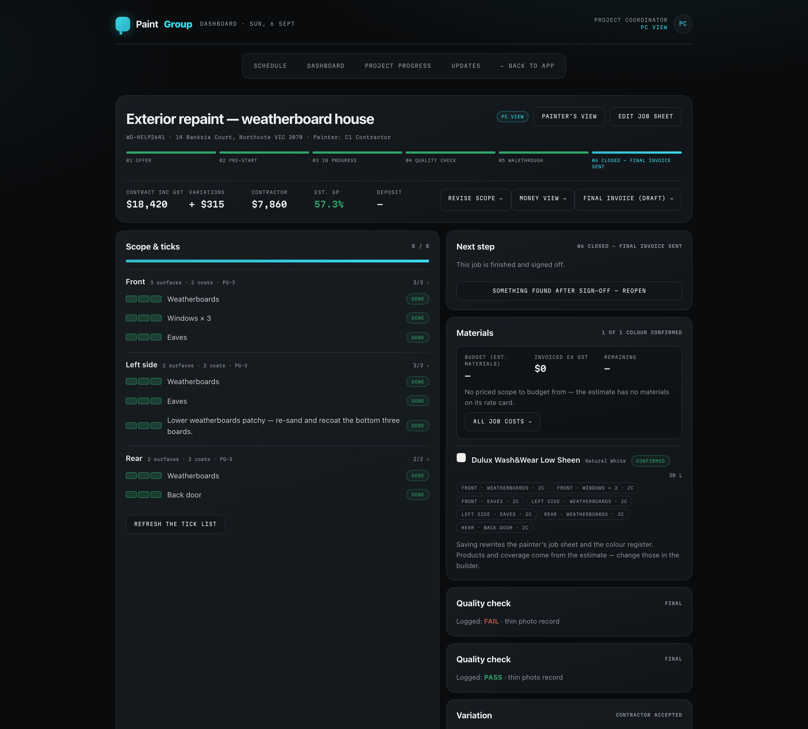
    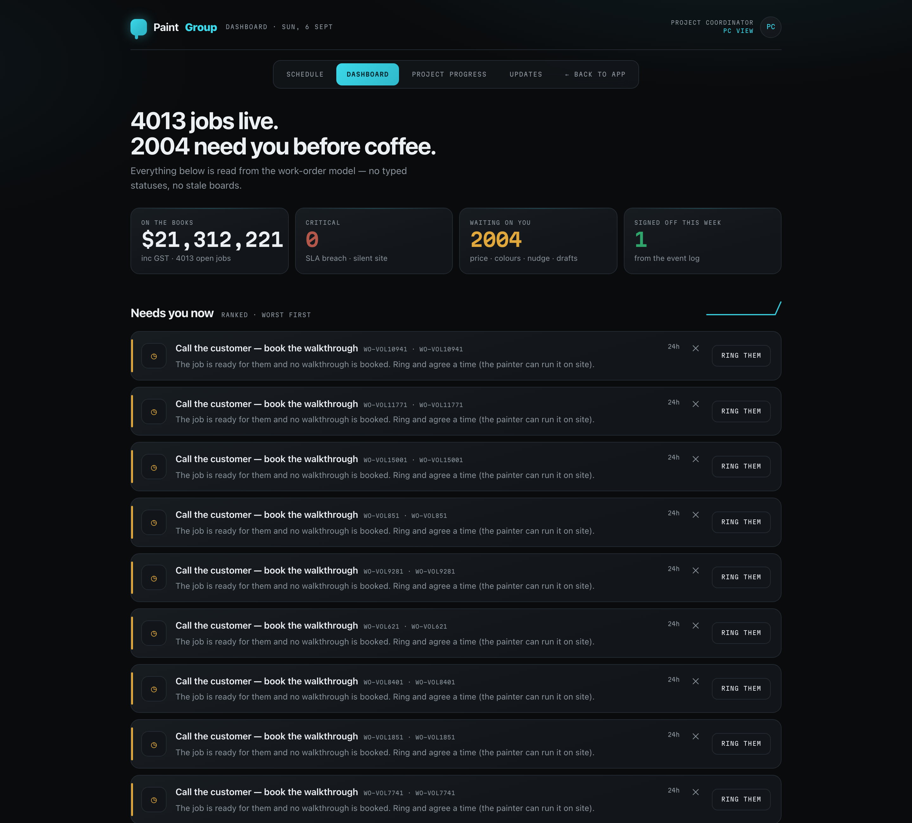

## Reviews, and what the dashboard counts from a job
- **Review card** (walkthrough and completed jobs): **We asked for a review** records that the customer was asked — a person's tick until the review-request automation ships. **Review received** with the stars records that it came back (a person's tick until the Google Business Profile connection). One row per job; asking twice never resets the first ask.
- **Quality check attempts**: every check on a job carries an attempt number — 1 for the first, one more after every fail. "Passed first time" on the dashboard means attempt 1 passed.
- **Finished on time**: the last surface ticked writes the moment the job was done; the booking's end date, moved by the painter's finish date or a reschedule that lengthens the job, is what it is compared with. A longer booking is logged as an extension on the job's activity.

## What the colours and labels mean
- **Amber** — waiting on a decision, usually yours: **WAITING**, **COLOURS TBC**, a queue card with an amber bar, a variation at **RAISED** or **PRICED**.
- **Clay (red)** — overdue or breached: **CRITICAL** tile, **Offer unanswered past SLA**, **Nothing ticked in N days**, an overdue decision.
- **Cyan** — live or informational: the current stage on the rail, **Customer update due**, drafted updates.
- **Emerald (green)** — done: completed stages on the rail, a passed check, **SIGNED OFF THIS WEEK**.
- Lane names: **01 Offer, 02 Booking confirmed, 03 Pre-start, 04 In progress, 05 Quality check, 06 Walkthrough, 07 Closed — final invoice sent**. There is no separate completion-prep lane; the painter's finishing-up list is part of In progress.
- **Orange** (Pre-start lane) — the job starts within three days, or its start date has passed and it has not started.
- **Booking confirmed** and **Pre-start** are the same job stage split by date. A job whose painter has accepted (or been assigned) waits in **Booking confirmed** while its start date is more than seven days away, or has no start date yet. Once the start is within seven days — or has passed without the job starting — the card moves to **Pre-start** by itself; nothing is pressed. The stage rail on the job lights the same lane, and the **Next step** card is headed **02 Booking confirmed** or **03 Pre-start** to match. The pre-start list can be worked in either lane.
- Variation rail: **RAISED → PRICED → CUSTOMER → CONTRACTOR → WORK**.

## If something goes wrong
- **"The pre-start list has to be true before a job can start."** An item is unticked or a question unanswered; colours must be ticked before materials.
- **"The saved materials and equipment lists could not be read"** under the Pre-start card. The read failed — the lists are not empty. Reload before typing, or you may save over them.
- **"The pre-start list has not been built for this job yet."** The job reached Pre-start without its list. Open the job once: the page builds the list as it loads, and the card appears. If the card still reads **Pre-start · list not built** after a refresh, tell whoever looks after the platform — the job cannot start until the list is there, which is deliberate: an empty list is not a finished one.
- **"1 variation still waiting on a decision."** The painter cannot finish while a variation is unpriced, unsigned or unaccepted. Price it, chase the customer's signature, or approve it for the contractor only.
- **"Every surface has to be ticked off first."** The painter has rows not yet Done. Check **Scope & ticks**, or tick on their behalf from **Painter's view** if you have confirmed the work on site.
- **"N quality checks still open."** Log every scheduled check as a pass before the pack can go. A logged **FAIL** is not what is holding it: the fail schedules its own re-check, and it is the re-check (or a mid-job check you added) that is still unlogged. The card with the standards is the one to work. If the job is at Quality check and the only card reads Logged: FAIL, the painter has not finished again yet — the re-check card appears when they tap **All done — next step**.
- **A job sits at Quality check with no card.** No check was due; use **All done — next step** to route it on.
- **The painter says they cannot tick.** The job has no before photo yet (Step 1 on their phone), or the job is not at In progress. **They cannot finish:** the after photos (Step 3) are not in.
- **Every box is ticked and the job will not leave In progress.** Read the **Before the next step** list on the Next-step card: the open ○ line is the reason. Most often it is the after photos — upload them from the card if you have them, or **move on without them** with a reason. If the list is all ✓ and the button still refuses, the words under it name the gate (a variation waiting, an open quality check, a colour-match code).
- **"This job isn't at In progress any more — reload the page."** Someone else (or the painter) moved it while this page was open. Reload to see where it is.
- **The customer never received the variation link.** Check the contact's email and phone on the estimate, then **Text the link** or **Both**.

## Related
- [Offer a job to a painter and manage the booking](../scheduling/staff.md)
- [Approve and pay contractor invoices](../self-invoicing/staff.md)
